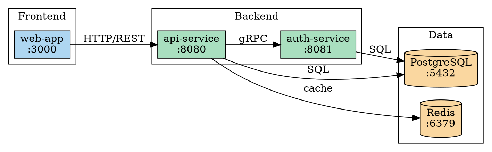
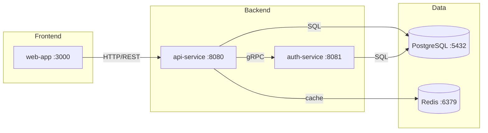
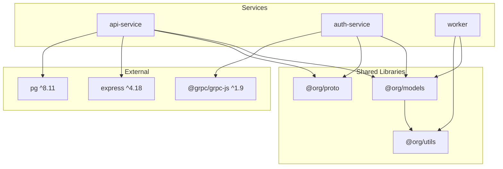
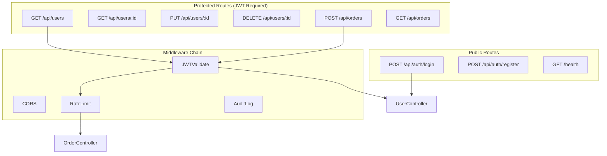
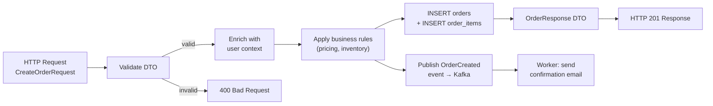
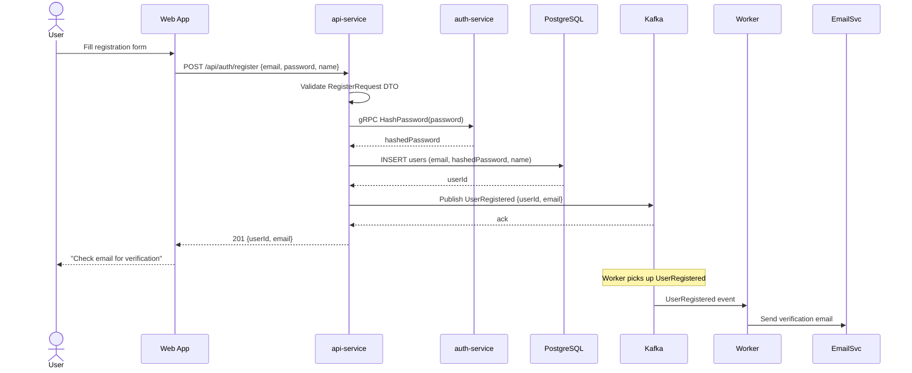

# Code Atlas Skill

## Purpose

Build exhaustive, regeneratable architecture atlases directly from code truth — not from stale documentation. A code-atlas is a living document set: diagrams, graphs, and inventory tables that together form a navigable map of any codebase. The key innovation is that **atlas-building is investigation**: forcing structured reasoning about code in graph form reveals structural bugs, API contract mismatches, and architectural drift that linear code review misses.

An atlas is complete when any engineer, given only the atlas and a bug report, can trace the full execution path without opening the source code.

## Philosophy Alignment

### Ruthless Simplicity

- **Code is truth**: Every diagram derives from code, not from memory or stale docs
- **Exhaustive by default**: Cover all services, all API surfaces, all user entry points — no partial maps
- **Regeneratable**: Run one command to rebuild from code truth at any time

### Zero-BS Implementation

- **Real analysis**: Parse actual imports, routes, env vars, and configs — no invented topology
- **Graph-form reasoning**: Structure exposes what prose hides — contradictions become visible
- **Evidence-backed bugs**: Every filed issue includes code evidence extracted from the atlas

### Modular Design (Bricks & Studs)

- **This skill is one brick**: Atlas orchestration and bug-hunt workflow
- **Delegates to other bricks**: code-visualizer for Python analysis, mermaid-diagram-generator for syntax, visualization-architect for complex DOT layouts
- **Clear output contract**: Atlas = 6 layers + inventory tables + bug report with code evidence

## Skill Delegation Architecture

```
code-atlas (this skill)
├── Responsibilities:
│   ├── Atlas layer orchestration (all 6 layers)
│   ├── Language-agnostic code exploration
│   ├── Two-pass bug-hunting workflow
│   ├── Staleness detection triggers
│   ├── CI integration patterns
│   └── Publication workflow (GitHub Pages, mkdocs, SVG)
│
└── Delegates to:
    ├── code-visualizer skill
    │   ├── Python AST module analysis
    │   ├── Import relationship extraction
    │   └── Timestamp-based staleness detection
    │
    ├── mermaid-diagram-generator skill
    │   ├── Mermaid diagram syntax generation
    │   ├── Flowchart, sequence, class diagram formatting
    │   └── Markdown embedding
    │
    ├── visualization-architect agent
    │   ├── Complex DOT graph rendering
    │   ├── Multi-level cross-layer layouts
    │   └── ASCII diagram alternatives
    │
    ├── analyzer agent
    │   ├── Deep codebase investigation
    │   ├── Dependency tree mapping
    │   └── Runtime topology discovery
    │
    └── reviewer agent
        ├── Contradiction hunting across layers
        ├── Route/DTO mismatch detection
        └── Code-evidence gathering for bug reports
```

**Invocation Pattern:**

```
# Phase 1: Build atlas layers from code truth
Delegate Python analysis → code-visualizer skill
Delegate polyglot exploration → analyzer agent
Delegate Mermaid output → mermaid-diagram-generator skill
Delegate complex DOT graphs → visualization-architect agent

# Phase 2: Bug hunt using the atlas
Pass 1: Contradiction hunt → reviewer agent + atlas cross-reference
Pass 2: Journey trace → follow user scenarios through graphs

# Phase 3: Publish and maintain
Generate SVGs, push to GitHub Pages / mkdocs directory
Register CI hook for staleness detection on code changes
```

## When to Use This Skill

| Trigger                                 | Use Case                                         |
| --------------------------------------- | ------------------------------------------------ |
| Starting work on an unfamiliar codebase | Full atlas build before coding                   |
| Onboarding a new engineer               | Share atlas as navigation guide                  |
| Before a major refactor                 | Map current state; plan changes against topology |
| Bug hunt stalled                        | Pass 1 + Pass 2 bug-hunting through graphs       |
| Docs feel stale                         | Staleness check + targeted rebuild               |
| Adding CI/CD quality gate               | Register atlas freshness checks                  |
| Publishing documentation site           | GitHub Pages / mkdocs publication workflow       |
| Reviewing an unfamiliar PR              | PR impact view using diff against current atlas  |

## Quick Start

### Build a Full Atlas

```
User: Build a complete code atlas for this repository
```

### Run Bug-Hunt Passes

```
User: Run code atlas bug hunting passes on this service
```

### Check Atlas Freshness

```
User: Are our architecture diagrams still accurate?
```

### Publish to GitHub Pages

```
User: Publish our code atlas to GitHub Pages
```

---

## Core Capabilities

### Layer 1: Runtime Service Topology

**What it maps**: Services, containers, processes, and their live communication channels (HTTP, gRPC, message queues, event streams).

**Discovery approach (language-agnostic)**:

```bash
# Docker Compose / Kubernetes manifests
find . -name "docker-compose*.yml" -o -name "*.yaml" -path "*/k8s/*"
grep -r "ports:" docker-compose.yml
grep -r "serviceName\|clusterIP\|targetPort" k8s/

# Service mesh and DNS config
find . -name "*.env" -o -name "*.env.*" | xargs grep -l "HOST\|PORT\|URL\|ENDPOINT"
grep -r "REDIS_URL\|DATABASE_URL\|KAFKA_BROKER\|AMQP_URL" .

# Process registries
grep -r "listen\|bind\|serve\|ListenAndServe\|app.run\|app.listen" --include="*.go" --include="*.ts" --include="*.py" .
```

**Output formats**:





---

### Layer 2: Compile-Time Dependency Graph

**What it maps**: Package-level imports, module boundaries, build-time linkage, and external library versions.

**Discovery approach (polyglot)**:

```bash
# Go
find . -name "go.mod" | head -5
go mod graph | head -50

# TypeScript / Node
cat package.json | jq '.dependencies, .devDependencies'
grep -r "^import\|^require" --include="*.ts" src/ | grep -v node_modules | head -50

# Python
grep -r "^import\|^from" --include="*.py" src/ | grep -v __pycache__ | head -50

# .NET
find . -name "*.csproj" | xargs grep "PackageReference\|ProjectReference"

# Rust
cat Cargo.toml | grep -A 50 "\[dependencies\]"
```

**Output**: Module dependency graph (delegates Python to `code-visualizer`, polyglot analysis to `analyzer` agent).



**Inventory Table** (required output):

| Package       | Version   | Consumers                         | Direct? | License    |
| ------------- | --------- | --------------------------------- | ------- | ---------- |
| express       | ^4.18     | api-service                       | Yes     | MIT        |
| @grpc/grpc-js | ^1.9      | auth-service                      | Yes     | Apache-2.0 |
| pg            | ^8.11     | api-service                       | Yes     | MIT        |
| @org/models   | workspace | api-service, auth-service, worker | Yes     | Internal   |

---

### Layer 3: HTTP Routing and API Contracts

**What it maps**: All HTTP routes, their handlers, request/response DTOs, authentication requirements, and middleware chains.

**Discovery approach (polyglot)**:

```bash
# Express / Fastify (TypeScript)
grep -r "router\.\(get\|post\|put\|patch\|delete\)\|app\.\(get\|post\)" --include="*.ts" src/

# FastAPI / Flask (Python)
grep -r "@app\.\|@router\.\|@blueprint\." --include="*.py" src/

# Go (chi / gin / echo)
grep -r "r\.Get\|r\.Post\|r\.Handle\|router\.GET\|e\.GET" --include="*.go" .

# ASP.NET Core (.NET)
grep -r "\[HttpGet\]\|\[HttpPost\]\|MapGet\|MapPost" --include="*.cs" .

# Rust (axum / actix-web)
grep -r "\.route\|get!\|post!\|Router::new" --include="*.rs" .

# OpenAPI specs
find . -name "openapi*.json" -o -name "openapi*.yaml" -o -name "swagger*.json"
```

**Output**:



**Inventory Table** (required output):

| Method | Path            | Handler                | Auth | DTO In             | DTO Out          | Middleware           |
| ------ | --------------- | ---------------------- | ---- | ------------------ | ---------------- | -------------------- |
| POST   | /api/auth/login | AuthController.login   | None | LoginRequest       | TokenResponse    | cors                 |
| GET    | /api/users      | UserController.list    | JWT  | —                  | UserListResponse | cors, jwt, audit     |
| POST   | /api/orders     | OrderController.create | JWT  | CreateOrderRequest | OrderResponse    | cors, jwt, ratelimit |

---

### Layer 4: Data Flow Graph

**What it maps**: How data enters the system, transforms through components, persists to stores, and exits (responses, events, files).

**Discovery approach**:

```bash
# Find DTO / schema definitions
find . -name "*.schema.ts" -o -name "schemas.py" -o -name "*_dto.go" -o -name "*.dto.ts"
grep -r "interface.*Request\|interface.*Response\|class.*Dto\|type.*Payload" --include="*.ts" src/

# Find database models / ORM mappings
grep -r "@Entity\|@Table\|class.*Model\|struct.*db:\|type.*struct" --include="*.ts" --include="*.py" --include="*.go" src/

# Find event producers and consumers
grep -r "emit\|publish\|send\|dispatch\|subscribe\|consume\|on(" --include="*.ts" src/ | grep -v test
```

**Output**:



---

### Layer 5: User Journey Scenario Graphs

**What it maps**: Named end-to-end user journeys traced as paths through the system (entry point → service calls → data mutations → exit).

**How to define journeys** (exhaustive by default — derive from routes + pages/CLI entries):

```markdown
## Journeys to trace (auto-derived from Layer 3 routes):

1. User registration + email verification
2. Login → receive JWT
3. Browse products → add to cart → checkout → order confirmation
4. Admin: view all orders → export CSV
5. Worker: process payment → update order status → notify user
```

**Output per journey** (Sequence diagram format):



---

### Layer 6: Exhaustive Inventory Tables

Inventory tables are **required companion outputs** for Layers 2 and 3, and a **standalone layer** here covering all system entities:

**6a. Service Inventory**

| Service      | Language   | Port | Repo Path       | Owner         | Health Check |
| ------------ | ---------- | ---- | --------------- | ------------- | ------------ |
| api-service  | TypeScript | 8080 | services/api    | backend-team  | GET /health  |
| auth-service | Go         | 8081 | services/auth   | platform-team | GET /healthz |
| worker       | Python     | —    | services/worker | backend-team  | —            |

**6b. Environment Variable Inventory**

| Variable      | Service(s)                | Required | Default | Purpose                      |
| ------------- | ------------------------- | -------- | ------- | ---------------------------- |
| DATABASE_URL  | api-service, auth-service | Yes      | —       | PostgreSQL connection string |
| JWT_SECRET    | api-service, auth-service | Yes      | —       | JWT signing key              |
| REDIS_URL     | api-service               | Yes      | —       | Cache connection             |
| KAFKA_BROKERS | api-service, worker       | Yes      | —       | Event streaming              |
| EMAIL_API_KEY | worker                    | Yes      | —       | Email delivery               |
| LOG_LEVEL     | all                       | No       | info    | Logging verbosity            |

**6c. Data Store Inventory**

| Store  | Type       | Version | Schema Location | Consumers                 | Migration Tool  |
| ------ | ---------- | ------- | --------------- | ------------------------- | --------------- |
| app_db | PostgreSQL | 15      | db/migrations/  | api-service, auth-service | Flyway          |
| cache  | Redis      | 7       | —               | api-service               | —               |
| events | Kafka      | 3.5     | proto/events/   | api-service, worker       | Schema Registry |

**6d. External Dependency Inventory**

| Dependency      | Type         | Auth    | Rate Limit  | Fallback      |
| --------------- | ------------ | ------- | ----------- | ------------- |
| Stripe API      | Payments     | API Key | 100 req/s   | Queue + retry |
| SendGrid        | Email        | API Key | 100 req/day | Log + alert   |
| S3 / Azure Blob | File Storage | IAM/SAS | —           | Local cache   |

---

## Bug-Hunting Workflow

The atlas is not just documentation — it is an **active investigation tool**. Two defined passes transform the atlas from a map into a bug-detection engine.

### Pass 1: Contradiction Hunt

> "Build the atlas from verified code paths, then systematically hunt contradictions between layers."

**Step 1.1 — Route ↔ DTO Mismatch Detection** (Layer 3 × Layer 4):

```bash
# Extract all route handler signatures
route_params=$(mktemp)
grep -r "req\.body\|req\.params\|req\.query" --include="*.ts" src/ | \
  sort > "$route_params"

# Extract DTO definitions
dto_defs=$(mktemp)
grep -r "interface.*Request\|class.*Dto" --include="*.ts" src/ | \
  sort > "$dto_defs"

# Hunt: routes referencing fields not in DTOs
diff <(grep "body\." "$route_params" | sed 's/.*body\.\([a-z_]*\).*/\1/') \
     <(grep -o '[a-z_]*:' "$dto_defs" | tr -d ':' | sort -u)
```

**Step 1.2 — Orphaned Environment Variables** (Layer 1 × Layer 6b):

```bash
# Find declared env vars
used_env=$(mktemp)
grep -r "process\.env\.\|os\.getenv\|os\.environ\|viper\.Get\|Getenv" \
  --include="*.ts" --include="*.py" --include="*.go" . | \
  grep -oP '(?<=env\.)([A-Z_]+)' | sort -u > "$used_env"

# Compare with .env.example / documented vars
declared_env=$(mktemp)
cat .env.example | grep "^[A-Z]" | cut -d= -f1 | sort > "$declared_env"

# Orphaned: used but not declared
comm -23 "$used_env" "$declared_env"
# Undead: declared but never used
comm -13 "$used_env" "$declared_env"
```

**Step 1.3 — Dead Runtime Paths** (Layer 1 × Layer 3):

```bash
# Services referenced in Layer 1 topology but with no routes in Layer 3
# Services with routes but not present in docker-compose / k8s manifests
diff <(grep "label=" architecture/runtime-topology.dot | grep -oP '"[^"]*"' | sort) \
     <(grep "Host\|service:" docker-compose.yml | sort)
```

**Step 1.4 — Stale Documentation Contradictions**:

```bash
# Docs referencing routes that no longer exist
doc_routes=$(mktemp)
grep -r "\/api\/" docs/ | grep -oP '(?<=`)(/api/[a-z/{}:]+)' | sort -u > "$doc_routes"
code_routes=$(mktemp)
grep -r "router\.\(get\|post\)" --include="*.ts" src/ | grep -oP "(?<=\")[/a-z:{}]+(?=\")" | \
  sort -u > "$code_routes"
comm -23 "$doc_routes" "$code_routes"  # In docs, not in code = STALE
```

**Bug Report Format** (per contradiction found):

```markdown
## Bug: Route/DTO Mismatch — POST /api/orders

**Layer**: 3 (HTTP Routing) × 4 (Data Flow)
**Severity**: High
**Evidence**:

- Handler `OrderController.create` (src/controllers/orders.ts:45) accesses `req.body.customerId`
- `CreateOrderRequest` DTO (src/dtos/orders.ts:12) declares: `{ items, deliveryAddress }` — no `customerId`
- Layer 3 inventory table row: POST /api/orders → CreateOrderRequest DTO

**Impact**: Runtime TypeErrors in production when client omits customerId; not caught by DTO validation
**Fix**: Add `customerId: string` to CreateOrderRequest DTO or remove handler reference
```

---

### Pass 2: User Journey Trace

> "Follow specific user journey scenarios through the graphs to find deeper bugs that contradict business expectations."

**Step 2.1 — Select journeys to trace** (from Layer 5):

Prioritize journeys that:

1. Cross service boundaries (appear in multiple Layer 1 nodes)
2. Write to data stores (mutate Layer 4)
3. Have known user-reported bugs

**Step 2.2 — Trace each journey through all layers**:

For each journey step, verify:

- Layer 3: The route exists and accepts the right DTO
- Layer 4: The data flow matches expectations (correct fields persisted)
- Layer 1: The service-to-service calls match the topology
- Layer 2: No missing dependencies required for this path

**Step 2.3 — Document journey-traced bugs**:

```markdown
## Bug: Checkout Journey — Order Items Not Persisted

**Journey**: "Browse → Cart → Checkout" (Layer 5, Step 4)
**Layers crossed**: Layer 3 (POST /api/orders) → Layer 4 (INSERT orders) → Layer 1 (worker)
**Evidence**:

- Layer 5 sequence shows: API → DB: INSERT orders + INSERT order_items
- Layer 4 data flow shows CreateOrderRequest.items → order_items table
- Actual handler (src/controllers/orders.ts:67): Only INSERTs to `orders` table; skips `order_items`
- Layer 3 inventory confirms CreateOrderRequest.items field exists

**Impact**: Orders created with no line items; revenue reporting broken; fulfillment fails
**Fix**: Add order_items insert loop in OrderController.create after orders insert
```

**Pass 2 makes Pass 1 better**: After filing pass-2 bugs and fixing them, the atlas reflects corrected state — the next bug-hunting cycle starts from a higher-quality baseline.

---

## Staleness Detection and Automated Rebuild

### Trigger Table

| File Change                                                                      | Atlas Layer(s) Affected    | Rebuild Command              |
| -------------------------------------------------------------------------------- | -------------------------- | ---------------------------- |
| `docker-compose*.yml`, `k8s/**/*.yaml`, `kubernetes/**/*.yaml`, `helm/**/*.yaml` | Layer 1 (Runtime Topology) | `/code-atlas rebuild layer1` |
| `go.mod`, `package.json`, `*.csproj`, `Cargo.toml`                               | Layer 2 (Dependencies)     | `/code-atlas rebuild layer2` |
| Route files (`*routes*.ts`, `*controller*.go`, `*views*.py`, `*handler*.go`)     | Layer 3 (HTTP Routing)     | `/code-atlas rebuild layer3` |
| DTO files (`*dto*.ts`, `*schema*.py`, `*_request.go`, `*model*.go`)              | Layer 4 (Data Flow)        | `/code-atlas rebuild layer4` |
| User-facing page/CLI files                                                       | Layer 5 (Journeys)         | `/code-atlas rebuild layer5` |
| `.env.example`, service `README.md`                                              | Layer 6 (Inventory)        | `/code-atlas rebuild layer6` |
| **Any of the above**                                                             | Full atlas                 | `/code-atlas rebuild all`    |

### Staleness Detection Commands

```bash
# Check if atlas is stale against current HEAD
git diff --name-only HEAD~1 HEAD | while read f; do
  case "$f" in
    *docker-compose*|*k8s/*) echo "Layer 1 STALE: $f" ;;
    *go.mod|*package.json|*.csproj|*Cargo.toml) echo "Layer 2 STALE: $f" ;;
    *route*|*controller*|*views*) echo "Layer 3 STALE: $f" ;;
    *dto*|*schema*|*request*) echo "Layer 4 STALE: $f" ;;
    *.env.example) echo "Layer 6 STALE: $f" ;;
  esac
done
```

### Incremental Rebuild Strategy

1. **Full rebuild** (`/code-atlas rebuild all`): Used on first atlas creation and major refactors
2. **Layer rebuild** (`/code-atlas rebuild layer3`): Triggered by CI on file pattern match
3. **Staleness check** (`/code-atlas check`): Fast — reads git diff, reports stale layers, no rebuild

---

## CI Integration Patterns

Three integration patterns, ordered by effort:

### Pattern 1: Post-Merge Atlas Refresh Gate

```yaml
# .github/workflows/atlas-refresh.yml
name: Refresh Code Atlas

on:
  push:
    branches: [main]
    paths:
      - "src/**"
      - "services/**"
      - "docker-compose*.yml"
      - "**/package.json"
      - "**/go.mod"
      - "**/*.csproj"

jobs:
  refresh-atlas:
    runs-on: ubuntu-latest
    steps:
      - uses: actions/checkout@v4
      - name: Detect stale atlas layers
        id: stale
        run: |
          # Run staleness detection script
          bash scripts/check-atlas-staleness.sh --strict > stale-report.txt
          cat stale-report.txt
          echo "stale=$(wc -l < stale-report.txt)" >> $GITHUB_OUTPUT

      - name: Rebuild stale layers
        if: steps.stale.outputs.stale != '0'
        run: |
          # Rebuild affected layers using Claude Code atlas skill
          echo "Atlas rebuild triggered — stale layers detected"
          # Commit updated diagrams back to docs/
          git config user.name "atlas-bot"
          git config user.email "atlas@ci"
          git add docs/atlas/
          git commit -m "chore: refresh code atlas [skip ci]" || echo "No changes"
          git push
```

### Pattern 2: PR Architecture Impact Check

```yaml
# .github/workflows/pr-atlas-impact.yml
name: PR Atlas Impact

on:
  pull_request:
    branches: [main]

jobs:
  atlas-impact:
    runs-on: ubuntu-latest
    steps:
      - uses: actions/checkout@v4
        with: { fetch-depth: 0 }
      - name: Detect atlas impact
        run: |
          git diff --name-only origin/main...HEAD | while read f; do
            case "$f" in
              *route*|*controller*) echo "⚠️ Layer 3 (HTTP Routing) may need update" ;;
              *docker-compose*) echo "⚠️ Layer 1 (Runtime Topology) may need update" ;;
              *dto*|*schema*) echo "⚠️ Layer 4 (Data Flow) may need update" ;;
            esac
          done
```

### Pattern 3: Scheduled Full Rebuild

```yaml
# .github/workflows/scheduled-atlas.yml
name: Scheduled Atlas Rebuild

on:
  schedule:
    - cron: "0 6 * * 1" # Every Monday 6am UTC
  workflow_dispatch:

jobs:
  full-atlas-rebuild:
    runs-on: ubuntu-latest
    steps:
      - uses: actions/checkout@v4
      - name: Full atlas rebuild
        run: bash scripts/rebuild-atlas-all.sh
      - name: Open issue if stale
        if: failure()
        run: gh issue create --title "Code atlas rebuild failed" --body "See workflow run"
```

---

## Publication Workflow

### Directory Structure

```
docs/
└── atlas/
    ├── index.md                    # Atlas landing page with layer overview
    ├── layer1-runtime/
    │   ├── topology.dot            # Graphviz DOT source
    │   ├── topology.mmd            # Mermaid source
    │   ├── topology.svg            # Rendered SVG (committed)
    │   └── README.md               # Layer narrative
    ├── layer2-dependencies/
    │   ├── dependencies.mmd
    │   ├── dependencies.svg
    │   ├── inventory.md            # Package inventory table
    │   └── README.md
    ├── layer3-http-routing/
    │   ├── routing.mmd
    │   ├── routing.svg
    │   ├── route-inventory.md      # Route inventory table
    │   └── README.md
    ├── layer4-dataflow/
    │   ├── dataflow.mmd
    │   ├── dataflow.svg
    │   └── README.md
    ├── layer5-user-journeys/
    │   ├── journey-registration.mmd
    │   ├── journey-checkout.mmd
    │   ├── *.svg
    │   └── README.md
    ├── layer6-inventory/
    │   ├── services.md
    │   ├── env-vars.md
    │   ├── data-stores.md
    │   └── external-deps.md
    └── bug-reports/
        ├── pass1-contradictions.md
        └── pass2-journey-bugs.md
```

### SVG Generation Commands

```bash
# Graphviz DOT → SVG
dot -Tsvg docs/atlas/layer1-runtime/topology.dot \
  -o docs/atlas/layer1-runtime/topology.svg

# Mermaid → SVG (requires mmdc / @mermaid-js/mermaid-cli)
mmdc -i docs/atlas/layer2-dependencies/dependencies.mmd \
     -o docs/atlas/layer2-dependencies/dependencies.svg \
     --backgroundColor transparent

# Batch all layers
find docs/atlas -name "*.mmd" | while read f; do
  svg="${f%.mmd}.svg"
  mmdc -i "$f" -o "$svg" --backgroundColor transparent
  echo "Rendered: $svg"
done
```

### mkdocs Integration

```yaml
# mkdocs.yml additions
nav:
  - Code Atlas:
      - Overview: atlas/index.md
      - Layer 1 — Runtime Topology: atlas/layer1-runtime/README.md
      - Layer 2 — Dependencies: atlas/layer2-dependencies/README.md
      - Layer 3 — HTTP Routing: atlas/layer3-http-routing/README.md
      - Layer 4 — Data Flows: atlas/layer4-dataflow/README.md
      - Layer 5 — User Journeys: atlas/layer5-user-journeys/README.md
      - Layer 6 — Inventory: atlas/layer6-inventory/services.md
      - Bug Reports: atlas/bug-reports/pass1-contradictions.md

plugins:
  - search
  - mermaid2 # pip install mkdocs-mermaid2-plugin
```

### GitHub Pages Deployment

```yaml
# .github/workflows/docs.yml
- name: Deploy docs with atlas
  uses: peaceiris/actions-gh-pages@v3
  with:
    github_token: ${{ secrets.GITHUB_TOKEN }}
    publish_dir: ./site # mkdocs build output

# Verify publication
- name: Verify atlas pages
  run: |
    curl -sf "https://<org>.github.io/<repo>/atlas/" | grep "Code Atlas" || \
      echo "WARNING: Atlas index page not found"
```

---

## Language-Agnostic Exploration Guide

### Go Codebases

```bash
# Entry points
find . -name "main.go" | head -10
grep -r "http.ListenAndServe\|server.ListenAndTLS" --include="*.go" .

# Routes (chi, gin, echo, gorilla/mux)
grep -r "\.Get\|\.Post\|\.Put\|\.Delete\|\.Handle" --include="*.go" . | grep -v "_test.go"

# Structs as DTOs
grep -r "type.*struct {" --include="*.go" . | grep -i "request\|response\|dto\|payload"
```

### TypeScript / Node.js

```bash
# Entry points
cat package.json | jq '.main, .scripts.start, .scripts.dev'
find . -name "index.ts" -o -name "server.ts" -o -name "app.ts" | grep -v node_modules

# Routes (Express, Fastify, NestJS)
grep -r "\.get\|\.post\|router\.\|@Controller\|@Get\|@Post" --include="*.ts" src/ | head -30

# DTOs / interfaces
find . -name "*.dto.ts" -o -name "*.interface.ts" -o -name "*.schema.ts" | grep -v node_modules
```

### Python (FastAPI, Django, Flask)

```bash
# Entry points
find . -name "app.py" -o -name "main.py" -o -name "wsgi.py" -o -name "asgi.py"

# Routes
grep -r "@app\.route\|@router\.\|path(" --include="*.py" . | grep -v test

# Pydantic models / serializers
grep -r "class.*BaseModel\|class.*Serializer\|class.*Schema" --include="*.py" .
```

### .NET (ASP.NET Core)

```bash
# Entry points
find . -name "Program.cs" -o -name "Startup.cs"

# Controllers and routes
find . -name "*Controller.cs" | xargs grep "\[Http\|MapGet\|MapPost"

# DTOs
find . -name "*Dto.cs" -o -name "*Request.cs" -o -name "*Response.cs"
```

### Rust (Axum, Actix-web)

```bash
# Entry points
find . -name "main.rs" | head -5

# Routes
grep -r "Router::new\|\.route\|get!\|post!" --include="*.rs" src/

# Request/response types
grep -r "#\[derive.*Deserialize\|#\[derive.*Serialize\]" --include="*.rs" src/ | head -20
```

---

## Usage Examples

### Example 1: Full Atlas Build on Unfamiliar Codebase

```
User: I've just joined this team. Build a complete code atlas so I can understand the system.

Atlas skill:
1. Runs language detection (find Dockerfiles, build files, entry points)
2. Delegates Python modules to code-visualizer
3. Delegates polyglot analysis to analyzer agent
4. Builds Layer 1: runtime topology from docker-compose + service discovery
5. Builds Layer 2: dependency graph per service
6. Builds Layer 3: exhaustive route inventory (all HTTP surfaces)
7. Builds Layer 4: data flow from DTOs + DB models
8. Derives Layer 5: 3-5 key user journeys from route inventory
9. Builds Layer 6: inventory tables (services, env vars, data stores)
10. Delegates mermaid output formatting to mermaid-diagram-generator
11. Delegates complex DOT layouts to visualization-architect
12. Saves all outputs to docs/atlas/
13. Generates SVG files for each diagram
14. Reports: "Atlas built — 6 layers, 3 services, 24 routes, 6 user journeys"
```

### Example 2: Bug-Hunt Passes

```
User: We keep getting runtime errors that don't show up in tests. Run code atlas bug hunting.

Atlas skill:
Pass 1 (Contradiction Hunt):
- Cross-references Layer 3 routes with Layer 4 DTOs
- Finds: OrderController.create accesses req.body.customerId not in CreateOrderRequest DTO
- Finds: 2 env vars used in auth-service not declared in .env.example
- Finds: /api/reports route referenced in README but removed from code
- Files 3 bugs with code evidence

Pass 2 (Journey Trace):
- Traces "checkout" journey through Layer 3 → 4 → 1
- Finds: order_items INSERT missing in handler (order created with no line items)
- Traces "admin export" journey
- Finds: PDF export calls auth-service directly, bypassing API gateway (Layer 1 violation)
- Files 2 bugs with sequence diagram evidence

Output: 5 total bugs filed, all with code-line evidence
```

### Example 3: PR Review with Atlas Impact

```
User: Show architecture impact of this PR before we merge.

Atlas skill:
1. Runs git diff to identify changed files
2. Maps changed files to atlas layers using Trigger Table
3. Layer 3 IMPACTED: 2 new routes added (POST /api/webhooks, GET /api/webhooks/:id)
4. Layer 4 IMPACTED: WebhookPayload DTO added
5. Layer 6 IMPACTED: WEBHOOK_SECRET env var used but not in .env.example
6. Generates diff diagram showing new routes added to Layer 3
7. Flags: WEBHOOK_SECRET orphaned env var — Pass 1 contradiction found pre-merge
```

### Example 4: Scheduled Rebuild After Deployment

```
User: We just shipped v2.3. Refresh the atlas.

Atlas skill:
1. Runs staleness detection against HEAD
2. Detects: 3 new routes in api-service (Layer 3 stale)
3. Detects: auth-service added Redis dependency (Layer 2 stale)
4. Detects: New worker-notifications service in docker-compose (Layer 1 stale)
5. Rebuilds Layers 1, 2, 3 incrementally (not full rebuild)
6. Regenerates SVGs for affected layers
7. Commits updated docs/atlas/ with message "chore: refresh atlas post-v2.3"
8. Reports: "3 layers rebuilt, 2 new routes documented, 1 new service mapped"
```

---

## Success Criteria

A complete code atlas satisfies:

### Atlas Completeness

- [ ] Layer 1: All runtime services mapped with ports and communication channels
- [ ] Layer 2: Full dependency graph per service; inventory table with versions and licenses
- [ ] Layer 3: Every HTTP route documented; route inventory table with DTOs and auth
- [ ] Layer 4: Primary data flows traced from request to persistence to response
- [ ] Layer 5: At least 3 named user journeys as sequence diagrams
- [ ] Layer 6: Service, env var, data store, and external dependency inventory tables complete

### Diagram Quality

- [ ] Both DOT and Mermaid formats produced for Layers 1–5
- [ ] SVG renders available alongside source files
- [ ] No orphaned nodes (every node connected to at least one edge)
- [ ] Legend present for any non-obvious symbols or colors
- [ ] Diagrams navigable by a new engineer without requiring code access

### Bug-Hunt Quality

- [ ] Pass 1 ran against all 6 layers
- [ ] Every filed bug includes: layer reference, file path, line number, code evidence
- [ ] Pass 2 traced ≥ 2 user journeys end-to-end
- [ ] Zero bugs filed without code-evidence quote

### Freshness and Automation

- [ ] Staleness trigger table documented for this codebase
- [ ] At least one CI pattern implemented (Pattern 1 recommended)
- [ ] Rebuild commands tested and produce valid outputs

### Publication

- [ ] docs/atlas/ directory structure matches template
- [ ] mkdocs nav updated (if mkdocs in use)
- [ ] GitHub Pages deployment verified (if used)

---

## Limitations

### Language Coverage Gaps

| Language Feature         | Coverage | Notes                                                                     |
| ------------------------ | -------- | ------------------------------------------------------------------------- |
| Python modules (AST)     | 95%      | Delegates to code-visualizer; dynamic imports missed                      |
| TypeScript/JS routes     | 85%      | Static grep-based; decorated routes (NestJS) require extra patterns       |
| Go routes (chi/gin/echo) | 80%      | Most router patterns covered; generated routes (protobuf) may be missed   |
| .NET (ASP.NET Core)      | 75%      | Controllers and minimal API both covered; Razor Pages partially           |
| Rust (axum/actix-web)    | 70%      | Core patterns covered; macro-heavy code harder to parse                   |
| GraphQL APIs             | 40%      | Not a primary target; resolver mapping requires special handling          |
| gRPC services            | 60%      | Proto files provide contract; service mesh topology requires runtime data |

### Staleness Detection Limitations

- **Timestamp-based, not semantic**: Formatting changes trigger false positives
- **CI integration is optional**: Without CI hooks, staleness goes undetected between runs
- **DOT rendering requires Graphviz installed**: SVG generation skipped if `dot` binary missing
- **Dynamic service discovery**: Services registered at runtime (consul, etcd) not covered by static analysis

### Bug-Hunt Limitations

- **Pass 1 detects structural contradictions, not logic bugs**: A correctly structured but logically wrong handler won't be found
- **Pass 2 scope is user-defined**: Only journeys explicitly named get traced — undocumented paths not covered
- **False positives in large codebases**: Some contradictions are intentional (legacy compatibility); require human triage

### Scope

- **Single-repository focus**: Cross-repo dependencies require manual configuration and multi-repo invocation
- **No runtime instrumentation**: Actual call frequencies, latency, and failure rates require APM tools
- **Secrets detection deferred**: Env var inventory does not scan for actual secret values (use detect-secrets)

---

## Remember

> **Diagramming is investigation, not just documentation.**

The most valuable output of a code atlas is not the diagrams themselves — it is the bugs and contradictions discovered while being forced to reason about the system in graph form. Every layer built is an opportunity to ask: "Does what the code says match what the code does?"

A code atlas that takes 2 hours to build and finds 5 critical bugs is worth more than 6 months of unread API documentation.

**Rebuild from code truth. Hunt contradictions. File evidence-backed bugs. Repeat.**
