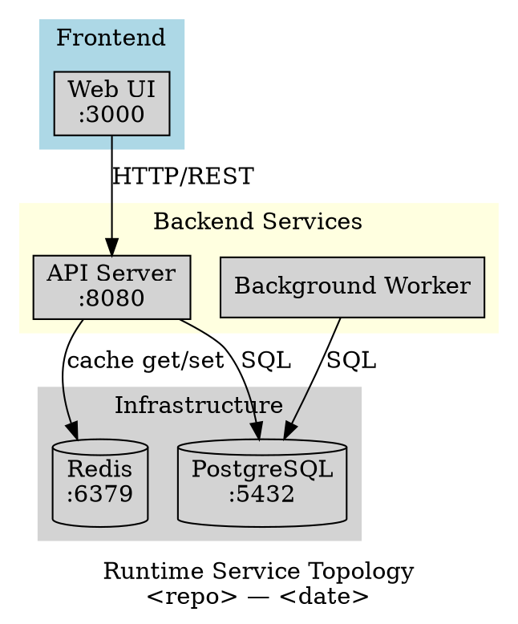
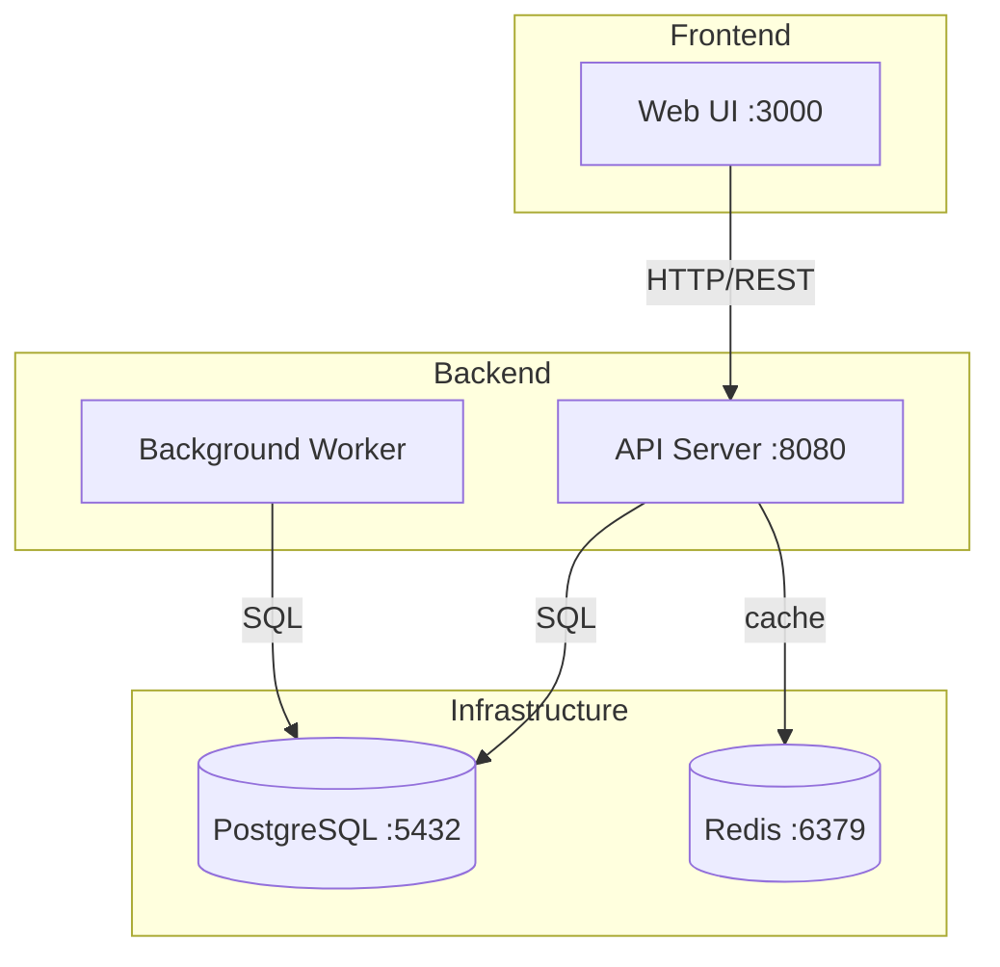
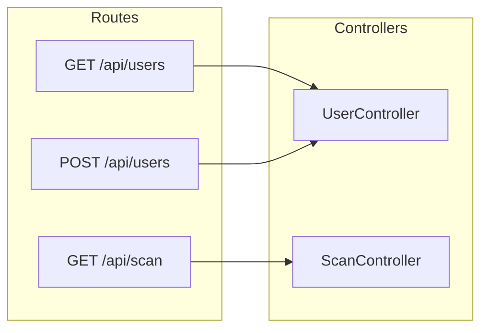
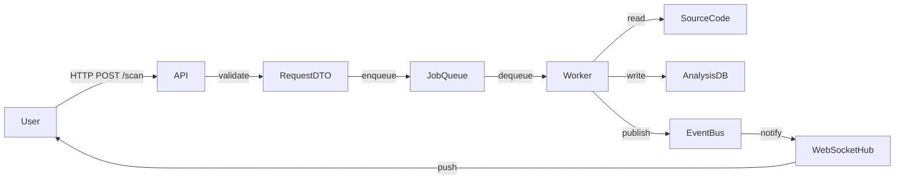
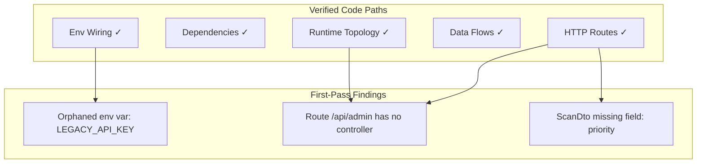
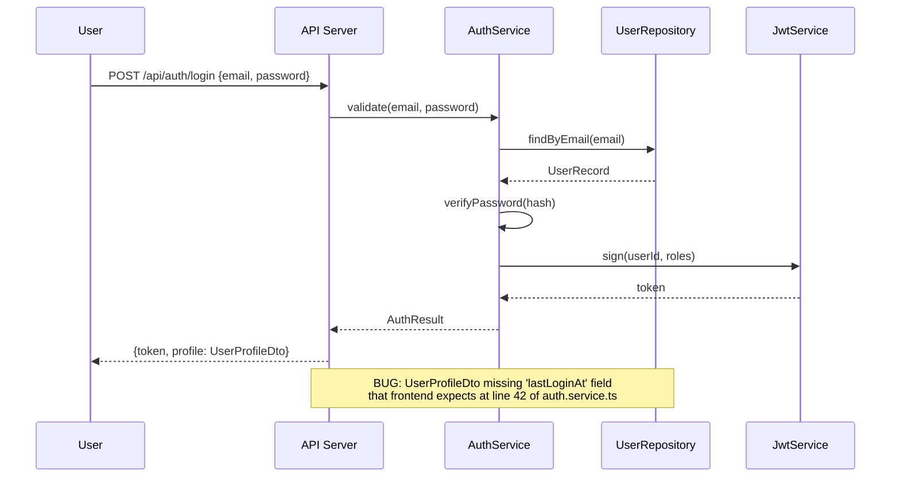

# Code Atlas Skill

## Purpose

This skill builds **living architecture atlases** from code-first truth sources and uses them as a
multi-pass, graph-based bug-hunting workflow. It is **language-agnostic**, exhaustive by default,
and treats diagram generation as an investigation method — not just documentation.

The key insight from issue #3171: **forcing LLMs to reason about code in graph form makes structural
bugs visible that linear reading misses**. Route/DTO mismatches, orphaned env vars, stale docs, and
dead runtime paths become obvious when compressed into graph form.

## Philosophy Alignment

- **Ruthless Simplicity**: Delegate diagram syntax to existing skills; focus on orchestration and
  investigation logic
- **Zero-BS**: Every diagram is generated from verified code paths, not assumptions
- **Brick Philosophy**: This skill is one orchestration brick; it composes code-visualizer,
  mermaid-diagram-generator, visualization-architect, and reviewer without duplicating their work
- **Code-First Truth**: Atlases are regenerated from code, not maintained by hand

## When to Use This Skill

| Situation | Why Code Atlas Helps |
|-----------|---------------------|
| Onboarding a new repository | Compress cross-file reasoning into navigable graphs |
| Pre-audit deep dive | Surface contradictions before manual review |
| Post-refactor verification | Confirm the intended topology matches the actual code |
| Living documentation | Atlas auto-updates on code change; no stale hand-drawn diagrams |
| Bug hunting | Graph-based contradiction hunting finds bugs linear reading misses |
| PR review | Visualize architecture impact of a change before merging |

## Skill Delegation Architecture

```
code-atlas (this skill — orchestrator)
├── Phase 1: Truth Source Inventory
│   └── analyzer agent (deep code investigation)
│
├── Phase 2: Atlas Generation
│   ├── code-visualizer skill (Python AST, staleness detection)
│   ├── mermaid-diagram-generator skill (Mermaid syntax)
│   └── visualization-architect agent (Graphviz DOT, complex layouts)
│
├── Phase 3: First-Pass Bug Hunt (Contradiction Detection)
│   └── reviewer agent (route/DTO/env contradiction hunting)
│
├── Phase 4: Second-Pass Scenario Graphs
│   └── visualization-architect agent (user journey diagrams)
│       └── reviewer agent (deeper scenario-level bugs)
│
└── Phase 5: Publication & Staleness Management
    └── (CI integration, GitHub Pages, mkdocs)
```

## The Five-Phase Workflow

### Phase 1 — Establish Code-First Truth Sources

Before generating any diagram, inventory the actual runtime/compile-time truth sources.
Do NOT start from existing documentation — it may be stale.

**Language-Agnostic Truth Sources to Inventory:**

```
Runtime composition:
  .NET/Aspire:   AppHost/Program.cs, appsettings.json, launchSettings.json
  Node.js:       server.ts/js, app.ts/js, docker-compose.yml
  Python:        main.py, wsgi.py, asgi.py, docker-compose.yml
  Go:            main.go, cmd/*/main.go
  Java/Spring:   Application.java, application.yml, Spring config
  Rust:          main.rs, Cargo.toml workspace

Routing / HTTP contracts:
  .NET:          Controllers/, MinimalAPI endpoints, YARP/nginx config
  Express/Fastify: routes/, app.use() chains
  FastAPI/Flask: @router decorators, Blueprint registrations
  Go:            mux.HandleFunc, gin.Group, http.Handle
  Rails:         routes.rb
  GraphQL:       schema.graphql, resolvers/

Frontend API surfaces:
  React/Vue/Angular: api/ clients, fetch/axios calls, OpenAPI clients
  Static analysis of all HTTP calls to backend

Compile-time dependencies:
  .NET:          *.csproj references, NuGet packages
  Node.js:       package.json dependencies
  Python:        pyproject.toml, requirements.txt
  Go:            go.mod
  Rust:          Cargo.toml

Environment wiring:
  All *.env, .env.*, docker-compose env_file, K8s ConfigMap/Secret refs
  Cross-reference: which service reads which env var?

Data models / DTOs:
  Request/response types at every API boundary
  Database schema files (migrations, ORM models)
```

**CRITICAL**: Cross-reference env vars against service owners. Mismatched wiring is a common bug.

### Phase 2 — Build the First-Pass Atlas

Generate diagrams in this order (highest signal-to-noise first):

#### 2a. Runtime Service Topology

Shows: all running services, their ports, network connections, external dependencies.





#### 2b. Compile-Time Dependency Graph

Shows: project references, package dependencies, build order.

For each language, extract and render:
- Direct project/module references
- Key external package dependencies (not all — filter to meaningful ones)
- Circular dependencies (flag as bugs)

#### 2c. HTTP Routing and Contracts

For EVERY API endpoint, produce:

| Route | Method | Controller/Handler | Request DTO | Response DTO | Auth Required |
|-------|--------|--------------------|-------------|--------------|---------------|
| /api/users | GET | UserController.List | ListUsersQuery | UserListDto[] | Yes (JWT) |
| /api/users/{id} | GET | UserController.Get | — | UserDto | Yes (JWT) |
| /api/scan | POST | ScanController.Start | ScanRequest | ScanJobDto | Yes (Admin) |

Then generate a routing diagram showing ownership:



#### 2d. Data Flow Diagram

Shows: how data moves from user input to storage and back.



#### 2e. Environment Variable Wiring Map

For every env var found, map: **source** (docker-compose / .env / K8s) → **consumer** (which service).

| Env Var | Defined In | Consumed By | Purpose |
|---------|-----------|-------------|---------|
| DATABASE_URL | docker-compose.yml | api, worker | Postgres connection string |
| REDIS_URL | .env.production | api | Cache connection |
| SECRET_KEY | K8s Secret | api | JWT signing |
| ~~LEGACY_API_KEY~~ | .env.example | ~~nowhere~~ | **ORPHANED — investigate** |

Flag: env vars defined but not consumed, and env vars consumed but not defined.

#### 2f. Verified Findings Map

After generating the above diagrams, produce a "findings topology" showing what was verified:



### Phase 3 — First-Pass Bug Hunt (Contradiction Detection)

After generating the atlas, invoke the **reviewer agent** to reason over the graphs and ask:

**Contradiction Checklist:**

```
Route integrity:
  □ Does every declared route have a real controller/handler?
  □ Does every frontend API call have a matching backend route?
  □ Are there routes in nginx/YARP that point to non-existent services?

DTO integrity:
  □ Does every route's request DTO match what the frontend actually sends?
  □ Does every route's response DTO match what the frontend expects to receive?
  □ Are there fields in DTOs that are never populated? Never read?

Environment wiring:
  □ Every env var consumed — is it defined in all environments?
  □ Every env var defined — is it actually consumed by something?
  □ Env vars pointing to service X — does X actually own that surface?

Runtime topology:
  □ Every service in the topology — does it actually start?
  □ Dead service stubs: service referenced but no implementation?
  □ Missing health checks for services in the topology?

Documentation drift:
  □ Does any README claim a service/route that no longer exists?
  □ Does any architecture doc describe a flow that was refactored away?
  □ Are there TODO/FIXME comments that reference resolved issues?
```

**Output format for each contradiction found:**

```markdown
## Bug: [Short Title]

**Type**: route-integrity | dto-mismatch | orphaned-env | dead-code | doc-drift
**Severity**: critical | high | medium | low
**Evidence**:
- `path/to/file.cs:42` — route declared: `GET /api/admin`
- `path/to/controller.cs` — no handler method found for this route
- Nginx config `nginx.conf:15` — proxies `/api/admin` to `adminService` which doesn't exist in AppHost

**Graph Node**: HTTP Routes → AdminController (missing edge)
**Recommended Action**: Either implement AdminController or remove the route declaration
```

### Phase 4 — Second-Pass Scenario Graphs

The first pass found structural contradictions. The second pass follows **specific user journeys** to
find deeper integration bugs that only appear when tracing end-to-end paths.

**How to define scenarios:**

```yaml
# atlas-scenarios.yml (place in repo root or docs/)
scenarios:
  - name: User Login Flow
    entry: POST /api/auth/login
    actor: anonymous_user
    steps:
      - validate_credentials
      - issue_jwt
      - return_user_profile
    expected_data_flow:
      - UserLoginRequest → AuthController
      - AuthController → UserRepository (read)
      - AuthController → JwtService (sign)
      - AuthController → UserProfileDto (response)

  - name: Scan Submission
    entry: POST /api/scan
    actor: authenticated_user
    steps:
      - validate_request
      - enqueue_job
      - return_job_id
    expected_data_flow:
      - ScanRequest → ScanController
      - ScanController → JobQueue (enqueue)
      - JobQueue → Worker (async)
      - Worker → AnalysisDB (write)
      - Worker → EventBus (publish)
```

For each scenario, generate a **sequence diagram** and then hunt for:
- Steps that are expected but have no code path
- Code paths that exist but are not in any scenario (dead flows)
- Data fields expected in one step that are dropped in a previous step



### Phase 5 — Publication and Staleness Management

#### 5a. File Layout Convention

```
docs/
  atlas/
    README.md                    # Atlas index and navigation
    runtime-topology.dot         # Graphviz source (version controlled)
    runtime-topology.svg         # Rendered (CI-generated, not hand-edited)
    runtime-topology.md          # Mermaid companion
    compile-dependencies.dot
    compile-dependencies.svg
    compile-dependencies.md
    http-routing.md              # Routing table + diagram
    data-flow.md
    env-wiring.md
    scenarios/
      login-flow.md
      scan-submission.md
    findings/
      FINDINGS.md                # All contradictions found
      issues/
        bug-001-orphaned-route.md
        bug-002-dto-mismatch.md
    ATLAS_META.json              # Staleness metadata
```

#### 5b. Staleness Metadata

```json
// docs/atlas/ATLAS_META.json
{
  "generated_at": "2025-01-15T10:30:00Z",
  "generator_version": "code-atlas@1.0.0",
  "source_hashes": {
    "AppHost/Program.cs": "sha256:abc123",
    "nginx.conf": "sha256:def456",
    "src/api/routes.ts": "sha256:ghi789"
  },
  "diagrams": [
    {
      "name": "runtime-topology",
      "format": "dot+svg+mermaid",
      "stale": false,
      "last_verified": "2025-01-15T10:30:00Z"
    }
  ],
  "findings_count": {
    "critical": 0,
    "high": 2,
    "medium": 5,
    "low": 3
  }
}
```

#### 5c. Staleness Detection Script

```bash
#!/bin/bash
# scripts/check-atlas-staleness.sh
# CI-safe staleness check. Exit 1 if atlas is stale.

ATLAS_META="docs/atlas/ATLAS_META.json"
TRUTH_SOURCES=(
    "AppHost/Program.cs"
    "nginx.conf"
    "docker-compose.yml"
    "src/api/routes.ts"
    "src/api/controllers"
)

if [ ! -f "$ATLAS_META" ]; then
    echo "ATLAS MISSING: docs/atlas/ATLAS_META.json not found"
    echo "Run: /amplihack:code-atlas to generate"
    exit 1
fi

ATLAS_DATE=$(jq -r '.generated_at' "$ATLAS_META")
STALE=false

for SOURCE in "${TRUTH_SOURCES[@]}"; do
    if [ -e "$SOURCE" ]; then
        # Check if source was modified after atlas generation
        SOURCE_DATE=$(git log -1 --format="%cI" -- "$SOURCE" 2>/dev/null)
        if [ -n "$SOURCE_DATE" ] && [ "$SOURCE_DATE" > "$ATLAS_DATE" ]; then
            echo "STALE: $SOURCE changed after atlas was generated"
            STALE=true
        fi
    fi
done

if [ "$STALE" = true ]; then
    echo "Atlas is stale. Run: /amplihack:code-atlas --incremental"
    exit 1
fi

echo "Atlas is fresh (generated: $ATLAS_DATE)"
exit 0
```

#### 5d. CI Integration

```yaml
# .github/workflows/atlas-check.yml
name: Atlas Freshness Check
on:
  push:
    paths:
      - "src/**"
      - "AppHost/**"
      - "nginx.conf"
      - "docker-compose.yml"

jobs:
  atlas-check:
    runs-on: ubuntu-latest
    steps:
      - uses: actions/checkout@v4
      - name: Check atlas staleness
        run: bash scripts/check-atlas-staleness.sh
      - name: Comment on PR if stale
        if: failure() && github.event_name == 'pull_request'
        uses: actions/github-script@v6
        with:
          script: |
            github.rest.issues.createComment({
              issue_number: context.issue.number,
              owner: context.repo.owner,
              repo: context.repo.repo,
              body: '⚠️ **Architecture atlas is stale.** Run `/amplihack:code-atlas --incremental` to update.'
            })
```

#### 5e. GitHub Pages Publication

```yaml
# .github/workflows/atlas-publish.yml
name: Publish Architecture Atlas
on:
  push:
    branches: [main]
    paths:
      - "docs/atlas/**"

jobs:
  render-and-publish:
    runs-on: ubuntu-latest
    steps:
      - uses: actions/checkout@v4

      - name: Install Graphviz
        run: sudo apt-get install -y graphviz

      - name: Render DOT to SVG
        run: |
          for dotfile in docs/atlas/*.dot; do
            svgfile="${dotfile%.dot}.svg"
            dot -Tsvg "$dotfile" -o "$svgfile"
            echo "Rendered: $svgfile"
          done

      - name: Build MkDocs site
        uses: mhausenblas/mkdocs-deploy-gh-pages@master
        env:
          GITHUB_TOKEN: ${{ secrets.GITHUB_TOKEN }}
          CONFIG_FILE: docs/atlas/mkdocs.yml
```

```yaml
# docs/atlas/mkdocs.yml
site_name: Architecture Atlas
nav:
  - Home: README.md
  - Runtime Topology: runtime-topology.md
  - Dependencies: compile-dependencies.md
  - HTTP Routing: http-routing.md
  - Data Flows: data-flow.md
  - Environment Wiring: env-wiring.md
  - User Journeys:
    - Login Flow: scenarios/login-flow.md
    - Scan Submission: scenarios/scan-submission.md
  - Findings: findings/FINDINGS.md

theme:
  name: material
  features:
    - navigation.tabs
    - search.suggest
```

## Execution Checklist

When invoked, follow this checklist in order:

```
Phase 1 — Inventory (do not skip)
  □ Identify language(s) and framework(s)
  □ Locate runtime composition entry point(s)
  □ List all HTTP routing files
  □ List all DTO/model files
  □ List all env var sources
  □ Confirm disk space and tooling (graphviz, mermaid CLI if available)

Phase 2 — Atlas Generation
  □ Runtime service topology (DOT + Mermaid)
  □ Compile-time dependency graph
  □ HTTP routing table + diagram
  □ Data flow diagram
  □ Environment variable wiring map
  □ Verified findings map (what was confirmed)
  □ Write docs/atlas/ATLAS_META.json

Phase 3 — First-Pass Bug Hunt
  □ Route integrity check
  □ DTO integrity check
  □ Environment wiring check
  □ Documentation drift check
  □ File issues for each contradiction found

Phase 4 — Second-Pass Scenario Graphs (mandatory, not optional)
  □ Identify 3-5 key user journeys
  □ Generate sequence diagram per journey
  □ Hunt for missing steps, dead flows, dropped fields
  □ File additional issues from scenario analysis

Phase 5 — Publication
  □ Write all diagrams to docs/atlas/
  □ Render SVG companions if graphviz available
  □ Update ATLAS_META.json with new hashes
  □ Optionally: commit, push, trigger GitHub Pages build
```

## Invocation Patterns

### Full Atlas Build

```
/amplihack:code-atlas
```

Runs all 5 phases. Prompts for confirmation before filing issues.

### Incremental Rebuild

```
/amplihack:code-atlas --incremental
```

Checks ATLAS_META.json source hashes, regenerates only stale diagrams.
Still runs full contradiction check on changed areas.

### Bug Hunt Only (Existing Atlas)

```
/amplihack:code-atlas --hunt-only
```

Skips diagram generation. Uses existing atlas to run contradiction checks.
Useful for: checking if previously found bugs were fixed.

### Scenario Analysis Only

```
/amplihack:code-atlas --scenarios
```

Runs Phase 4 only against an existing atlas. Good for: adding new user journeys.

### Single Diagram

```
/amplihack:code-atlas --diagram runtime-topology
/amplihack:code-atlas --diagram http-routing
/amplihack:code-atlas --diagram data-flow
```

### Publish Only

```
/amplihack:code-atlas --publish
```

Re-renders SVGs and updates GitHub Pages without re-analyzing code.

## Output Summary Template

At completion, produce a summary in this format:

```markdown
## Code Atlas — Build Summary

**Repository**: <repo-name>
**Generated**: <timestamp>
**Mode**: full | incremental | hunt-only | scenarios

### Diagrams Generated
| Diagram | Format | Status | File |
|---------|--------|--------|------|
| Runtime Topology | DOT + SVG + Mermaid | ✓ fresh | docs/atlas/runtime-topology.* |
| Compile Dependencies | DOT + SVG | ✓ fresh | docs/atlas/compile-dependencies.* |
| HTTP Routing | Mermaid + Table | ✓ fresh | docs/atlas/http-routing.md |
| Data Flow | Mermaid | ✓ fresh | docs/atlas/data-flow.md |
| Env Wiring | Table | ✓ fresh | docs/atlas/env-wiring.md |

### Bug Hunt Results

**First Pass** — 8 contradictions found:
- 🔴 2 Critical: [route → no handler], [env var consumed but never defined]
- 🟠 3 High: [DTO field mismatch × 2], [stale README service reference]
- 🟡 2 Medium: [unused env vars × 2]
- 🟢 1 Low: [comment references resolved issue]

**Second Pass** — 3 additional findings from scenario analysis:
- 🟠 1 High: Login flow drops `lastLoginAt` before returning UserProfileDto
- 🟡 2 Medium: Scan scenario has undocumented 30s timeout; filter field accepted but ignored

### Issues Filed
- #42 — Critical: Route /api/admin has no controller
- #43 — Critical: LEGACY_API_KEY consumed by AuthService but never defined
- #44 — High: ScanDto.priority field missing from response DTO

### Atlas Location
- HTML (GitHub Pages): https://<org>.github.io/<repo>/atlas/
- Source: docs/atlas/
- Metadata: docs/atlas/ATLAS_META.json
```

## Important Limitations

**What this skill does NOT do:**

- **Does not guarantee completeness**: Dynamic routing (reflection, plugin systems) may be missed
- **Does not replace security scanning**: Use dedicated SAST tools for vulnerability analysis
- **Does not run tests**: Atlas is static analysis; use test suite to verify runtime behavior
- **Staleness detection is hash-based**: Semantically identical refactors may still trigger staleness

**Accuracy expectations:**

| Check Type | Expected Accuracy | Notes |
|-----------|------------------|-------|
| Route → Controller mapping | 90%+ | Misses reflection-based routing |
| Env var ownership | 85%+ | Misses runtime env injection |
| DTO field matching | 80%+ | Requires comparable type names |
| Doc drift detection | 70%+ | Requires doc references to be linkable |
| Scenario path completeness | 75%+ | Better with explicit scenario definitions |

## Dependencies

This skill requires at least one of:
- **graphviz** (`dot` CLI): For DOT rendering to SVG
- **mermaid CLI** (`mmdc`): For Mermaid rendering to SVG/PNG (optional, Markdown-native Mermaid always works)
- **git**: For source hash tracking and staleness detection

If graphviz is not installed, this skill will:
1. Attempt to install it (`sudo apt-get install -y graphviz` or `brew install graphviz`)
2. Fall back to Mermaid-only output if installation fails
3. Document the limitation in ATLAS_META.json

## Relationship to Existing Skills

This skill **composes**, never duplicates:

| Capability | Handled By |
|-----------|-----------|
| Python AST parsing | code-visualizer (delegate) |
| Mermaid syntax generation | mermaid-diagram-generator (delegate) |
| Complex multi-level layout | visualization-architect agent (delegate) |
| Deep code investigation | analyzer agent (delegate) |
| Contradiction checking | reviewer agent (delegate) |
| **Orchestration of all above** | **this skill** |
| **Language-agnostic truth inventory** | **this skill** |
| **Multi-pass bug hunting workflow** | **this skill** |
| **Publication + staleness management** | **this skill** |
| **Scenario graph generation** | **this skill** |

The code-visualizer skill is Python-specific and import-centric. Code Atlas extends the concept
to all languages, all API surfaces, and adds the investigation workflow that makes it a bug-finding
tool rather than just a documentation tool.
