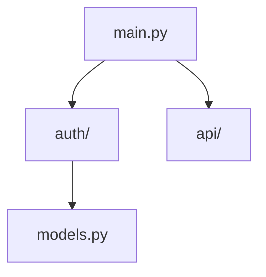

# Code Visualizer

Auto-generates and maintains visual code flow diagrams from Python module analysis.

## Quick Start

Simply describe what you want:

```
Generate a code flow diagram for the auth module
```

```
Check if my architecture diagrams are up to date
```

```
Show what architecture changes this PR introduces
```

## Features

### Auto-Generation

Analyzes Python imports and generates mermaid diagrams:



### Staleness Detection

Warns when diagrams become out of sync with code:

```
STALE: README.md diagram (last updated: Jan 1, code changed: Jan 15)
Missing: new_module.py, api/v2.py
```

### PR Impact Analysis

Shows architecture changes in pull requests:

- New modules added
- Changed dependencies
- Deleted relationships

## How It Works

1. **Analyze**: Parse Python files for imports and classes
2. **Generate**: Create mermaid diagrams from relationships
3. **Monitor**: Compare timestamps to detect staleness
4. **Report**: Provide freshness status and recommendations

## Integration

Works with:

- `mermaid-diagram-generator` skill for diagram syntax
- `visualization-architect` agent for complex diagrams
- PR review workflow for impact analysis

## Philosophy

Follows amplihack principles:

- **Ruthless Simplicity**: Auto-generate what humans forget
- **Zero-BS**: Diagrams must reflect actual code
- **Modular**: Each diagram covers one scope
