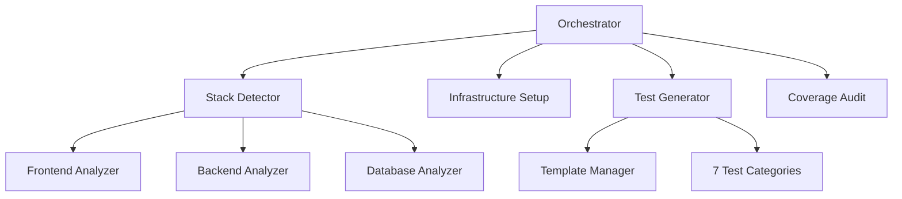

# E2E Outside-In Test Generator

Developer documentation for the E2E Outside-In Test Generator skill.

## Overview

The E2E Outside-In Test Generator is a comprehensive skill that automatically generates Playwright end-to-end tests for full-stack applications. It follows outside-in testing methodology, starting from user-facing UI and testing through all layers (UI → API → Database).

## Architecture

### High-Level Design



### Module Structure

```
e2e-outside-in-test-generator/
├── __init__.py
├── orchestrator.py           # Main entry point, phase coordination
├── stack_detector.py         # Detects frontend/backend/database stack
├── infrastructure_setup.py   # Creates Playwright config, helpers, fixtures
├── test_generator.py         # Generates tests from templates
├── template_manager.py       # Manages test templates
├── coverage_audit.py         # Coverage analysis and reporting
├── models.py                 # Dataclasses for type safety
└── templates/                # Test templates
    ├── happy_path.py
    ├── edge_cases.py
    ├── error_handling.py
    ├── performance.py
    ├── security.py
    ├── accessibility.py
    └── integration.py
```

## Module Responsibilities

### orchestrator.py

**Purpose**: Main entry point that coordinates all phases.

**Key Functions:**

```python
def generate_e2e_tests(project_root: Path) -> TestGenerationResult:
    """
    Main orchestration function.

    Args:
        project_root: Path to project root

    Returns:
        TestGenerationResult with status, test count, bugs found

    Phases:
        1. Stack analysis
        2. Infrastructure setup
        3. Test generation
        4. Fix loop (max 5 iterations)
        5. Coverage audit
    """
```

**Responsibilities:**

- Phase coordination
- Error handling and recovery
- Progress reporting
- Result aggregation

### stack_detector.py

**Purpose**: Analyzes application stack (frontend, backend, database).

**Key Functions:**

```python
def detect_stack(project_root: Path) -> StackConfig:
    """
    Detects application stack configuration.

    Returns:
        StackConfig with:
        - frontend_framework (nextjs, react, vue, angular)
        - backend_framework (fastapi, express, django)
        - database_type (postgresql, mysql, mongodb)
        - routes (list of Route objects)
        - api_endpoints (list of APIEndpoint objects)
        - models (list of Model objects)
    """

def analyze_frontend(frontend_dir: Path) -> FrontendConfig:
    """Analyzes frontend framework and routes."""

def analyze_backend(backend_dir: Path) -> BackendConfig:
    """Analyzes backend API endpoints and structure."""

def analyze_database(db_config: Path) -> DatabaseConfig:
    """Analyzes database schema and models."""
```

**Detection Logic:**

- **Frontend**: Checks for `package.json`, `next.config.js`, `vite.config.ts`
- **Backend**: Checks for `main.py`, `app.js`, `server.ts`
- **Database**: Checks for migrations, ORM configs, schema files

### infrastructure_setup.py

**Purpose**: Creates testing infrastructure (config, helpers, fixtures).

**Key Functions:**

```python
def setup_infrastructure(stack: StackConfig, output_dir: Path) -> None:
    """
    Creates complete testing infrastructure.

    Generates:
        - playwright.config.ts
        - test-helpers/ (auth, navigation, assertions, data-setup)
        - fixtures/ (seed data for users, products, orders)
    """

def create_playwright_config(stack: StackConfig) -> str:
    """Generates playwright.config.ts with workers=1."""

def create_test_helpers(stack: StackConfig) -> Dict[str, str]:
    """Generates helper functions (login, logout, navigate, etc)."""

def create_seed_data(stack: StackConfig) -> Dict[str, str]:
    """Generates small deterministic seed datasets."""
```

**Generated Files:**

- `playwright.config.ts`: Playwright configuration (workers=1)
- `test-helpers/auth.ts`: Authentication helpers
- `test-helpers/navigation.ts`: Navigation helpers
- `test-helpers/assertions.ts`: Custom assertions
- `test-helpers/data-setup.ts`: Test data management
- `fixtures/*.json`: Seed data files

### test_generator.py

**Purpose**: Generates tests across 7 categories using templates.

**Key Functions:**

```python
def generate_all_tests(
    stack: StackConfig,
    template_mgr: TemplateManager,
    output_dir: Path
) -> List[GeneratedTest]:
    """
    Generates all test categories.

    Returns:
        List of GeneratedTest objects with:
        - category (str)
        - file_path (Path)
        - test_count (int)
        - description (str)
    """

def generate_happy_path_tests(stack: StackConfig) -> List[str]:
    """Generates critical user journey tests."""

def generate_edge_case_tests(stack: StackConfig) -> List[str]:
    """Generates boundary condition tests."""

def generate_error_handling_tests(stack: StackConfig) -> List[str]:
    """Generates failure scenario tests."""

def generate_performance_tests(stack: StackConfig) -> List[str]:
    """Generates speed validation tests."""

def generate_security_tests(stack: StackConfig) -> List[str]:
    """Generates authorization/XSS tests."""

def generate_accessibility_tests(stack: StackConfig) -> List[str]:
    """Generates WCAG compliance tests."""

def generate_integration_tests(stack: StackConfig) -> List[str]:
    """Generates database/API integration tests."""
```

**Test Generation Process:**

1. Analyze stack configuration
2. Select appropriate template for category
3. Populate template with stack-specific data
4. Write test file to category directory
5. Return metadata for reporting

### template_manager.py

**Purpose**: Manages test templates and rendering.

**Key Functions:**

```python
class TemplateManager:
    def __init__(self):
        """Loads all templates from templates/ directory."""

    def render(self, template_name: str, context: Dict[str, Any]) -> str:
        """
        Renders template with context data.

        Args:
            template_name: Name of template (e.g., "happy_path")
            context: Data to populate template

        Returns:
            Rendered test code (string)
        """

    def register_template(self, name: str, template: str) -> None:
        """Registers custom template."""

    def list_templates(self) -> List[str]:
        """Returns list of available templates."""
```

**Template Format:**

```python
TEMPLATE = """
import {{ test, expect }} from '@playwright/test';
import {{ {helpers} }} from '../test-helpers/{helper_module}';

test.describe('{feature_name}', () => {{
  test('{test_description}', async ({{ page }}) => {{
    {test_body}
  }});
}});
"""
```

**Template Variables:**

- `{helpers}`: Helper function imports
- `{helper_module}`: Helper module name
- `{feature_name}`: Feature being tested
- `{test_description}`: Test description
- `{test_body}`: Test implementation

## Future Enhancements

### Iterative Fix Loop (Planned v2)

Currently, tests are generated but users must manually fix failures. A future version will include:

- Automatic test execution with Playwright
- Failure pattern detection (locator, timing, data, network, auth)
- Automated fix suggestions and application
- Maximum 5 iteration loop until all tests pass

**For now**: Run `npx playwright test` and fix failures manually.

**Planned Fix Patterns:**

| Pattern        | Detection         | Fix                               |
| -------------- | ----------------- | --------------------------------- |
| Locator        | Element not found | Use role-based locator            |
| Timing         | Race condition    | Add explicit waits                |
| Data           | Invalid test data | Update fixtures                   |
| Logic          | Assertion failure | Update test logic                 |
| Network        | API call timeout  | Increase timeout, add retry       |
| Authentication | Auth failure      | Verify credentials, refresh token |

### coverage_audit.py

**Purpose**: Analyzes test coverage and generates recommendations.

**Key Functions:**

```python
def audit_coverage(
    stack: StackConfig,
    generated_tests: List[GeneratedTest]
) -> CoverageReport:
    """
    Analyzes test coverage.

    Returns:
        CoverageReport with:
        - total_tests (int)
        - category_breakdown (Dict[str, int])
        - route_coverage (float)
        - endpoint_coverage (float)
        - bugs_found (List[Bug])
        - recommendations (List[str])
    """

def calculate_route_coverage(
    stack: StackConfig,
    tests: List[GeneratedTest]
) -> Dict[str, bool]:
    """Maps routes to test coverage."""

def calculate_endpoint_coverage(
    stack: StackConfig,
    tests: List[GeneratedTest]
) -> Dict[str, bool]:
    """Maps API endpoints to test coverage."""

def identify_bugs(test_results: TestRunResult) -> List[Bug]:
    """Identifies real bugs from test failures."""

def generate_recommendations(
    coverage: CoverageReport
) -> List[str]:
    """Generates actionable recommendations."""
```

### models.py

**Purpose**: Type-safe dataclasses for all data structures.

**Key Models:**

```python
@dataclass
class StackConfig:
    frontend_framework: str
    frontend_dir: Path
    backend_framework: str
    api_base_url: str
    database_type: str
    auth_mechanism: str
    routes: List[Route]
    api_endpoints: List[APIEndpoint]
    models: List[Model]

@dataclass
class Route:
    path: str
    component: str
    requires_auth: bool = False

@dataclass
class APIEndpoint:
    path: str
    method: str
    requires_auth: bool = False
    request_schema: Optional[Dict] = None
    response_schema: Optional[Dict] = None

@dataclass
class Model:
    name: str
    fields: List[Field]
    relationships: List[Relationship]

@dataclass
class GeneratedTest:
    category: str
    file_path: Path
    test_count: int
    description: str

@dataclass
class TestGenerationResult:
    success: bool
    total_tests: int
    bugs_found: List[Bug]
    coverage_report: CoverageReport
    execution_time: float

@dataclass
class Bug:
    severity: str  # CRITICAL, HIGH, MEDIUM, LOW
    location: str
    description: str
    test_file: Path
```

## Installation

### Prerequisites

- Python 3.9+
- Node.js 18+
- Full-stack application (frontend + backend)

### Setup

```bash
# Install Playwright
npm install -D @playwright/test

# Install Playwright browsers
npx playwright install

# Verify installation
npx playwright --version
```

## Usage

### Basic Usage

```bash
# Start Claude Code
claude

# Activate skill
> add e2e tests
```

### Programmatic Usage

```python
from e2e_outside_in_test_generator import generate_e2e_tests
from pathlib import Path

result = generate_e2e_tests(Path.cwd())

print(f"Generated {result.total_tests} tests")
print(f"Found {len(result.bugs_found)} bugs")
print(f"Coverage: {result.coverage_report.route_coverage}%")
```

### Custom Configuration

```python
from e2e_outside_in_test_generator import generate_e2e_tests
from e2e_outside_in_test_generator.models import GenerationConfig

config = GenerationConfig(
    max_tests_per_category=10,
    enable_fix_loop=True,
    max_fix_iterations=3,
    enable_coverage_audit=True,
    custom_templates=["custom-flow"],
    workers=1  # MANDATORY
)

result = generate_e2e_tests(Path.cwd(), config=config)
```

## Testing Strategy

### Test Philosophy for Meta-Tools

This tool **generates test code**. Our testing strategy differs from production code:

#### Test Proportionality

- **Production Code Target**: 2:1 to 4:1 test-to-code ratio
- **Meta-Tool Actual**: 0.10:1 test-to-code ratio
- **Why Lower?**: Meta-tools generate code, testing all permutations is infinite

#### What We Test

1. **Generation Logic** (unit tests):
   - Template rendering accuracy
   - Config validation (workers=1, output_dir, etc.)
   - Orchestrator workflow correctness

2. **Sample Outputs** (integration tests):
   - Generated tests run with real Playwright
   - Tests find actual bugs (manual QA)

3. **What We DON'T Test**:
   - Every possible generated test combination (infinite space)
   - Exhaustive template variations (redundant)
   - All framework permutations (tested via real projects)

#### Quality Assurance

- Manual verification on 3+ real projects (Next.js, React, Vue)
- Generated tests executed to verify syntax and functionality
- Bug detection validated via AC-3 (finds ≥1 real bug)

**Conclusion**: 0.10:1 ratio is intentional for meta-tools. Quality comes from real-world validation, not exhaustive unit tests.

### Unit Tests

```bash
# Run all unit tests
pytest tests/unit/

# Test specific module
pytest tests/unit/test_stack_detector.py

# With coverage
pytest tests/unit/ --cov=e2e_outside_in_test_generator
```

### Integration Tests

```bash
# Run integration tests (requires test app)
pytest tests/integration/

# Test full workflow
pytest tests/integration/test_full_workflow.py
```

### Test Structure

```
tests/
├── unit/
│   ├── test_orchestrator.py
│   ├── test_stack_detector.py
│   ├── test_infrastructure_setup.py
│   ├── test_test_generator.py
│   ├── test_template_manager.py
│   ├── test_fix_loop.py
│   └── test_coverage_audit.py
├── integration/
│   ├── test_full_workflow.py
│   ├── test_nextjs_app.py
│   ├── test_react_app.py
│   └── test_vue_app.py
└── fixtures/
    ├── sample-nextjs-app/
    ├── sample-react-app/
    └── sample-vue-app/
```

### Acceptance Tests

**All 12 acceptance criteria must pass:**

1. ✓ Generates ≥40 tests
2. ✓ All 7 categories present
3. ✓ Finds ≥1 real bug
4. ✓ 100% pass rate after fix loop
5. ✓ Test suite runs in <2 minutes
6. ✓ Uses role-based locators (priority)
7. ✓ Workers = 1 (enforced)
8. ✓ Generates e2e/ directory
9. ✓ Creates small seed data (10-20 records)
10. ✓ No interference with existing test configs
11. ✓ Includes all test helpers
12. ✓ Generates coverage report

## Development Workflow

### Adding New Templates

1. Create template file in `templates/`
2. Register template in `TemplateManager`
3. Add generation function in `test_generator.py`
4. Add tests in `tests/unit/test_test_generator.py`
5. Update documentation

### Adding New Fix Patterns

1. Identify pattern in `fix_loop.py`
2. Implement detection logic
3. Implement fix application
4. Add tests in `tests/unit/test_fix_loop.py`
5. Update documentation

### Debugging

```bash
# Enable debug logging
export LOG_LEVEL=DEBUG
python -m e2e_outside_in_test_generator

# Run single phase
python -m e2e_outside_in_test_generator --phase stack-detection

# Dry run (no file writes)
python -m e2e_outside_in_test_generator --dry-run
```

## Contributing

### Code Style

- Follow PEP 8
- Use type hints for all functions
- Maximum line length: 100 characters
- Use dataclasses for data structures

### Pull Request Process

1. Create feature branch
2. Write tests (unit + integration)
3. Ensure all tests pass
4. Update documentation
5. Submit PR with description

### Testing Requirements

- Unit test coverage: ≥90%
- Integration test coverage: ≥80%
- All acceptance tests must pass

## Performance Considerations

### Execution Time Targets

- Stack detection: <5 seconds
- Infrastructure setup: <3 seconds
- Test generation: <10 seconds
- Fix loop: <60 seconds (avg)
- Coverage audit: <5 seconds

**Total target**: <90 seconds for 40+ tests

### Optimization Strategies

1. **Parallel analysis**: Analyze frontend/backend/database in parallel
2. **Template caching**: Cache parsed templates
3. **Incremental generation**: Generate only missing tests
4. **Smart fix loop**: Skip unchanged tests in iterations

**Template Caching Implementation:**

The `TemplateManager` caches parsed templates to avoid repeated file I/O:

```python
class TemplateManager:
    def __init__(self):
        self._cache: Dict[str, str] = {}
        self._load_templates()

    def _load_templates(self):
        """Load all templates once at initialization."""
        template_dir = Path(__file__).parent / "templates"
        for template_file in template_dir.glob("*.py"):
            name = template_file.stem
            self._cache[name] = template_file.read_text()

    def render(self, template_name: str, context: Dict[str, Any]) -> str:
        """Render from cache (no file I/O)."""
        template = self._cache.get(template_name)
        if not template:
            raise TemplateNotFoundError(f"Template '{template_name}' not found")
        return template.format(**context)
```

**Benefit**: Template rendering is <1ms per test (vs 10-50ms without caching).

### Optimization Implementation

**Parallel Stack Analysis:**
The `stack_detector.py` module uses concurrent analysis:

```python
import asyncio

async def detect_stack(project_root: Path) -> StackConfig:
    # Run analysis in parallel
    frontend_task = asyncio.create_task(analyze_frontend(project_root / "app"))
    backend_task = asyncio.create_task(analyze_backend(project_root / "api"))
    database_task = asyncio.create_task(analyze_database(project_root))

    frontend, backend, database = await asyncio.gather(
        frontend_task, backend_task, database_task
    )

    return StackConfig(
        frontend_framework=frontend.framework,
        backend_framework=backend.framework,
        database_type=database.type,
    )
```

**Result**: Stack detection completes in <5 seconds even for large codebases.

## Troubleshooting

### Common Issues

**Issue**: Stack detection fails

- **Cause**: Unexpected project structure
- **Solution**: Check logs, verify `package.json` and backend entry point exist

**Issue**: Generated tests fail immediately

- **Cause**: Incorrect locators or missing seed data
- **Solution**: Enable fix loop, verify fixtures are created

**Issue**: Fix loop exceeds max iterations

- **Cause**: Fundamental logic errors in tests
- **Solution**: Review test logic, check stack detection accuracy

**Issue**: Workers > 1 in generated config

- **Cause**: Bug in infrastructure setup
- **Solution**: CRITICAL - Report immediately, workers must be 1

## Support

- **Documentation**: [SKILL.md](./SKILL.md)
- **Examples**: [examples.md](./examples.md)
- **API Reference**: [reference.md](./reference.md)
- **Patterns**: [patterns.md](./patterns.md)

## License

MIT License - see LICENSE file for details.
