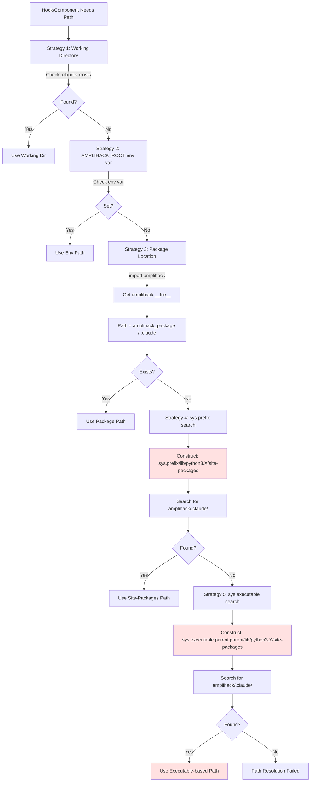

# Team Alpha: Plugin System Architecture Map

## Executive Summary

The amplihack plugin system has **two distinct installation modes**:

1. **Native Plugin Mode** (via Claude Code's plugin system): Uses `~/.amplihack/.claude/` as centralized installation
2. **UVX Fallback Mode** (when Claude CLI unavailable): Falls back to per-project `~/.amplihack/.claude/` directory copy

The error path `/home/azureuser/.cache/uv/archive-v0/.../lib/python3.12/site-packages` originates from:
- **Proxy server path resolution** attempting to locate `amplihack.proxy.server` in UVX environments
- **Hook manager** searching for bundled hooks in installed package locations

## Component Architecture

```mermaid
graph TB
    CLI[amplihack CLI Entry Point<br/>src/amplihack/cli.py] --> |UVX Mode Detected| UVX_SETUP[UVX Setup Handler<br/>Lines 697-875]
    CLI --> |Local Mode| LOCAL_SETUP[Local Setup Handler]

    UVX_SETUP --> |Step 1| DETECT[is_uvx_deployment<br/>Check: .cache/uv/ in sys.executable]
    UVX_SETUP --> |Step 2| PLUGIN_CHECK[Check for Plugin Manifest<br/>amplihack/.claude-plugin/plugin.json]

    PLUGIN_CHECK --> |Found| NATIVE_FLOW[Native Plugin Installation Flow]
    PLUGIN_CHECK --> |Not Found| FALLBACK_FLOW[Fallback: Directory Copy]

    NATIVE_FLOW --> |Step 3| CLAUDE_CLI[Ensure Claude CLI<br/>utils/claude_cli.py]
    CLAUDE_CLI --> |Auto-Install| NPM[npm install -g @anthropic-ai/claude-code<br/>Target: ~/.npm-global/bin/]
    CLAUDE_CLI --> |Found| CLI_PATH[Return: claude binary path]

    NATIVE_FLOW --> |Step 4| PLUGIN_INSTALL[subprocess.run<br/>claude plugin install package_root]

    PLUGIN_INSTALL --> |Delegates to| PLUGIN_MGR[PluginManager.install<br/>src/amplihack/plugin_manager/manager.py]

    PLUGIN_MGR --> |Step 5a| VALIDATE[validate_manifest<br/>Check: name, version, entry_point]
    PLUGIN_MGR --> |Step 5b| COPY[shutil.copytree<br/>Source: package_root<br/>Target: ~/.amplihack/.claude/plugins/amplihack]
    PLUGIN_MGR --> |Step 5c| REGISTER[_register_plugin<br/>Update: ~/.config/claude-code/plugins.json]

    REGISTER --> |Add to| ENABLED_PLUGINS[enabledPlugins: ['amplihack']]

    NATIVE_FLOW --> |Step 6| SETTINGS_GEN[Generate settings.json<br/>Path: project/.claude/settings.json]
    SETTINGS_GEN --> |Contains| HOOK_REFS[Hook References with ${CLAUDE_PLUGIN_ROOT}]

    FALLBACK_FLOW --> |Copy to| PROJECT_CLAUDE[project/.claude/]

    style CLI fill:#e1f5ff
    style PLUGIN_MGR fill:#fff4e1
    style PROXY_RESOLVE fill:#ffe1e1
    style HOOK_MANAGER fill:#ffe1e1
```

## Plugin Installation Lifecycle

### Phase 1: Discovery (UVX Detection)

**Location**: `src/amplihack/cli.py:697-742`

```python
# Detection: Check if running from UV cache
def is_uvx_deployment() -> bool:
    import sys
    return ".cache/uv/" in sys.executable or "\\cache\\uv\\" in sys.executable
```

**Result**: Boolean flag determining installation strategy

### Phase 2: Plugin Manifest Check

**Location**: `src/amplihack/cli.py:744-757`

```python
plugin_manifest = amplihack_package / ".claude-plugin" / "plugin.json"
if not plugin_manifest.exists():
    # FALLBACK PATH: Use directory copy
    # Falls back to old copytree approach
else:
    # NATIVE PATH: Use plugin system
```

**Critical File**: `src/amplihack/.claude-plugin/plugin.json`

### Phase 3: Claude CLI Acquisition

**Location**: `src/amplihack/utils/claude_cli.py`

**Flow**:
1. **Search PATH**: `shutil.which("claude")` → Check existing installations
2. **Auto-Install** (if not found):
   ```python
   # Configure user-local npm
   user_npm_dir = Path.home() / ".npm-global"
   env["NPM_CONFIG_PREFIX"] = str(user_npm_dir)

   # Install to user directory
   subprocess.run([
       npm_path, "install", "-g",
       "--prefix", str(user_npm_dir),
       "@anthropic-ai/claude-code",
       "--ignore-scripts"
   ])
   ```
3. **Validate**: Run `claude --version` to verify binary works
4. **Retry Logic**: If validation fails, remove binary and retry once

**Output**: Path to `claude` binary (typically `~/.npm-global/bin/claude`)

### Phase 4: Plugin Installation

**Location**: `src/amplihack/cli.py:775-792`

```python
# Call: claude plugin install <path>
result = subprocess.run(
    [claude_path, "plugin", "install", str(package_root)],
    capture_output=True,
    text=True,
    timeout=60
)
```

**Delegates to**: Claude CLI's plugin system → `PluginManager.install()`

### Phase 5: PluginManager Operations

**Location**: `src/amplihack/plugin_manager/manager.py:128-280`

#### Step 5a: Validation

```python
def validate_manifest(self, manifest_path: Path) -> ValidationResult:
    # Required fields: name, version, entry_point
    # Version format: semantic versioning (major.minor.patch)
    # Name format: lowercase letters, numbers, hyphens

    # Path traversal protection:
    manifest_path = (source_path / ".claude-plugin" / "plugin.json").resolve()
    if not self._validate_path_safety(manifest_path, source_path):
        return error
```

#### Step 5b: File Copy

```python
# Target: ~/.amplihack/.claude/plugins/amplihack
target_path = self.plugin_root / plugin_name

# Create directory structure
self.plugin_root.mkdir(parents=True, exist_ok=True)

# Copy all plugin files
shutil.copytree(source_path, target_path)
```

#### Step 5c: Registration

**Location**: `manager.py:363-402`

```python
def _register_plugin(self, plugin_name: str) -> bool:
    """Register plugin in Claude Code settings."""
    settings_path = Path.home() / ".config" / "claude-code" / "plugins.json"

    # Load or create settings
    settings = json.loads(settings_path.read_text()) if settings_path.exists() else {}

    # Add to enabledPlugins array
    if 'enabledPlugins' not in settings:
        settings['enabledPlugins'] = []

    if plugin_name not in settings['enabledPlugins']:
        settings['enabledPlugins'].append(plugin_name)

    # Write back
    settings_path.write_text(json.dumps(settings, indent=2))
```

### Phase 6: Settings Generation

**Location**: `src/amplihack/cli.py:794-860`

Creates `project/.claude/settings.json` with hook references:

```json
{
  "hooks": {
    "SessionStart": [{
      "hooks": [{
        "type": "command",
        "command": "${CLAUDE_PLUGIN_ROOT}/tools/amplihack/hooks/session_start.py",
        "timeout": 10000
      }]
    }],
    "Stop": [{
      "hooks": [{
        "type": "command",
        "command": "${CLAUDE_PLUGIN_ROOT}/tools/amplihack/hooks/stop.py",
        "timeout": 30000
      }]
    }]
  }
}
```

**Environment Variable Set**:
```python
os.environ["CLAUDE_PLUGIN_ROOT"] = str(plugin_root)  # ~/.amplihack/.claude
```

## Path Resolution Flow

### Runtime Path Resolution

When Claude Code launches, it resolves paths through multiple strategies:



## Error Path Construction Sites

### Site 1: Proxy Server Resolution

**Location**: `src/amplihack/proxy/manager.py:674-689`

```python
server_candidates = [
    # Check common installation locations
    Path(sys.prefix)
    / "lib"
    / f"python{sys.version_info.major}.{sys.version_info.minor}"
    / "site-packages"
    / "amplihack"
    / "proxy"
    / "server.py",

    # Also check site-packages directly in case of virtual environment
    Path(sys.executable).parent.parent
    / "lib"
    / f"python{sys.version_info.major}.{sys.version_info.minor}"
    / "site-packages"
    / "amplihack"
    / "proxy"
    / "server.py",
]
```

**When Executed**: When `ProxyManager._find_proxy_server_command()` attempts to locate the proxy server module.

**UVX Context**: In UVX deployment, `sys.executable` points to:
```
/home/azureuser/.cache/uv/archive-v0/[hash]/lib/python3.12/site-packages/...
```

**Result**: Constructs paths like:
```
/home/azureuser/.cache/uv/archive-v0/.../lib/python3.12/site-packages/amplihack/proxy/server.py
```

### Site 2: Hook Manager Search

**Location**: `src/amplihack/hooks/manager.py:57-86`

```python
def _find_stop_hook() -> Path | None:
    """Find the stop.py hook file.

    Searches in multiple locations:
    1. Bundled hooks in installed package (site-packages/amplihack/.claude/)
    2. Local .claude directory (for development)
    """
    # PRIORITY 1: Try bundled hooks in installed package FIRST
    module_dir = Path(__file__).parent.parent.parent.parent
    bundled_hook = module_dir / ".claude" / "tools" / "amplihack" / "hooks" / "stop.py"
    if bundled_hook.exists():
        return bundled_hook

    # PRIORITY 2: Fall back to local .claude directory
    current = Path.cwd()
    for parent in [current] + list(current.parents):
        claude_dir = parent / ".claude"
        if claude_dir.exists():
            stop_hook = claude_dir / "tools" / "amplihack" / "hooks" / "stop.py"
            if stop_hook.exists():
                return stop_hook

    return None
```

**When Executed**: During stop hook execution (`hooks/manager.py:execute_stop_hook()`)

**Path Construction**: `Path(__file__).parent.parent.parent.parent` navigates from:
```
/home/azureuser/.cache/uv/archive-v0/.../lib/python3.12/site-packages/amplihack/hooks/manager.py
```

Up four levels to:
```
/home/azureuser/.cache/uv/archive-v0/.../lib/python3.12/site-packages/amplihack/
```

Then constructs:
```
/home/azureuser/.cache/uv/archive-v0/.../lib/python3.12/site-packages/amplihack/.claude/tools/amplihack/hooks/stop.py
```

### Site 3: Framework Path Resolver

**Location**: `src/amplihack/utils/paths.py:45-55`

```python
# Strategy 3: Check inside the package as LAST RESORT (for UVX and installed packages)
try:
    import amplihack

    package_root = Path(amplihack.__file__).parent
    package_claude = package_root / ".claude"
    if package_claude.exists():
        FrameworkPathResolver._cached_root = package_root
        return package_root
except (ImportError, AttributeError):
    pass
```

**Result**: Returns path within site-packages if `~/.amplihack/.claude/` directory exists there.

## Plugin vs. UVX Path Dichotomy

### Native Plugin Mode
- **Installation Location**: `~/.amplihack/.claude/`
- **Claude Code Discovery**: Via `enabledPlugins` in `~/.config/claude-code/plugins.json`
- **Hook References**: Use `${CLAUDE_PLUGIN_ROOT}` variable
- **Path Resolution**: Claude Code resolves `${CLAUDE_PLUGIN_ROOT}` → `~/.amplihack/.claude/`
- **Runtime Access**: All components reference centralized location

### UVX Fallback Mode
- **Installation Location**: `project/.claude/` (per-project copy)
- **Source**: Copied from UVX package at `~/.cache/uv/archive-v0/.../site-packages/amplihack/.claude/`
- **Path Resolution**: Working directory search finds `project/.claude/`
- **Problem**: Components still attempt fallback searches in site-packages

## Critical Path Resolution Order

**Priority Order** (from `FrameworkPathResolver.find_framework_root()`):

1. **PRIORITY 1**: Current working directory and parents (local development)
   - Search for `~/.amplihack/.claude/` in CWD and parent directories
   - Enables local development mode

2. **PRIORITY 2**: `AMPLIHACK_ROOT` environment variable
   - Explicit override for custom installations
   - Set by launcher: `os.environ["CLAUDE_PLUGIN_ROOT"]`

3. **PRIORITY 3**: Inside amplihack package (UVX and installed packages - FALLBACK)
   - `amplihack.__file__` → package location
   - Used when `~/.amplihack/.claude/` exists in site-packages
   - **This is where UVX paths appear**

## Component Interaction Map

```mermaid
graph LR
    USER[User: amplihack launch] --> CLI[CLI Entry Point]
    CLI --> |UVX Mode| UVX_DETECT[UVX Detection]
    CLI --> |Local Mode| LOCAL[Local Installation]

    UVX_DETECT --> MANIFEST_CHECK[Check Plugin Manifest]
    MANIFEST_CHECK --> |Found| NATIVE[Native Plugin Flow]
    MANIFEST_CHECK --> |Missing| FALLBACK[Fallback: Copy .claude/]

    NATIVE --> GET_CLI[Get Claude CLI]
    GET_CLI --> |Not Found| AUTO_INSTALL[Auto-Install via npm]
    GET_CLI --> |Found| PLUGIN_INSTALL[Call: claude plugin install]

    PLUGIN_INSTALL --> PLUGIN_MGR[PluginManager]
    PLUGIN_MGR --> VALIDATE[Validate Manifest]
    PLUGIN_MGR --> COPY_FILES[Copy to ~/.amplihack/.claude/plugins/]
    PLUGIN_MGR --> REGISTER[Register in plugins.json]

    NATIVE --> GEN_SETTINGS[Generate project/.claude/settings.json]
    GEN_SETTINGS --> HOOK_REFS[Hook refs with ${CLAUDE_PLUGIN_ROOT}]

    FALLBACK --> COPY_LOCAL[Copy to project/.claude/]

    LOCAL --> STAGE[Stage .claude/ directory]
    STAGE --> VERIFY[Verify framework files]

    subgraph "Runtime Path Resolution"
        LAUNCH[Claude Code Launch] --> LOAD_SETTINGS[Load settings.json]
        LOAD_SETTINGS --> RESOLVE_VARS[Resolve ${CLAUDE_PLUGIN_ROOT}]
        RESOLVE_VARS --> EXEC_HOOKS[Execute Hooks]

        EXEC_HOOKS --> HOOK_MGR[Hook Manager]
        HOOK_MGR --> |Search 1| BUNDLED[Bundled in package]
        HOOK_MGR --> |Search 2| LOCAL_SEARCH[Local .claude/]

        PROXY_START[Proxy Starts] --> PROXY_MGR[ProxyManager]
        PROXY_MGR --> |Search 1| IMPORT[Try import]
        PROXY_MGR --> |Search 2| FILE_SEARCH[Search file system]
        FILE_SEARCH --> SYS_PREFIX_SEARCH[Check sys.prefix/lib/pythonX.Y/site-packages]
        FILE_SEARCH --> SYS_EXE_SEARCH[Check sys.executable/../lib/pythonX.Y/site-packages]
    end

    style SYS_PREFIX_SEARCH fill:#ffe1e1
    style SYS_EXE_SEARCH fill:#ffe1e1
    style BUNDLED fill:#ffe1e1
```

## Key Findings

### 1. Dual Installation Architecture
- **Native Mode**: Centralized plugin at `~/.amplihack/.claude/`
- **Fallback Mode**: Per-project copy at `project/.claude/`

### 2. Error Path Origin
The path `/home/azureuser/.cache/uv/archive-v0/.../lib/python3.12/site-packages` is constructed by:
- **ProxyManager**: During server module resolution (lines 674-689)
- **Hook Manager**: During bundled hook search (lines 69-73)
- **Framework Path Resolver**: As Strategy 3 fallback (lines 45-55)

### 3. Path Construction Pattern
```python
# Pattern: sys.executable-based
Path(sys.executable).parent.parent / "lib" / f"python{major}.{minor}" / "site-packages"

# Pattern: sys.prefix-based
Path(sys.prefix) / "lib" / f"python{major}.{minor}" / "site-packages"

# Pattern: Package location-based
Path(amplihack.__file__).parent / ".claude"
```

### 4. Resolution Conflict
- **Plugin Mode** expects: `~/.amplihack/.claude/` via `${CLAUDE_PLUGIN_ROOT}`
- **Fallback searches** still probe: `site-packages/amplihack/.claude/`
- **UVX Context** makes `sys.executable` point to UV cache, triggering error paths

### 5. Installation Gating
Plugin installation success depends on:
1. Plugin manifest existence
2. Claude CLI availability (auto-installs if missing)
3. Successful `claude plugin install` execution
4. Settings.json generation with proper variable references

## Recommendations for Team Bravo (Fix Implementation)

### Priority 1: Eliminate Site-Packages Fallbacks in UVX Mode
- Detect UVX environment early
- Skip site-packages search paths when in plugin mode
- Rely solely on `CLAUDE_PLUGIN_ROOT` environment variable

### Priority 2: Improve Path Resolution Logging
- Add debug logging showing which strategy succeeded
- Log attempted paths when resolution fails
- Include UVX detection status in logs

### Priority 3: Validate Plugin Mode Success
- After installation, verify `~/.amplihack/.claude/` exists
- Check `${CLAUDE_PLUGIN_ROOT}` can be resolved
- Fail early with clear error if plugin mode incomplete

### Priority 4: Fallback Chain Refinement
- Move site-packages search to **last resort only**
- Prefer environment variables over package introspection
- Add explicit UVX detection before constructing site-packages paths

## Related Files

### Core Plugin System
- `src/amplihack/plugin_manager/manager.py` - Plugin installation logic
- `src/amplihack/plugin_cli/cli_handlers.py` - CLI command handlers
- `src/amplihack/plugin_cli/verifier.py` - Plugin verification

### Path Resolution
- `src/amplihack/utils/paths.py` - Framework path resolver
- `src/amplihack/hooks/manager.py` - Hook location finder
- `src/amplihack/proxy/manager.py` - Proxy server locator

### UVX Integration
- `src/amplihack/utils/__init__.py` - UVX detection
- `src/amplihack/utils/uvx_models.py` - UVX data models
- `src/amplihack/cli.py` - Entry point with UVX setup

### Installation Flow
- `src/amplihack/utils/claude_cli.py` - Claude CLI auto-installation
- `docs/plugin/ARCHITECTURE.md` - Plugin architecture documentation

---

**Generated by**: Team Alpha Analysis Agent
**Mission**: Map plugin system architecture to understand installation flow
**Focus**: Path resolution and error path construction in UVX environments
