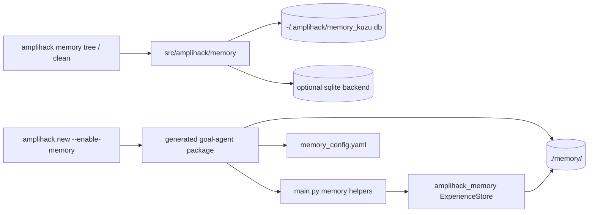
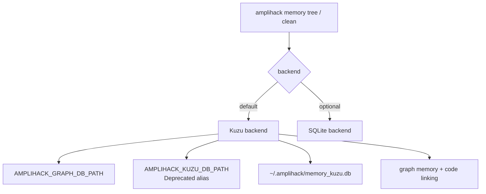
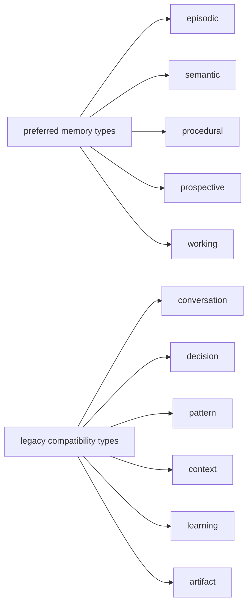
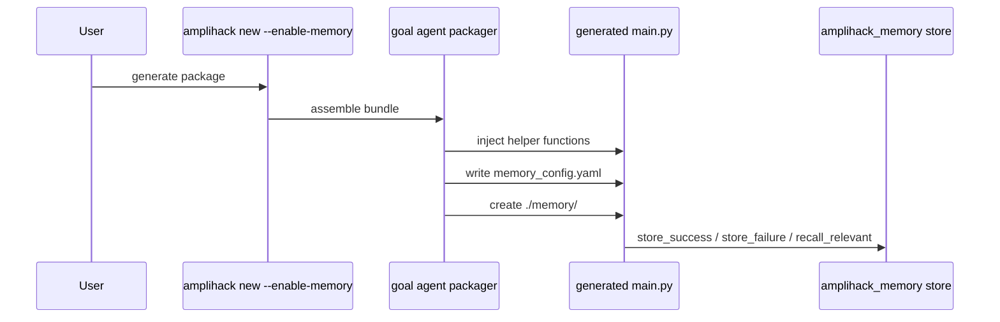
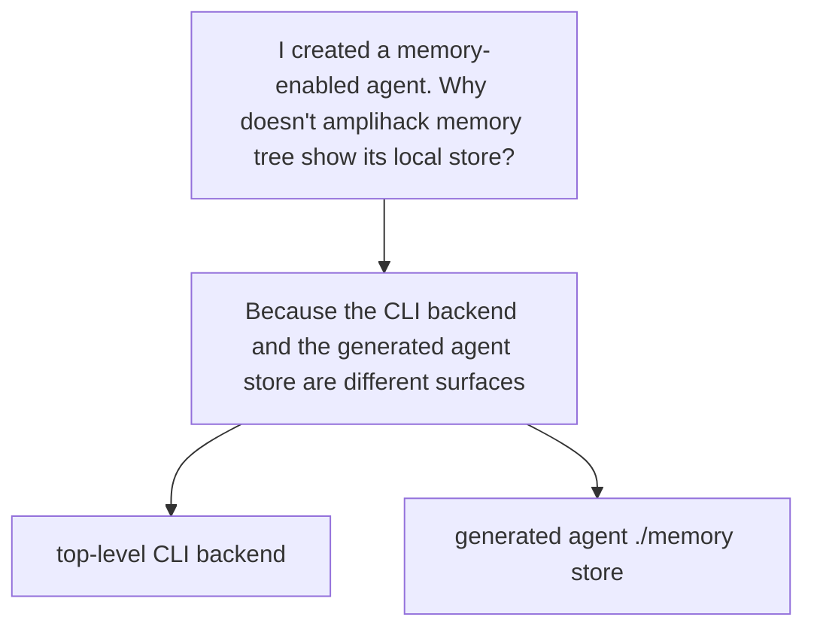

# Memory Systems Diagrams

This file is the presentation-friendly companion to `docs/concepts/memory-enabled-agents-architecture.md`.

## Diagram 1: Two Memory Surfaces

### Speaker Notes

- The repo has one memory story for the top-level CLI and another for generated standalone agents.
- The CLI-facing backend is graph-oriented and Kuzu-first.
- Generated agents package an experience-store scaffold under their own `./memory/` directory.

## Diagram 2: In-Repo Memory Backend

### Speaker Notes

- `tree` and `clean` are the verified top-level memory commands in this checkout.
- Kuzu is the default backend.
- `AMPLIHACK_GRAPH_DB_PATH` is the preferred environment variable.

## Diagram 3: Memory Type Model

### Speaker Notes

- The model layer uses five preferred psychological memory types.
- The CLI still exposes the older compatibility names for `memory tree --type`.
- That mismatch is intentional today and should be explained, not hidden.

## Diagram 4: Generated Agent Memory Scaffold

### Speaker Notes

- `--enable-memory` gives the generated package a usable scaffold.
- The important helpers are `store_success`, `store_failure`, `store_pattern`, `store_insight`, and `recall_relevant`.
- The scaffold is explicit: teams still decide where those helpers should be called in their agent flow.

## Diagram 5: Where Confusion Usually Comes From

### Speaker Notes

- The docs used to blur these together.
- The updated docs separate them on purpose.
- That separation is the fastest way to explain what works, where it lives, and which command owns it.

## Related Material

- `docs/memory/README.md`
- `docs/AGENT_MEMORY_QUICKSTART.md`
- `docs/concepts/memory-enabled-agents-architecture.md`
- `docs/reference/memory-cli-reference.md`
