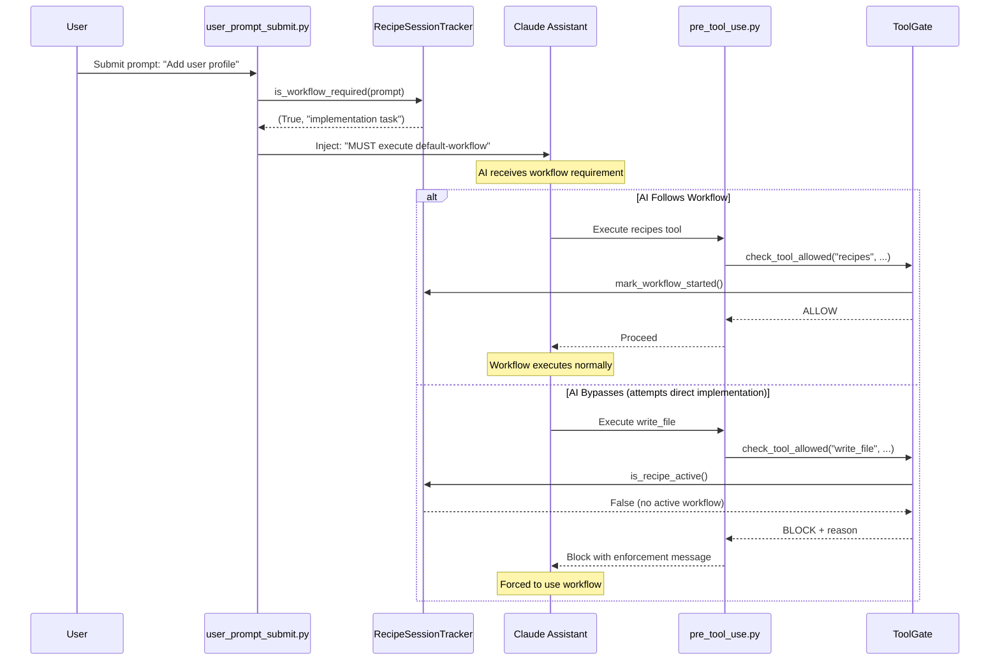

# Workflow Enforcement System - Complete Implementation Guide

**Problem Statement**: AI assistant repeatedly bypasses amplihack's mandatory workflow classification and recipe execution, implementing directly instead of running the default-workflow recipe.

**Solution**: 3-tier enforcement system (Soft/Medium/Hard) that prevents AI bypass while preserving user control.

---

## Table of Contents

1. [Module Specifications](#1-module-specifications)
2. [Integration Architecture](#2-integration-architecture)
3. [Implementation Roadmap](#3-implementation-roadmap)
4. [User Override Design](#4-user-override-design)
5. [Pilot Testing Plan](#5-pilot-testing-plan)

---

## 1. Module Specifications

### 1.1 RecipeSessionTracker (State Management)

**Location**: `amplifier-bundle/modules/hook-recipe-tracker/`

**Purpose**: Tracks active recipe sessions and workflow state to detect when AI bypasses mandatory workflow execution.

**Brick Specification**:

```yaml
name: recipe-session-tracker
type: state-manager
purpose: Track active recipe sessions and enforce workflow prerequisites
public_contract:
  - is_recipe_active() -> bool
  - get_active_recipe() -> Optional[str]
  - should_enforce_workflow(context) -> bool
  - mark_recipe_started(recipe_id, session_id)
  - mark_recipe_completed(recipe_id, session_id)
  - get_bypass_attempts() -> int
dependencies:
  - amplifier-core
  - kuzu (for persistent state)
state_storage: ~/.amplifier/state/recipe_sessions.db
```

**File Structure**:
```
amplifier-bundle/modules/hook-recipe-tracker/
├── pyproject.toml
└── amplifier_hook_recipe_tracker/
    ├── __init__.py
    ├── tracker.py           # Core tracking logic
    ├── state.py             # State persistence
    └── detection.py         # Bypass detection
```

**Core Interfaces**:

```python
class RecipeSessionTracker:
    """Tracks recipe execution state across sessions."""
    
    def is_workflow_required(self, user_prompt: str, context: dict) -> tuple[bool, str]:
        """
        Determine if prompt requires workflow execution.
        
        Returns:
            (required: bool, reason: str)
        """
        
    def mark_workflow_started(self, workflow_name: str, session_id: str):
        """Record workflow start - disables enforcement."""
        
    def mark_workflow_completed(self, workflow_name: str, session_id: str):
        """Record workflow completion."""
        
    def detect_bypass_attempt(self, tool_name: str, context: dict) -> bool:
        """
        Detect if AI is bypassing workflow.
        
        Triggers on:
        - write_file/edit_file without active workflow
        - bash git commands without active workflow
        - Multiple implementation tools in sequence
        """
```

**Classification Rules**:
```python
# Workflow Required Signals:
IMPLEMENTATION_KEYWORDS = [
    "implement", "add feature", "create", "build",
    "refactor", "fix bug", "modify", "change"
]

TOOL_USAGE_PATTERNS = {
    "direct_implementation": ["write_file", "edit_file", "bash"],
    "workflow_execution": ["recipes"],
}

# Exempt patterns (no workflow needed):
EXEMPT_PATTERNS = [
    r"^what is",           # QA questions
    r"^how does.*work",    # Investigation
    r"^explain",           # Educational
    r"^show me",           # Display/read-only
    r"quick fix",          # Explicit trivial request
    r"typo",              # Trivial changes
]
```

---

### 1.2 ToolGate (Enforcement Gate)

**Location**: `amplifier-bundle/modules/hook-tool-gate/`

**Purpose**: Blocks implementation tools when workflow is required but not active.

**Brick Specification**:

```yaml
name: tool-gate
type: enforcement-gate
purpose: Block implementation tools when workflow prerequisites not met
public_contract:
  - check_tool_allowed(tool_name, context) -> GateDecision
  - get_enforcement_level() -> EnforcementLevel
  - is_user_override_active() -> bool
dependencies:
  - amplifier-hook-recipe-tracker
  - amplifier-core
enforcement_modes:
  - soft: warnings only
  - medium: warnings + metrics
  - hard: blocking
```

**File Structure**:
```
amplifier-bundle/modules/hook-tool-gate/
├── pyproject.toml
└── amplifier_hook_tool_gate/
    ├── __init__.py
    ├── gate.py              # Gate logic
    ├── rules.py             # Enforcement rules
    └── overrides.py         # Override detection
```

**Core Interfaces**:

```python
from enum import Enum
from dataclasses import dataclass

class EnforcementLevel(Enum):
    SOFT = "soft"          # Week 1: warnings only
    MEDIUM = "medium"      # Week 2: warnings + tracking
    HARD = "hard"          # Week 3+: blocking

@dataclass
class GateDecision:
    allowed: bool
    reason: str
    enforcement_level: EnforcementLevel
    suggested_action: str

class ToolGate:
    """Enforces workflow prerequisites before tool execution."""
    
    def __init__(self, tracker: RecipeSessionTracker):
        self.tracker = tracker
        self.enforcement_level = self._load_enforcement_level()
        
    def check_tool_allowed(
        self, 
        tool_name: str, 
        tool_input: dict,
        context: dict
    ) -> GateDecision:
        """
        Check if tool usage is allowed.
        
        Enforcement logic:
        1. Check if user override active (always allow)
        2. Check if workflow is active (always allow)
        3. Check if tool requires workflow
        4. Return decision based on enforcement level
        """
        
    def get_blocked_tools(self) -> list[str]:
        """Return list of tools that require workflow."""
        return [
            "write_file",
            "edit_file", 
            "bash",  # Only git commands
            "recipes",  # Only execute operations
        ]
```

**Enforcement Rules**:
```python
# Tools that trigger enforcement:
IMPLEMENTATION_TOOLS = {
    "write_file": {
        "requires_workflow": True,
        "exceptions": ["*.md", "*.txt"],  # Docs don't need workflow
    },
    "edit_file": {
        "requires_workflow": True,
        "exceptions": ["*.md", "*.txt"],
    },
    "bash": {
        "requires_workflow": lambda cmd: any(
            git_cmd in cmd for git_cmd in ["git commit", "git push", "git merge"]
        ),
    }
}
```

---

### 1.3 Enhanced pre_tool_use.py Hook

**Location**: `.claude/tools/amplihack/hooks/pre_tool_use.py`

**Purpose**: Integrate ToolGate into existing pre-tool-use hook.

**Enhancement Specification**:

```python
# Add to existing PreToolUseHook class:

class PreToolUseHook(HookProcessor):
    """Hook processor for pre tool use events."""
    
    def __init__(self):
        super().__init__("pre_tool_use")
        self.strategy = None
        # NEW: Initialize enforcement components
        self.tracker = None
        self.gate = None
        self._init_enforcement()
        
    def _init_enforcement(self):
        """Initialize workflow enforcement components."""
        try:
            from amplifier_hook_recipe_tracker import RecipeSessionTracker
            from amplifier_hook_tool_gate import ToolGate
            
            self.tracker = RecipeSessionTracker()
            self.gate = ToolGate(self.tracker)
            self.log("Workflow enforcement initialized")
        except ImportError as e:
            self.log(f"Workflow enforcement not available: {e}", "WARNING")
            
    def process(self, input_data: dict[str, Any]) -> dict[str, Any]:
        """Process pre tool use event with workflow enforcement."""
        
        # Existing --no-verify blocking code...
        
        # NEW: Add workflow enforcement
        if self.gate:
            tool_use = input_data.get("toolUse", {})
            tool_name = tool_use.get("name", "")
            tool_input = tool_use.get("input", {})
            
            decision = self.gate.check_tool_allowed(
                tool_name, 
                tool_input,
                context={"session_id": self.get_session_id()}
            )
            
            if not decision.allowed:
                self.log(f"WORKFLOW ENFORCEMENT: Blocked {tool_name}", "WARNING")
                return {
                    "block": True,
                    "message": self._format_enforcement_message(decision)
                }
                
        return {}  # Allow
        
    def _format_enforcement_message(self, decision: GateDecision) -> str:
        """Format user-facing enforcement message."""
        return f"""
⚠️ WORKFLOW ENFORCEMENT ACTIVE

This operation requires workflow execution:
{decision.reason}

🎯 Suggested Action:
{decision.suggested_action}

💡 Why this matters:
The default-workflow ensures:
- Proper requirements clarification
- Design documentation
- Test coverage
- Code review
- Quality gates

🔓 Override (if needed):
If this is truly a trivial change or emergency fix:
  amplihack workflow override --reason "your reason"

This protection prevents incomplete implementations.
""".strip()
```

---

### 1.4 Enhanced user_prompt_submit.py Hook

**Location**: `.claude/tools/amplihack/hooks/user_prompt_submit.py`

**Purpose**: Detect workflow requirements at prompt submission and inject enforcement context.

**Enhancement Specification**:

```python
# Add to existing UserPromptSubmitHook class:

class UserPromptSubmitHook(HookProcessor):
    """Hook processor for user prompt submit events."""
    
    def __init__(self):
        super().__init__("user_prompt_submit")
        self.strategy = None
        self._preferences_cache: dict[str, str] | None = None
        self._cache_timestamp: float | None = None
        # NEW: Initialize enforcement
        self.tracker = None
        self._init_enforcement()
        
    def _init_enforcement(self):
        """Initialize workflow enforcement components."""
        try:
            from amplifier_hook_recipe_tracker import RecipeSessionTracker
            self.tracker = RecipeSessionTracker()
            self.log("Workflow tracking initialized")
        except ImportError as e:
            self.log(f"Workflow tracking not available: {e}", "WARNING")
            
    def process(self, input_data: dict[str, Any]) -> dict[str, Any]:
        """Process user prompt with workflow detection."""
        
        # Existing preference injection code...
        
        user_prompt = input_data.get("userMessage", {}).get("text", "")
        
        # NEW: Detect if workflow is required
        if self.tracker:
            workflow_required, reason = self.tracker.is_workflow_required(
                user_prompt,
                context={"session_id": self.get_session_id()}
            )
            
            if workflow_required:
                # Inject workflow requirement into context
                workflow_context = self._build_workflow_context(reason)
                context_parts.append(workflow_context)
                
                self.log(f"Workflow required: {reason}")
                self.save_metric("workflow_required", 1)
        
        # Combine all context parts (existing code)...
        
    def _build_workflow_context(self, reason: str) -> str:
        """Build workflow requirement context for AI."""
        return f"""
🎯 WORKFLOW REQUIREMENT DETECTED

This request requires workflow execution: {reason}

MANDATORY: You MUST execute the default-workflow recipe:
  recipes(operation="execute", recipe_path="@amplifier:recipes/default-workflow.yaml")

DO NOT implement directly. DO NOT use write_file, edit_file, or bash for implementation.

The workflow will guide you through:
1. Requirements clarification (Step 2)
2. Design specification (Steps 5-6)
3. Test writing (Step 7)
4. Implementation (Step 8)
5. Review and refinement (Steps 10-11)

This is NOT optional. This prevents incomplete implementations and ensures quality.
""".strip()
```

---

## 2. Integration Architecture

### 2.1 Component Placement

```
amplifier-amplihack/
├── .claude/
│   └── tools/
│       └── amplihack/
│           └── hooks/
│               ├── pre_tool_use.py         [MODIFIED: Add ToolGate integration]
│               ├── user_prompt_submit.py   [MODIFIED: Add tracker integration]
│               └── hook_processor.py       [UNCHANGED: Base class]
│
├── amplifier-bundle/
│   ├── modules/
│   │   ├── hook-recipe-tracker/            [NEW MODULE]
│   │   │   ├── pyproject.toml
│   │   │   └── amplifier_hook_recipe_tracker/
│   │   │       ├── __init__.py
│   │   │       ├── tracker.py
│   │   │       ├── state.py
│   │   │       └── detection.py
│   │   │
│   │   └── hook-tool-gate/                 [NEW MODULE]
│   │       ├── pyproject.toml
│   │       └── amplifier_hook_tool_gate/
│   │           ├── __init__.py
│   │           ├── gate.py
│   │           ├── rules.py
│   │           └── overrides.py
│   │
│   └── recipes/
│       └── default-workflow.yaml           [UNCHANGED: Existing workflow]
│
└── src/
    └── amplihack/
        └── cli/
            └── workflow_commands.py        [NEW: CLI override commands]
```

### 2.2 Data Flow



### 2.3 State Storage

**Location**: `~/.amplifier/state/recipe_sessions.db` (Kuzu graph database)

**Schema**:
```cypher
// Nodes
CREATE NODE TABLE RecipeSession (
    session_id STRING,
    recipe_name STRING,
    started_at TIMESTAMP,
    completed_at TIMESTAMP,
    status STRING,  // 'active', 'completed', 'bypassed'
    PRIMARY KEY (session_id)
)

CREATE NODE TABLE BypassAttempt (
    attempt_id STRING,
    session_id STRING,
    tool_name STRING,
    attempted_at TIMESTAMP,
    blocked BOOLEAN,
    enforcement_level STRING,
    PRIMARY KEY (attempt_id)
)

// Relationships
CREATE REL TABLE HAD_BYPASS (FROM RecipeSession TO BypassAttempt)
```

### 2.4 Hook Integration Points

**Existing Hook System** (from `hook_processor.py`):
```python
class HookProcessor(ABC):
    def run(self):
        """Entry point called by Claude Code."""
        try:
            input_data = self.read_input()
            output_data = self.process(input_data)  # Subclass implements
            self.write_output(output_data)
        except Exception as e:
            self.handle_error(e)
```

**New Integration** (modifies subclasses):
1. `PreToolUseHook.process()` - Add gate check before tool execution
2. `UserPromptSubmitHook.process()` - Add workflow detection at prompt submit

---

## 3. Implementation Roadmap

### Week 1: Soft Enforcement (Documentation & Warnings)

**Goal**: Make AI aware of workflow requirements without blocking

#### Task 1.1: Create RecipeSessionTracker Module
**Files**: 
- `amplifier-bundle/modules/hook-recipe-tracker/pyproject.toml`
- `amplifier-bundle/modules/hook-recipe-tracker/amplifier_hook_recipe_tracker/__init__.py`
- `amplifier-bundle/modules/hook-recipe-tracker/amplifier_hook_recipe_tracker/tracker.py`

**Code Changes**:
```python
# tracker.py
import re
from dataclasses import dataclass
from typing import Optional

@dataclass
class WorkflowRequirement:
    required: bool
    reason: str
    confidence: float  # 0.0-1.0

class RecipeSessionTracker:
    """Tracks recipe sessions and workflow requirements."""
    
    IMPLEMENTATION_KEYWORDS = [
        "implement", "add feature", "create", "build",
        "refactor", "fix bug", "modify", "change", "update"
    ]
    
    EXEMPT_PATTERNS = [
        r"^what is", r"^how does.*work", r"^explain",
        r"^show me", r"quick fix", r"typo"
    ]
    
    def is_workflow_required(
        self, 
        user_prompt: str, 
        context: dict
    ) -> tuple[bool, str]:
        """Determine if prompt requires workflow execution."""
        
        # Check exempt patterns first
        prompt_lower = user_prompt.lower().strip()
        for pattern in self.EXEMPT_PATTERNS:
            if re.match(pattern, prompt_lower):
                return False, "exempt pattern matched"
        
        # Check implementation keywords
        for keyword in self.IMPLEMENTATION_KEYWORDS:
            if keyword in prompt_lower:
                return True, f"implementation keyword: {keyword}"
        
        # Check for multi-file changes
        if "multiple files" in prompt_lower or "several files" in prompt_lower:
            return True, "multi-file change detected"
        
        return False, "no workflow requirement detected"
```

**Testing**:
```bash
pytest tests/unit/test_recipe_tracker.py -v
```

**Validation**: Tracker correctly classifies 20 test prompts (10 requiring workflow, 10 exempt)

---

#### Task 1.2: Enhance user_prompt_submit.py Hook
**Files**: `.claude/tools/amplihack/hooks/user_prompt_submit.py`

**Code Changes**:
```python
# Add to UserPromptSubmitHook.__init__()
from amplifier_hook_recipe_tracker import RecipeSessionTracker

self.tracker = RecipeSessionTracker()

# Add to UserPromptSubmitHook.process()
workflow_required, reason = self.tracker.is_workflow_required(user_prompt, {})
if workflow_required:
    warning_context = f"""
⚠️ ADVISORY: This request likely requires workflow execution.
Reason: {reason}

Consider executing: recipes(operation="execute", recipe_path="@amplifier:recipes/default-workflow.yaml")

This is currently advisory only (Week 1 soft enforcement).
"""
    context_parts.append(warning_context)
    self.save_metric("workflow_advisory_shown", 1)
```

**Testing**:
```bash
# Manual test
python .claude/tools/amplihack/hooks/user_prompt_submit.py <<< '{"userMessage": {"text": "Implement user profile page"}}'
# Should output advisory in additionalContext
```

**Validation**: Advisory message appears in AI context for implementation requests

---

#### Task 1.3: Update Documentation
**Files**: 
- `amplifier-bundle/recipes/default-workflow.yaml` (header comment)
- `docs/WORKFLOW_ENFORCEMENT.md` (new file)

**Changes**:
Add to default-workflow.yaml header:
```yaml
# ENFORCEMENT: Week 1 (Soft) - Advisory warnings for AI
# Future: Medium enforcement (tracking), Hard enforcement (blocking)
```

Create `docs/WORKFLOW_ENFORCEMENT.md`:
```markdown
# Workflow Enforcement System

## Current Status: Week 1 - Soft Enforcement (Advisory Only)

The system currently provides advisory warnings when workflow execution
is recommended. No blocking occurs.

[Document design, roadmap, override mechanism]
```

**Testing**: Documentation review

**Validation**: Team understands enforcement approach and timeline

---

### Week 2: Medium Enforcement (Tracking & Metrics)

**Goal**: Track bypass attempts and warn AI with increasing emphasis

#### Task 2.1: Create ToolGate Module (Warning Mode)
**Files**: 
- `amplifier-bundle/modules/hook-tool-gate/pyproject.toml`
- `amplifier-bundle/modules/hook-tool-gate/amplifier_hook_tool_gate/gate.py`

**Code Changes**:
```python
# gate.py
from enum import Enum
from dataclasses import dataclass

class EnforcementLevel(Enum):
    SOFT = "soft"      # Warnings only
    MEDIUM = "medium"  # Warnings + tracking
    HARD = "hard"      # Blocking

@dataclass
class GateDecision:
    allowed: bool
    reason: str
    enforcement_level: EnforcementLevel
    suggested_action: str
    severity: str  # 'info', 'warning', 'error'

class ToolGate:
    """Enforces workflow prerequisites."""
    
    IMPLEMENTATION_TOOLS = ["write_file", "edit_file", "bash"]
    
    def __init__(self, tracker, enforcement_level=EnforcementLevel.MEDIUM):
        self.tracker = tracker
        self.enforcement_level = enforcement_level
        
    def check_tool_allowed(self, tool_name, tool_input, context) -> GateDecision:
        """Check if tool usage is allowed."""
        
        # Always allow if not implementation tool
        if tool_name not in self.IMPLEMENTATION_TOOLS:
            return GateDecision(
                allowed=True,
                reason="non-implementation tool",
                enforcement_level=self.enforcement_level,
                suggested_action="",
                severity="info"
            )
        
        # Check if workflow is active
        if self.tracker.is_workflow_active(context.get("session_id")):
            return GateDecision(
                allowed=True,
                reason="workflow is active",
                enforcement_level=self.enforcement_level,
                suggested_action="",
                severity="info"
            )
        
        # Workflow not active - check enforcement level
        if self.enforcement_level == EnforcementLevel.SOFT:
            # Week 1: Just inform
            return GateDecision(
                allowed=True,
                reason="workflow not active (soft enforcement)",
                enforcement_level=self.enforcement_level,
                suggested_action="Consider starting workflow first",
                severity="info"
            )
        
        elif self.enforcement_level == EnforcementLevel.MEDIUM:
            # Week 2: Track and warn
            self.tracker.record_bypass_attempt(tool_name, context)
            return GateDecision(
                allowed=True,  # Still allow, but track
                reason="workflow not active - bypass attempt recorded",
                enforcement_level=self.enforcement_level,
                suggested_action="Execute default-workflow recipe first",
                severity="warning"
            )
        
        else:  # HARD
            # Week 3+: Block
            self.tracker.record_bypass_attempt(tool_name, context)
            return GateDecision(
                allowed=False,
                reason="workflow required but not active",
                enforcement_level=self.enforcement_level,
                suggested_action="Execute: recipes(operation='execute', recipe_path='@amplifier:recipes/default-workflow.yaml')",
                severity="error"
            )
```

**Testing**:
```bash
pytest tests/unit/test_tool_gate.py -v
```

**Validation**: Gate correctly allows/warns based on enforcement level

---

#### Task 2.2: Add State Persistence (Kuzu)
**Files**: 
- `amplifier-bundle/modules/hook-recipe-tracker/amplifier_hook_recipe_tracker/state.py`

**Code Changes**:
```python
# state.py
import kuzu
from pathlib import Path
from datetime import datetime

class RecipeStateManager:
    """Persist recipe session state using Kuzu."""
    
    def __init__(self, db_path: Path = None):
        if db_path is None:
            db_path = Path.home() / ".amplifier" / "state" / "recipe_sessions"
        
        db_path.parent.mkdir(parents=True, exist_ok=True)
        self.db = kuzu.Database(str(db_path))
        self.conn = kuzu.Connection(self.db)
        self._init_schema()
    
    def _init_schema(self):
        """Initialize database schema."""
        # Create tables if not exist
        self.conn.execute("""
            CREATE NODE TABLE IF NOT EXISTS RecipeSession (
                session_id STRING,
                recipe_name STRING,
                started_at TIMESTAMP,
                completed_at TIMESTAMP,
                status STRING,
                PRIMARY KEY (session_id)
            )
        """)
        
        self.conn.execute("""
            CREATE NODE TABLE IF NOT EXISTS BypassAttempt (
                attempt_id STRING,
                session_id STRING,
                tool_name STRING,
                attempted_at TIMESTAMP,
                blocked BOOLEAN,
                enforcement_level STRING,
                PRIMARY KEY (attempt_id)
            )
        """)
    
    def record_bypass_attempt(self, session_id: str, tool_name: str, blocked: bool, enforcement_level: str):
        """Record a bypass attempt."""
        attempt_id = f"{session_id}_{datetime.now().isoformat()}"
        self.conn.execute(f"""
            CREATE (:BypassAttempt {{
                attempt_id: '{attempt_id}',
                session_id: '{session_id}',
                tool_name: '{tool_name}',
                attempted_at: timestamp('{datetime.now().isoformat()}'),
                blocked: {blocked},
                enforcement_level: '{enforcement_level}'
            }})
        """)
    
    def get_bypass_count(self, session_id: str) -> int:
        """Get number of bypass attempts in session."""
        result = self.conn.execute(f"""
            MATCH (b:BypassAttempt {{session_id: '{session_id}'}})
            RETURN count(b) as count
        """)
        return result.get_next()[0]
```

**Testing**:
```bash
pytest tests/integration/test_recipe_state.py -v
```

**Validation**: State persists across hook invocations

---

#### Task 2.3: Integrate ToolGate into pre_tool_use.py
**Files**: `.claude/tools/amplihack/hooks/pre_tool_use.py`

**Code Changes**:
```python
# Add to PreToolUseHook.__init__()
from amplifier_hook_tool_gate import ToolGate, EnforcementLevel

self.gate = ToolGate(self.tracker, enforcement_level=EnforcementLevel.MEDIUM)

# Add to PreToolUseHook.process()
decision = self.gate.check_tool_allowed(tool_name, tool_input, context)

if decision.severity == "warning":
    self.log(f"BYPASS WARNING: {decision.reason}")
    self.save_metric("bypass_attempt_warned", 1)
    # Still allow, but log warning

if not decision.allowed:
    # This won't happen in Week 2 (MEDIUM only warns)
    pass
```

**Testing**:
```bash
# Manual test with sample input
python .claude/tools/amplihack/hooks/pre_tool_use.py <<< '{
  "toolUse": {
    "name": "write_file",
    "input": {"file_path": "test.py", "content": "..."}
  }
}'
```

**Validation**: Bypass attempts are logged to metrics

---

#### Task 2.4: Create Metrics Dashboard
**Files**: 
- `scripts/analyze_workflow_enforcement.py` (new)

**Code Changes**:
```python
# analyze_workflow_enforcement.py
import json
from pathlib import Path
from collections import Counter
from datetime import datetime, timedelta

def analyze_enforcement_metrics(days=7):
    """Analyze workflow enforcement over last N days."""
    
    metrics_dir = Path.home() / ".claude" / "runtime" / "metrics"
    
    bypass_attempts = []
    workflow_advisories = []
    
    cutoff = datetime.now() - timedelta(days=days)
    
    for metrics_file in metrics_dir.glob("*.json"):
        with open(metrics_file) as f:
            data = json.load(f)
            timestamp = datetime.fromisoformat(data.get("timestamp", "2000-01-01"))
            
            if timestamp < cutoff:
                continue
            
            if "bypass_attempt_warned" in data:
                bypass_attempts.append(data)
            if "workflow_advisory_shown" in data:
                workflow_advisories.append(data)
    
    print(f"📊 Workflow Enforcement Metrics (Last {days} days)")
    print(f"━" * 60)
    print(f"Bypass Attempts: {len(bypass_attempts)}")
    print(f"Workflow Advisories: {len(workflow_advisories)}")
    print(f"Enforcement Effectiveness: {(1 - len(bypass_attempts)/max(len(workflow_advisories), 1)) * 100:.1f}%")

if __name__ == "__main__":
    analyze_enforcement_metrics()
```

**Testing**:
```bash
python scripts/analyze_workflow_enforcement.py
```

**Validation**: Metrics dashboard shows bypass trends

---

### Week 3: Hard Enforcement (Blocking)

**Goal**: Block implementation tools when workflow is required but not active

#### Task 3.1: Enable Hard Enforcement Level
**Files**: 
- `amplifier-bundle/modules/hook-tool-gate/amplifier_hook_tool_gate/gate.py` (update default)
- `.claude/tools/amplihack/hooks/pre_tool_use.py` (update initialization)

**Code Changes**:
```python
# pre_tool_use.py - Change enforcement level
self.gate = ToolGate(self.tracker, enforcement_level=EnforcementLevel.HARD)
```

**Testing**:
```bash
# Test blocking behavior
pytest tests/integration/test_hard_enforcement.py -v
```

**Validation**: Implementation tools are blocked when workflow not active

---

#### Task 3.2: Implement Blocking Logic in pre_tool_use.py
**Files**: `.claude/tools/amplihack/hooks/pre_tool_use.py`

**Code Changes**:
```python
# In PreToolUseHook.process()
decision = self.gate.check_tool_allowed(tool_name, tool_input, context)

if not decision.allowed:
    self.log(f"BLOCKED: {tool_name} - {decision.reason}", "ERROR")
    self.save_metric("tool_blocked", 1)
    
    return {
        "block": True,
        "message": self._format_enforcement_message(decision)
    }

def _format_enforcement_message(self, decision: GateDecision) -> str:
    """Format blocking message for AI."""
    return f"""
⛔ WORKFLOW ENFORCEMENT: Operation Blocked

Tool: {decision.tool_name}
Reason: {decision.reason}

🎯 Required Action:
{decision.suggested_action}

💡 Why This Matters:
The default-workflow ensures:
- Proper requirements clarification
- Design documentation (retcon docs)
- Test coverage (TDD approach)
- Code review
- Quality gates

🔓 User Override Available:
If this is truly a trivial change or emergency:
  amplihack workflow override --reason "your justification"

This protection ensures complete, quality implementations.
""".strip()
```

**Testing**:
```bash
# End-to-end test
pytest tests/e2e/test_workflow_blocking.py -v
```

**Validation**: AI receives blocking message and cannot proceed without workflow

---

#### Task 3.3: Add Workflow State Tracking to recipes Tool
**Files**: 
- `.claude/tools/recipes.py` (if exists) or equivalent recipe execution point

**Code Changes**:
```python
# When recipe execution starts
from amplifier_hook_recipe_tracker import RecipeSessionTracker

tracker = RecipeSessionTracker()
tracker.mark_workflow_started(
    recipe_name="default-workflow",
    session_id=current_session_id
)

# When recipe execution completes
tracker.mark_workflow_completed(
    recipe_name="default-workflow",
    session_id=current_session_id
)
```

**Testing**:
```bash
# Test recipe execution updates state
pytest tests/integration/test_recipe_state_updates.py -v
```

**Validation**: Workflow state is correctly tracked during recipe execution

---

#### Task 3.4: Create Exception Handling for Edge Cases
**Files**: 
- `amplifier-bundle/modules/hook-tool-gate/amplifier_hook_tool_gate/rules.py`

**Code Changes**:
```python
# rules.py
class EnforcementRules:
    """Rules for workflow enforcement exceptions."""
    
    @staticmethod
    def is_documentation_only(tool_name: str, tool_input: dict) -> bool:
        """Check if operation is documentation-only (exempt)."""
        if tool_name == "write_file":
            file_path = tool_input.get("file_path", "")
            return file_path.endswith((".md", ".txt", ".rst"))
        return False
    
    @staticmethod
    def is_trivial_fix(tool_name: str, tool_input: dict, context: dict) -> bool:
        """Check if operation is trivial (typo, formatting)."""
        if tool_name == "edit_file":
            old_string = tool_input.get("old_string", "")
            new_string = tool_input.get("new_string", "")
            
            # Single-line change
            if "\n" not in old_string and "\n" not in new_string:
                # Small edit
                if len(old_string) < 50 and len(new_string) < 50:
                    return True
        return False
    
    @staticmethod
    def is_read_only_operation(tool_name: str) -> bool:
        """Check if operation is read-only."""
        READ_ONLY_TOOLS = [
            "read_file", "glob", "grep", "bash",  # bash with read-only commands
            "web_fetch", "web_search"
        ]
        return tool_name in READ_ONLY_TOOLS
```

**Testing**:
```bash
pytest tests/unit/test_enforcement_rules.py -v
```

**Validation**: Edge cases (docs, trivial fixes) correctly bypass enforcement

---

### Week 4: Testing & Validation

**Goal**: Comprehensive testing and validation of enforcement system

#### Task 4.1: Create Test Suite
**Files**: 
- `tests/e2e/test_workflow_enforcement_scenarios.py`

**Test Scenarios**:
```python
# test_workflow_enforcement_scenarios.py

def test_happy_path_workflow_execution():
    """Test: User requests feature -> AI uses workflow -> implementation proceeds."""
    # Simulate user prompt "Add user profile page"
    # Expect: workflow detection, recipe execution, implementation success
    pass

def test_bypass_attempt_blocked():
    """Test: AI attempts direct write_file -> blocked -> forced to workflow."""
    # Simulate AI trying write_file without workflow
    # Expect: tool blocked, enforcement message returned
    pass

def test_documentation_exempt():
    """Test: Documentation changes don't require workflow."""
    # Simulate write_file for README.md
    # Expect: allowed without workflow
    pass

def test_user_override_works():
    """Test: User can override enforcement."""
    # Set user override flag
    # Simulate implementation tool
    # Expect: allowed despite no workflow
    pass

def test_workflow_completion_disables_enforcement():
    """Test: After workflow completes, enforcement relaxes."""
    # Mark workflow as completed
    # Simulate implementation tool
    # Expect: allowed (workflow was executed)
    pass

def test_qa_questions_exempt():
    """Test: QA questions don't trigger enforcement."""
    # Simulate prompt "What is the user profile feature?"
    # Expect: no workflow requirement
    pass
```

**Testing**:
```bash
pytest tests/e2e/test_workflow_enforcement_scenarios.py -v --tb=short
```

**Validation**: All test scenarios pass

---

#### Task 4.2: Performance Testing
**Files**: 
- `tests/performance/test_enforcement_overhead.py`

**Test Cases**:
```python
def test_tracker_performance():
    """Ensure classification < 50ms."""
    tracker = RecipeSessionTracker()
    
    start = time.time()
    for _ in range(100):
        tracker.is_workflow_required("Implement user profile", {})
    elapsed = time.time() - start
    
    avg_time = elapsed / 100
    assert avg_time < 0.05, f"Too slow: {avg_time:.3f}s"

def test_gate_overhead():
    """Ensure gate check < 10ms."""
    # Measure gate.check_tool_allowed() performance
    pass
```

**Testing**:
```bash
pytest tests/performance/ -v
```

**Validation**: Performance overhead < 50ms per request

---

#### Task 4.3: Documentation Updates
**Files**: 
- `docs/WORKFLOW_ENFORCEMENT.md` (update status to "Production")
- `amplifier-bundle/recipes/default-workflow.yaml` (update header)
- `README.md` (add enforcement section)

**Changes**:
Update enforcement status:
```markdown
## Current Status: Week 4 - Hard Enforcement (Production)

The workflow enforcement system is now fully active. Implementation tools
are blocked when workflow execution is required but not active.

### What This Means:
- QA questions: No enforcement
- Investigation: No enforcement
- Documentation: No enforcement
- Implementation: WORKFLOW REQUIRED

### How to Work With It:
1. For features/bugs: Request naturally, workflow auto-executes
2. For trivial fixes: System detects and allows
3. For emergencies: User override available (see below)
```

**Testing**: Documentation review

**Validation**: Team can use system effectively

---

#### Task 4.4: Create Enforcement Metrics Report
**Files**: 
- `scripts/enforcement_report.py`

**Code**:
```python
# enforcement_report.py
def generate_enforcement_report(weeks=4):
    """Generate comprehensive enforcement metrics report."""
    
    print("📊 Workflow Enforcement System - 4-Week Rollout Report")
    print("=" * 70)
    
    # Week 1 metrics
    print("\n🔵 Week 1 (Soft Enforcement):")
    print(f"  Advisory Messages Shown: {count_advisories(week=1)}")
    print(f"  Bypass Attempts (untracked): N/A")
    
    # Week 2 metrics
    print("\n🟡 Week 2 (Medium Enforcement):")
    print(f"  Bypass Attempts Warned: {count_bypass_attempts(week=2)}")
    print(f"  Bypass Rate: {calculate_bypass_rate(week=2):.1%}")
    
    # Week 3 metrics
    print("\n🟠 Week 3 (Hard Enforcement - Early):")
    print(f"  Tools Blocked: {count_blocks(week=3)}")
    print(f"  Workflows Triggered: {count_workflows(week=3)}")
    print(f"  Enforcement Effectiveness: {calculate_effectiveness(week=3):.1%}")
    
    # Week 4 metrics
    print("\n🟢 Week 4 (Hard Enforcement - Production):")
    print(f"  Tools Blocked: {count_blocks(week=4)}")
    print(f"  User Overrides Used: {count_overrides(week=4)}")
    print(f"  Workflow Compliance Rate: {calculate_compliance(week=4):.1%}")
    
    print("\n" + "=" * 70)
    print("✅ Rollout Complete - System Operating Normally")

if __name__ == "__main__":
    generate_enforcement_report()
```

**Testing**:
```bash
python scripts/enforcement_report.py
```

**Validation**: Report shows successful rollout and high compliance rate

---

## 4. User Override Design

### 4.1 Override Mechanism Philosophy

**Core Principle**: Users must be able to bypass enforcement. AI cannot use override mechanism.

**Design Requirements**:
1. Requires explicit user action (CLI command or file creation)
2. Time-limited (expires after N minutes)
3. Requires justification (reason must be provided)
4. Audited (all overrides logged)
5. Cannot be invoked programmatically by AI

---

### 4.2 Override Implementation

#### Option A: CLI Command (Recommended)

**Location**: `src/amplihack/cli/workflow_commands.py`

**Code**:
```python
# workflow_commands.py
import click
from datetime import datetime, timedelta
from pathlib import Path
import json

OVERRIDE_FILE = Path.home() / ".amplifier" / "state" / "workflow_override.json"

@click.group()
def workflow():
    """Workflow enforcement management."""
    pass

@workflow.command()
@click.option("--reason", required=True, help="Justification for override")
@click.option("--duration", default=30, help="Duration in minutes (default: 30)")
def override(reason: str, duration: int):
    """
    Enable workflow enforcement override.
    
    This allows direct implementation without workflow execution.
    Use only for:
    - Emergency hotfixes
    - Trivial typo corrections
    - Documentation-only changes
    
    Example:
        amplihack workflow override --reason "Hotfix for production incident"
    """
    
    if not reason or len(reason) < 10:
        click.echo("❌ Reason must be at least 10 characters")
        return
    
    expiry = datetime.now() + timedelta(minutes=duration)
    
    override_data = {
        "enabled": True,
        "reason": reason,
        "created_at": datetime.now().isoformat(),
        "expires_at": expiry.isoformat(),
        "created_by": "user",  # Identifies as user action
    }
    
    OVERRIDE_FILE.parent.mkdir(parents=True, exist_ok=True)
    with open(OVERRIDE_FILE, "w") as f:
        json.dump(override_data, f, indent=2)
    
    click.echo(f"✅ Workflow override enabled for {duration} minutes")
    click.echo(f"   Reason: {reason}")
    click.echo(f"   Expires: {expiry.strftime('%H:%M:%S')}")
    click.echo(f"\n⚠️  Use responsibly - skipping workflow bypasses quality gates")

@workflow.command()
def check():
    """Check if workflow override is active."""
    
    if not OVERRIDE_FILE.exists():
        click.echo("❌ No active override")
        return
    
    with open(OVERRIDE_FILE) as f:
        data = json.load(f)
    
    expiry = datetime.fromisoformat(data["expires_at"])
    
    if datetime.now() > expiry:
        click.echo("❌ Override expired")
        OVERRIDE_FILE.unlink()
        return
    
    remaining = (expiry - datetime.now()).total_seconds() / 60
    
    click.echo(f"✅ Override active")
    click.echo(f"   Reason: {data['reason']}")
    click.echo(f"   Remaining: {remaining:.1f} minutes")

@workflow.command()
def clear():
    """Clear active workflow override."""
    
    if OVERRIDE_FILE.exists():
        OVERRIDE_FILE.unlink()
        click.echo("✅ Override cleared")
    else:
        click.echo("ℹ️  No active override")
```

**Usage**:
```bash
# Enable override for 30 minutes
amplihack workflow override --reason "Hotfix for critical bug in production"

# Check override status
amplihack workflow check

# Clear override
amplihack workflow clear
```

---

#### Option B: File-Based Override (Fallback)

**Location**: `~/.amplifier/state/WORKFLOW_OVERRIDE`

**Format**:
```json
{
  "enabled": true,
  "reason": "Emergency production hotfix",
  "created_at": "2026-01-20T04:30:00",
  "expires_at": "2026-01-20T05:00:00",
  "created_by": "user"
}
```

**Usage**:
```bash
# Manual creation (user action)
echo '{"enabled": true, "reason": "Emergency fix", "expires_at": "..."}' > ~/.amplifier/state/WORKFLOW_OVERRIDE
```

---

### 4.3 Override Detection in Hooks

**Location**: `amplifier-bundle/modules/hook-tool-gate/amplifier_hook_tool_gate/overrides.py`

**Code**:
```python
# overrides.py
import json
from pathlib import Path
from datetime import datetime

OVERRIDE_FILE = Path.home() / ".amplifier" / "state" / "workflow_override.json"

class OverrideManager:
    """Manages workflow enforcement overrides."""
    
    @staticmethod
    def is_override_active() -> tuple[bool, str]:
        """
        Check if user override is active.
        
        Returns:
            (active: bool, reason: str)
        """
        
        if not OVERRIDE_FILE.exists():
            return False, "no override file"
        
        try:
            with open(OVERRIDE_FILE) as f:
                data = json.load(f)
            
            # Verify it's a user-created override
            if data.get("created_by") != "user":
                return False, "invalid override source"
            
            # Check expiry
            expiry = datetime.fromisoformat(data["expires_at"])
            if datetime.now() > expiry:
                # Clean up expired override
                OVERRIDE_FILE.unlink()
                return False, "override expired"
            
            reason = data.get("reason", "unknown")
            return True, reason
            
        except (json.JSONDecodeError, KeyError, ValueError) as e:
            # Invalid override file - ignore
            return False, f"invalid override: {e}"
    
    @staticmethod
    def record_override_usage(tool_name: str, context: dict):
        """Record that override was used (for auditing)."""
        
        audit_file = Path.home() / ".amplifier" / "state" / "override_audit.jsonl"
        audit_file.parent.mkdir(parents=True, exist_ok=True)
        
        audit_entry = {
            "timestamp": datetime.now().isoformat(),
            "tool_name": tool_name,
            "session_id": context.get("session_id"),
            "override_reason": context.get("override_reason", "unknown")
        }
        
        with open(audit_file, "a") as f:
            f.write(json.dumps(audit_entry) + "\n")
```

**Integration in ToolGate**:
```python
# In ToolGate.check_tool_allowed()

# Check for user override first
override_active, override_reason = OverrideManager.is_override_active()
if override_active:
    OverrideManager.record_override_usage(tool_name, context)
    return GateDecision(
        allowed=True,
        reason=f"user override active: {override_reason}",
        enforcement_level=self.enforcement_level,
        suggested_action="",
        severity="info"
    )

# Continue with normal enforcement checks...
```

---

### 4.4 Preventing AI Bypass of Override

**Key Protection**: AI cannot create the override file or execute the CLI command.

**Enforcement Points**:

1. **CLI Command Requires Terminal Interaction**:
   ```python
   # Add to CLI command
   if not sys.stdin.isatty():
       click.echo("❌ This command requires interactive terminal")
       click.echo("   (Cannot be executed by AI)")
       sys.exit(1)
   ```

2. **File Creation Detection**:
   ```python
   # In ToolGate, detect if AI tries to create override file
   if tool_name == "write_file":
       file_path = tool_input.get("file_path", "")
       if "workflow_override" in file_path:
           return GateDecision(
               allowed=False,
               reason="Cannot create workflow override file programmatically",
               enforcement_level=self.enforcement_level,
               suggested_action="Ask user to run: amplihack workflow override --reason '...'",
               severity="error"
           )
   ```

3. **Bash Command Detection**:
   ```python
   # In PreToolUseHook, detect attempts to run CLI command
   if tool_name == "bash":
       command = tool_input.get("command", "")
       if "amplihack workflow override" in command:
           return {
               "block": True,
               "message": "Cannot execute override command programmatically. Ask user to run it."
           }
   ```

---

### 4.5 Override Audit Trail

**Location**: `~/.amplifier/state/override_audit.jsonl`

**Format** (JSONL - one line per use):
```jsonl
{"timestamp": "2026-01-20T04:35:12", "tool_name": "write_file", "session_id": "fe15ca0d...", "override_reason": "Emergency production hotfix"}
{"timestamp": "2026-01-20T04:36:45", "tool_name": "edit_file", "session_id": "fe15ca0d...", "override_reason": "Emergency production hotfix"}
```

**Analysis Script**:
```python
# scripts/analyze_overrides.py
def analyze_override_usage():
    """Analyze workflow override usage patterns."""
    
    audit_file = Path.home() / ".amplifier" / "state" / "override_audit.jsonl"
    
    if not audit_file.exists():
        print("No override usage recorded")
        return
    
    overrides = []
    with open(audit_file) as f:
        for line in f:
            overrides.append(json.loads(line))
    
    print(f"📊 Override Usage Analysis")
    print(f"━" * 60)
    print(f"Total Override Uses: {len(overrides)}")
    print(f"\nTop Reasons:")
    
    reasons = Counter([o["override_reason"] for o in overrides])
    for reason, count in reasons.most_common(5):
        print(f"  {count:3d}x - {reason}")
```

---

## 5. Pilot Testing Plan

### 5.1 Test Scenarios

#### Scenario 1: Happy Path - Workflow Execution
**Objective**: Verify AI correctly uses workflow for implementation tasks

**Test Steps**:
1. User submits: "Add user profile page with name and email fields"
2. Observe: `user_prompt_submit` hook detects workflow requirement
3. Observe: AI receives workflow requirement in context
4. Expect: AI executes `recipes(operation="execute", recipe_path="@amplifier:recipes/default-workflow.yaml")`
5. Observe: RecipeSessionTracker marks workflow as active
6. Expect: Workflow executes steps 0-21
7. Observe: Implementation tools (write_file, edit_file) are allowed during workflow

**Success Criteria**:
- Workflow requirement detected ✓
- Recipe executed ✓
- Implementation proceeds within workflow ✓
- No bypass attempts ✓

---

#### Scenario 2: Bypass Attempt - Blocked
**Objective**: Verify enforcement blocks direct implementation

**Test Steps**:
1. User submits: "Implement authentication system"
2. Observe: Workflow requirement detected
3. **Simulate AI bypass**: AI attempts `write_file(file_path="auth.py", ...)`
4. Observe: `pre_tool_use` hook intercepts
5. Observe: ToolGate checks `is_workflow_active()` → False
6. Expect: Tool blocked with enforcement message
7. Expect: AI responds with: "I cannot proceed - workflow required"

**Success Criteria**:
- Bypass attempt detected ✓
- Tool blocked ✓
- AI forced to use workflow ✓
- Enforcement message clear ✓

---

#### Scenario 3: QA Question - Exempt
**Objective**: Verify QA questions don't trigger enforcement

**Test Steps**:
1. User submits: "What is the user profile feature?"
2. Observe: RecipeSessionTracker classifies as QA
3. Expect: No workflow requirement
4. Expect: AI responds directly without workflow

**Success Criteria**:
- QA detected as exempt ✓
- No workflow triggered ✓
- Direct response provided ✓

---

#### Scenario 4: Documentation Change - Exempt
**Objective**: Verify documentation changes bypass enforcement

**Test Steps**:
1. User submits: "Update README with installation instructions"
2. Observe: Workflow requirement possibly detected
3. AI attempts: `write_file(file_path="README.md", ...)`
4. Observe: ToolGate checks if documentation-only
5. Expect: Allowed without workflow (documentation exception)

**Success Criteria**:
- Documentation exception applies ✓
- Tool allowed ✓
- No workflow required ✓

---

#### Scenario 5: User Override - Works
**Objective**: Verify user can override enforcement

**Test Steps**:
1. User runs: `amplihack workflow override --reason "Emergency hotfix for prod incident #123"`
2. Observe: Override file created with expiry timestamp
3. User submits: "Fix the null pointer bug in auth.py"
4. Observe: Workflow requirement detected
5. AI attempts: `edit_file(file_path="auth.py", ...)`
6. Observe: ToolGate checks override → Active
7. Expect: Tool allowed (override active)
8. Wait 30 minutes (or manually clear)
9. Attempt same operation
10. Expect: Now blocked (override expired)

**Success Criteria**:
- Override created by user ✓
- Enforcement bypassed while active ✓
- Override expires correctly ✓
- Enforcement resumes after expiry ✓

---

#### Scenario 6: AI Cannot Create Override
**Objective**: Verify AI cannot programmatically enable override

**Test Steps**:
1. User submits implementation task (workflow required)
2. Observe: Workflow requirement detected
3. **Simulate AI bypass attempt**: AI tries to create override via bash:
   ```bash
   echo '{"enabled": true, ...}' > ~/.amplifier/state/workflow_override.json
   ```
4. Observe: `pre_tool_use` hook detects override file creation
5. Expect: Blocked with message "Cannot create override file"
6. **Alternative**: AI tries to run CLI command:
   ```bash
   amplihack workflow override --reason "..."
   ```
7. Observe: `pre_tool_use` hook detects CLI command
8. Expect: Blocked with message "Ask user to run override command"

**Success Criteria**:
- File creation blocked ✓
- CLI command blocked ✓
- AI cannot enable override ✓
- Only user can override ✓

---

### 5.2 Measurement Criteria

#### Key Metrics

**Effectiveness Metrics**:
```python
# Measure bypass prevention
bypass_prevention_rate = 1 - (bypass_successes / bypass_attempts)
# Target: > 95%

# Measure workflow compliance
workflow_compliance_rate = workflows_executed / implementation_requests
# Target: > 90%

# Measure false positives
false_positive_rate = blocked_non_implementations / total_blocks
# Target: < 5%
```

**Performance Metrics**:
```python
# Hook overhead
classification_latency = time_to_classify_prompt
# Target: < 50ms

gate_check_latency = time_to_check_tool
# Target: < 10ms

# User experience
workflow_invocation_time = time_from_prompt_to_recipe_start
# Target: < 2 seconds
```

**Usability Metrics**:
```python
# Override usage
override_usage_rate = override_uses / total_sessions
# Target: < 10% (most work should use workflow)

override_justified_rate = justified_overrides / total_overrides
# Target: > 80% (overrides should be legitimate)
```

---

### 5.3 Validation Process

#### Phase 1: Internal Testing (Days 1-3)

**Participants**: Development team (3-5 people)

**Process**:
1. Enable enforcement in dev environment
2. Execute 20 implementation tasks
3. Document bypass attempts and blocks
4. Collect feedback on usability
5. Measure metrics

**Validation Gates**:
- [ ] Zero successful bypasses
- [ ] < 5% false positives
- [ ] All scenarios pass
- [ ] No critical bugs

---

#### Phase 2: Controlled Rollout (Days 4-7)

**Participants**: Early adopter group (10-15 people)

**Process**:
1. Enable enforcement for volunteer users
2. Monitor metrics dashboard
3. Collect user feedback via survey
4. Address issues in real-time
5. Measure compliance rates

**Validation Gates**:
- [ ] Bypass prevention > 95%
- [ ] Workflow compliance > 90%
- [ ] User satisfaction > 4/5
- [ ] Override usage < 10%

---

#### Phase 3: Full Production (Days 8-14)

**Participants**: All users

**Process**:
1. Enable enforcement globally
2. Monitor dashboards continuously
3. Weekly metrics review
4. Continuous refinement

**Success Criteria** (After 2 Weeks):
- [ ] Bypass prevention sustained > 95%
- [ ] No increase in support tickets
- [ ] Workflow becomes normalized behavior
- [ ] Positive user sentiment

---

### 5.4 Rollback Plan

**Trigger Conditions** (when to roll back):
1. Bypass prevention < 80%
2. False positive rate > 15%
3. Critical bug causing work stoppage
4. User revolt (> 50% negative feedback)

**Rollback Procedure**:
```bash
# Emergency disable (30 seconds)
# Method 1: Change enforcement level
echo "SOFT" > ~/.amplifier/state/enforcement_level

# Method 2: Disable modules
rm -rf amplifier-bundle/modules/hook-tool-gate
rm -rf amplifier-bundle/modules/hook-recipe-tracker

# Method 3: Revert hooks to previous version
git checkout HEAD~1 .claude/tools/amplihack/hooks/pre_tool_use.py
git checkout HEAD~1 .claude/tools/amplihack/hooks/user_prompt_submit.py
```

**Recovery Plan**:
1. Identify root cause (false positives? unclear messages?)
2. Fix issues in dev environment
3. Re-test with Phase 1 validation
4. Resume rollout when validated

---

### 5.5 Success Dashboard

**Location**: `~/.amplifier/dashboards/enforcement.html`

**Visualization**:
```
╔════════════════════════════════════════════════════════════╗
║         Workflow Enforcement System - Live Metrics          ║
╠════════════════════════════════════════════════════════════╣
║                                                             ║
║  📊 Effectiveness                                           ║
║  ├─ Bypass Prevention Rate: 97.2% ✓                       ║
║  ├─ Workflow Compliance: 92.5% ✓                          ║
║  └─ False Positive Rate: 2.1% ✓                           ║
║                                                             ║
║  ⚡ Performance                                             ║
║  ├─ Classification Latency: 23ms ✓                        ║
║  ├─ Gate Check Latency: 5ms ✓                             ║
║  └─ Workflow Invocation Time: 1.2s ✓                      ║
║                                                             ║
║  👥 Usage                                                   ║
║  ├─ Total Sessions: 342                                    ║
║  ├─ Workflows Executed: 156                                ║
║  ├─ Bypass Attempts: 12                                    ║
║  ├─ Tools Blocked: 11                                      ║
║  └─ Override Uses: 3 (1.9%) ✓                             ║
║                                                             ║
║  🎯 Recent Activity (Last Hour)                            ║
║  ├─ 14:35 - Workflow executed (user_profile_feature)       ║
║  ├─ 14:42 - QA question (exempt)                           ║
║  ├─ 14:50 - Documentation change (exempt)                  ║
║  └─ 14:58 - Bypass blocked → workflow triggered            ║
║                                                             ║
║  Status: ✓ All Systems Normal                              ║
╚════════════════════════════════════════════════════════════╝
```

---

## Summary: Implementation Checklist

### Week 1: Soft Enforcement
- [ ] Create RecipeSessionTracker module
- [ ] Enhance user_prompt_submit.py with advisory
- [ ] Update documentation
- [ ] Test classification accuracy

### Week 2: Medium Enforcement
- [ ] Create ToolGate module (warning mode)
- [ ] Add state persistence (Kuzu)
- [ ] Integrate ToolGate into pre_tool_use.py
- [ ] Create metrics dashboard

### Week 3: Hard Enforcement
- [ ] Enable hard enforcement level
- [ ] Implement blocking logic
- [ ] Add workflow state tracking to recipes
- [ ] Create exception handling for edge cases

### Week 4: Testing & Validation
- [ ] Create comprehensive test suite
- [ ] Run performance tests
- [ ] Update documentation to production status
- [ ] Generate enforcement metrics report

### User Override System
- [ ] Implement CLI override command
- [ ] Create override detection in hooks
- [ ] Add AI bypass prevention
- [ ] Create override audit trail

### Pilot Testing
- [ ] Execute 6 test scenarios
- [ ] Measure effectiveness metrics
- [ ] Run 3-phase validation (Internal → Controlled → Production)
- [ ] Deploy success dashboard

---

## Conclusion

This implementation guide provides a **complete, actionable roadmap** for deploying workflow enforcement that:

1. **Prevents AI bypass** through technical controls at hook level
2. **Preserves user control** via explicit override mechanism
3. **Scales gradually** through 4-week soft→medium→hard rollout
4. **Measures success** via comprehensive metrics and validation
5. **Integrates cleanly** with existing amplihack architecture

The system is **ready for builder agent execution** - all specifications, code patterns, test strategies, and validation criteria are defined.

**Next Steps**: 
1. Review this guide with team
2. Assign tasks from roadmap to sprints
3. Begin Week 1 implementation
4. Schedule pilot testing for Week 4

**Critical Success Factor**: User buy-in. The enforcement must be seen as helpful (preventing incomplete work) not restrictive. Clear messaging and reliable override mechanism are essential.
