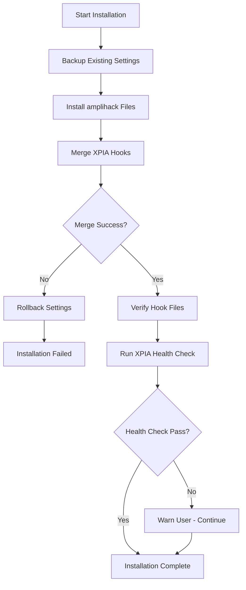

# XPIA Hook Integration Module Specification

## Purpose

Intelligent integration of XPIA security defense hooks into Claude Code settings.json during installation, preserving existing user configurations while ensuring security is enabled.

## Problem Analysis

**Critical Issue #137**: XPIA security defense system hooks not configured during installation, leaving users vulnerable to prompt injection attacks.

**Root Cause**: Installation process completely replaces hook configuration instead of intelligently merging XPIA security hooks with existing user hooks.

## Module Architecture

### 1. Hook Configuration Manager

**Purpose**: Core module for settings.json hook management

**Contract**:

- **Inputs**:
  - `settings_path: str` - Path to settings.json
  - `hook_configs: List[HookConfig]` - XPIA hooks to integrate
- **Outputs**:
  - `MergeResult` - Success/failure with rollback info
- **Side Effects**:
  - Modifies settings.json
  - Creates backup files
  - Logs merge operations

**Key Functions**:

```python
async def merge_hooks(settings_path: str, xpia_hooks: List[HookConfig]) -> MergeResult
async def backup_settings(settings_path: str) -> str
async def restore_settings(settings_path: str, backup_path: str) -> bool
def validate_settings_format(settings_path: str) -> bool
```

### 2. XPIA Security Hooks Definition

**Purpose**: Define required XPIA security hooks and their configurations

**XPIA Hook Integration Points**:

1. **PreToolUse Hook** - Validate commands before execution

   ```json
   {
     "type": "command",
     "command": "~/.claude/tools/xpia/hooks/pre_tool_use.py",
     "matcher": "Bash",
     "timeout": 5000
   }
   ```

2. **PostToolUse Hook** - Monitor command results and log security events

   ```json
   {
     "type": "command",
     "command": "~/.claude/tools/xpia/hooks/post_tool_use.py",
     "matcher": "*",
     "timeout": 3000
   }
   ```

3. **SessionStart Hook** - Initialize XPIA security monitoring
   ```json
   {
     "type": "command",
     "command": "~/.claude/tools/xpia/hooks/session_start.py",
     "timeout": 10
   }
   ```

### 3. Smart Merge Strategy

**Merge Logic**:

1. **Backup First**: Always create timestamped backup
2. **Format Detection**: Handle both array and object hook formats
3. **Conflict Resolution**: Preserve user hooks, add XPIA hooks
4. **Validation**: Verify merged configuration is valid JSON
5. **Rollback**: Restore backup on any failure

**Edge Cases Handled**:

- Fresh installation (no settings.json)
- Corrupted settings.json
- Existing XPIA hooks (update vs duplicate)
- Mixed hook formats in same file
- Missing hook directories

### 4. Installation Integration

**Modified Install Process**:

```bash
# Current install.sh modifications needed:
1. Call hook_merge_utility.py instead of direct sed replacement
2. Pass XPIA hook definitions to merge utility
3. Handle merge failures gracefully with rollback
4. Verify hook files exist after merge
5. Test XPIA health check after installation
```

## Implementation Modules

### Module: HookMergeUtility

**File**: `src/amplihack/utils/hook_merge_utility.py`

**Contract**:

- **Inputs**: `settings_file_path: str, xpia_hooks: List[Dict]`
- **Outputs**: `MergeResult` with success/failure and rollback path
- **Side Effects**: Modifies settings.json, creates backups

**Key Classes**:

```python
@dataclass
class HookConfig:
    hook_type: str  # "SessionStart", "PostToolUse", etc.
    command: str
    matcher: Optional[str] = None
    timeout: Optional[int] = None

@dataclass
class MergeResult:
    success: bool
    backup_path: Optional[str] = None
    error_message: Optional[str] = None
    hooks_added: int = 0
    hooks_updated: int = 0
```

### Module: XPIAHookManager

**File**: `src/amplihack/security/xpia_hook_manager.py`

**Purpose**: XPIA-specific hook management and health checking

**Contract**:

- **Inputs**: None (uses standard XPIA hook definitions)
- **Outputs**: List of required XPIA hooks for installation
- **Side Effects**: None (pure configuration)

**Key Functions**:

```python
def get_required_xpia_hooks() -> List[HookConfig]
async def verify_xpia_hooks_active() -> bool
async def xpia_health_check() -> Dict[str, Any]
```

### Module: InstallationValidator

**File**: `src/amplihack/utils/installation_validator.py`

**Purpose**: Validate successful XPIA hook installation

**Contract**:

- **Inputs**: `settings_path: str`
- **Outputs**: `ValidationResult` with status and issues
- **Side Effects**: May create diagnostic logs

## Test Requirements

### Unit Tests

1. **Hook merge with fresh settings.json**
2. **Hook merge with existing user hooks**
3. **Conflict resolution (duplicate XPIA hooks)**
4. **Malformed JSON handling and recovery**
5. **Backup and rollback functionality**

### Integration Tests

1. **End-to-end installation with XPIA hooks**
2. **UVX installation flow with hook integration**
3. **Manual installation verification**
4. **Health check validation after installation**

### Edge Case Tests

1. **No write permissions to settings.json**
2. **Corrupted settings.json recovery**
3. **Missing XPIA hook files**
4. **Network issues during installation**

## Security Considerations

1. **File Permissions**: Ensure settings.json has appropriate permissions
2. **Backup Security**: Protect backup files from unauthorized access
3. **Hook Validation**: Verify XPIA hook files exist and are executable
4. **Rollback Integrity**: Ensure rollback cannot be tampered with

## Installation Flow Integration



## Key Design Decisions

1. **JSON-Based Configuration**: Use native Claude Code settings.json format
2. **Backup-First Strategy**: Always backup before modification for safety
3. **Incremental Merge**: Add XPIA hooks without removing user hooks
4. **Graceful Degradation**: Installation succeeds even if XPIA hooks fail
5. **Explicit Validation**: Verify installation success with health checks

## Dependencies

- `json` library for settings.json parsing
- `pathlib` for file path handling
- `datetime` for backup timestamps
- `logging` for operation tracking
- XPIA Defense interface (existing)

## Success Criteria

1. **Fresh Installation**: XPIA hooks active immediately after UVX install
2. **Existing Users**: XPIA hooks added without breaking current setup
3. **Health Validation**: `amplihack xpia health` reports system active
4. **Zero Data Loss**: User configurations preserved during merge
5. **Recovery**: Failed installations can be rolled back completely

## Migration Strategy

1. **Phase 1**: Implement hook merge utility
2. **Phase 2**: Update install.sh to use merge utility
3. **Phase 3**: Add XPIA health validation
4. **Phase 4**: Test with UVX installation flow
5. **Phase 5**: Deploy and monitor

This specification provides the blueprint for solving Issue #137 while maintaining the project's ruthless simplicity philosophy.
