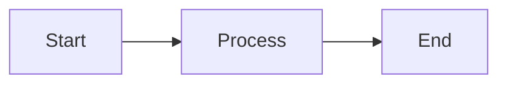

# amplihack Documentation

This directory contains the source files for the amplihack documentation website built with MkDocs Material.

## Documentation Structure

```
docs/
├── index.md                    # Landing page
├── README.md                   # This file
├── commands/                   # Command guides
│   └── COMMAND_SELECTION_GUIDE.md
├── stylesheets/                # Custom CSS
│   └── extra.css
├── javascripts/                # Custom JS
│   └── extra.js
└── [other markdown files]      # Additional documentation

# Documentation sources (referenced in mkdocs.yml)
├── .claude/context/            # Core concepts
├── .claude/workflow/           # Workflows
├── .claude/agents/             # Agents
├── .claude/commands/           # Commands
├── .claude/skills/             # Skills
├── .claude/scenarios/          # Tools
└── [root level .md files]      # Getting started guides
```

## Building and Serving

### Prerequisites

Install documentation dependencies:

```bash
pip install -r requirements-docs.txt
```

### Local Development

Start a local development server with live reload:

```bash
make docs-serve
# or
mkdocs serve
```

Documentation will be available at: http://127.0.0.1:8000

### Build Static Site

Build the documentation to the `site/` directory:

```bash
make docs-build
# or
mkdocs build --strict
```

The `--strict` flag ensures warnings are treated as errors.

### Deploy to GitHub Pages

Deploy to GitHub Pages (requires write access):

```bash
make docs-deploy
# or
mkdocs gh-deploy --force
```

## Configuration

### Main Configuration

The documentation is configured in `/mkdocs.yml`:

- **Site metadata**: Name, description, URL
- **Theme**: Material theme with custom colors and features
- **Navigation**: Hierarchical navigation structure
- **Plugins**: Search, git revision dates, minification
- **Markdown extensions**: Enhanced markdown features

### Theme Features

The Material theme includes:

- **Dark/light mode toggle**
- **Instant navigation** (SPA-like experience)
- **Search with suggestions**
- **Navigation tabs** (main sections)
- **Code copy buttons**
- **Mermaid diagram support**
- **Math rendering** (MathJax)

### Custom Styling

Custom CSS is in `stylesheets/extra.css`:

- Code block styling
- Table improvements
- Admonition styling
- Command block highlighting
- Dark mode adjustments

Custom JavaScript is in `javascripts/extra.js`:

- Copy button enhancements
- Smooth scrolling
- Back to top button
- External link indicators
- Command code block detection

## Navigation Structure

The navigation is organized into 9 main sections:

1. **Home**: Landing page
2. **Getting Started**: Installation and quick start
3. **Core Concepts**: Philosophy, patterns, trust
4. **Workflows**: Default workflow, DDD, fault tolerance
5. **Agents**: Core, specialized, and workflow agents
6. **Commands**: All slash commands with guides
7. **Skills**: Claude Code skills
8. **Tools**: Scenarios and hooks
9. **Advanced Topics**: Development guide, integrations
10. **Reference**: Discoveries, security, testing

## Adding New Documentation

### Adding a New Page

1. **Create markdown file**:

   ```bash
   touch docs/new-page.md
   ```

2. **Add to navigation** in `mkdocs.yml`:

   ```yaml
   nav:
     - Section Name:
         - Page Title: new-page.md
   ```

3. **Preview changes**:
   ```bash
   make docs-serve
   ```

### Referencing Existing Files

You can reference files outside the `docs/` directory by adding them to the navigation:

```yaml
nav:
  - Core Concepts:
      - Philosophy: .claude/context/PHILOSOPHY.md
```

### Using Markdown Extensions

The documentation supports enhanced markdown:

#### Admonitions

```markdown
!!! note "Custom Title"
This is a note admonition.

!!! warning
This is a warning.

!!! tip
This is a tip.
```

#### Code Blocks with Syntax Highlighting

````markdown
```python
def hello_world():
    print("Hello, World!")
```
````

#### Mermaid Diagrams

````markdown

````

#### Task Lists

```markdown
- [x] Completed task
- [ ] Incomplete task
```

#### Tabbed Content

```markdown
=== "Tab 1"
Content for tab 1

=== "Tab 2"
Content for tab 2
```

## Continuous Integration

The documentation is automatically deployed on push to `main` via GitHub Actions (`.github/workflows/docs.yml`).

### Deployment Triggers

- Push to `main` branch
- Changes to:
  - `docs/**`
  - `mkdocs.yml`
  - `requirements-docs.txt`
  - `~/.amplihack/.claude/**` (context, workflows, agents, commands, skills, scenarios)
  - Root level markdown files

### Manual Deployment

Trigger manual deployment via GitHub Actions:

1. Go to Actions tab
2. Select "Deploy Documentation" workflow
3. Click "Run workflow"

## Troubleshooting

### Build Errors

**Problem**: Build fails with "Config value: 'X' not found"

**Solution**: Check that referenced files exist in `mkdocs.yml` navigation

**Problem**: Warnings treated as errors

**Solution**: Fix all warnings or remove `--strict` flag (not recommended)

### Missing Files

**Problem**: File not found when serving locally

**Solution**: Ensure file path in `mkdocs.yml` is relative to repository root

### Plugin Errors

**Problem**: Plugin fails to load

**Solution**: Reinstall documentation dependencies:

```bash
pip install -r requirements-docs.txt --force-reinstall
```

### GitHub Pages Not Updating

**Problem**: Changes not visible on GitHub Pages

**Solution**:

1. Check GitHub Actions logs
2. Ensure `gh-pages` branch exists
3. Verify GitHub Pages settings in repository

## Best Practices

### Documentation Writing

1. **Start with user needs**: What are they trying to do?
2. **Use clear headings**: H2 for main sections, H3 for subsections
3. **Include examples**: Show, don't just tell
4. **Link related content**: Help users discover more
5. **Keep it concise**: Respect the reader's time

### Navigation Organization

1. **Logical hierarchy**: Group related content together
2. **Clear labels**: Navigation titles should be descriptive
3. **Consistent depth**: Don't nest too deeply (3 levels max)
4. **Progressive disclosure**: Start simple, link to advanced

### Code Examples

1. **Complete and runnable**: Examples should work as-is
2. **Annotated**: Explain non-obvious parts
3. **Realistic**: Use real-world scenarios
4. **Tested**: Verify examples actually work

## Resources

- **MkDocs**: https://www.mkdocs.org/
- **Material for MkDocs**: https://squidfunk.github.io/mkdocs-material/
- **Markdown Guide**: https://www.markdownguide.org/
- **PyMdown Extensions**: https://facelessuser.github.io/pymdown-extensions/

## Contributing

When adding documentation:

1. Follow the existing structure
2. Use markdown extensions appropriately
3. Test locally before committing
4. Update navigation in `mkdocs.yml`
5. Consider cross-linking related content

---

For questions or issues, please open an issue on GitHub.
