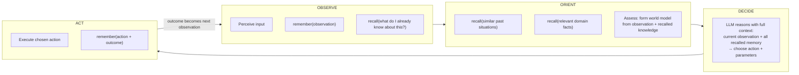
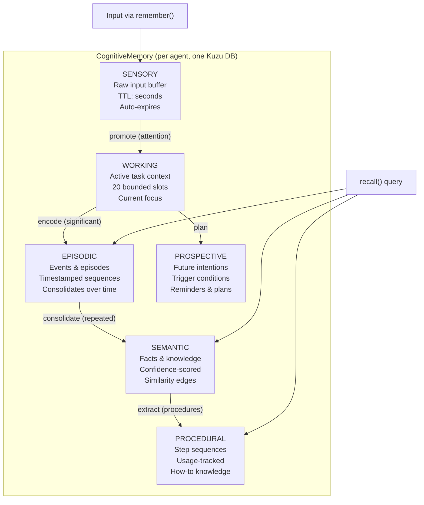
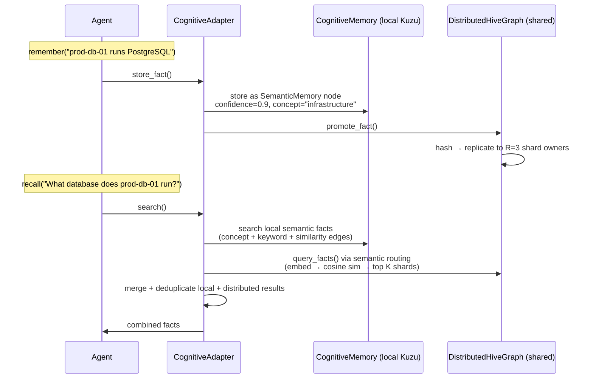

# Goal-Seeking Agent & Memory Architecture

## Agent

A `GoalSeekingAgent` is a single unit that can learn, reason, and act. It has one `Memory` instance and one `AgenticLoop` (OODA cycle). Every operation — learning content, answering questions, pursuing multi-step goals — runs through the same OODA loop.

```python
from amplihack.memory import Memory

mem = Memory("agent_0")
mem.remember("Server prod-db-01 runs PostgreSQL 15.4")
facts = mem.recall("What database does prod-db-01 run?")
```

The agent doesn't know or care whether memory is local or distributed. That's configuration.

## OODA Loop

Every agent operation is one or more iterations of:



**OBSERVE** stores the input and checks what the agent already knows about it. **ORIENT** deepens the context with similar past situations and domain knowledge — both via `recall()`. **DECIDE** is where the LLM reasons with the full picture. **ACT** executes and stores the outcome.

Memory is read and written at multiple phases, not just at the end.

### Operations Mapped to OODA

**`learn_from_content(content)`** — one iteration:
- OBSERVE: remember the content, recall if we've seen similar before
- ORIENT: check for duplicates, assess temporal context
- DECIDE: LLM extracts structured facts
- ACT: store each fact via `remember()`, record the episode

**`answer_question(question)`** — one iteration:
- OBSERVE: remember the question, recall any prior answers to it
- ORIENT: recall domain facts, recall similar past questions
- DECIDE: LLM synthesizes answer from recalled context
- ACT: return answer, remember the Q&A pair

**`run(goal)`** — multiple iterations:
- Each iteration: observe current state → orient with memory → decide next action → act → observe result
- Continues until goal is achieved or max iterations

## Memory System

Memory has two concerns: **storage backend** and **topology**.

**Storage backend** (how facts are persisted per agent):
- `cognitive` (default): 6-type CognitiveMemory backed by Kuzu graph DB. Supports sensory, working, episodic, semantic, procedural, and prospective memory. Each agent gets a 256MB Kuzu instance.
- `hierarchical`: Simpler flat key-value store. No external dependencies.
- `simple`: In-memory dict. For testing.

**Topology** (how agents share knowledge):
- `single` (default): One agent, local storage only. No network. For development.
- `distributed`: All agents share a single `DistributedHiveGraph`. Facts are sharded across agents via a consistent hash ring with replication factor R=3.

### Configuration

Resolves in priority order: explicit kwargs → environment variables → YAML config file → sensible defaults.

```yaml
# ~/.amplihack/memory.yaml
memory:
  backend: cognitive
  topology: distributed
  storage_path: /data/memory
  kuzu_buffer_pool_mb: 256
  replication_factor: 3
  query_fanout: 5
  gossip_enabled: true
  gossip_rounds: 3
  shard_backend: memory  # "memory" (default) or "kuzu"
```

Or via env vars for containers:

```
AMPLIHACK_MEMORY_BACKEND=cognitive
AMPLIHACK_MEMORY_TOPOLOGY=distributed
AMPLIHACK_MEMORY_REPLICATION=3
AMPLIHACK_MEMORY_SHARD_BACKEND=kuzu
```

**Shard backend guidance:**
- `shard_backend: memory` (default) — DHT shards are held in-memory dicts. Fast, zero dependencies, but data is lost on restart. Use for development, testing, and short-lived multi-agent sessions.
- `shard_backend: kuzu` — DHT shards are persisted to Kuzu databases under `{storage_path}/shards/{agent_id}/`. Survives restarts and supports larger datasets. Use for production distributed deployments where cross-agent facts must persist across process boundaries.

## Cognitive Memory Model

CognitiveMemory is the storage backend — it's what sits behind `Memory.remember()` and `Memory.recall()` when `backend=cognitive`. It implements six distinct memory types modeled on human cognitive architecture, all backed by a single Kuzu graph database per agent.



### Memory Types

**Sensory** — raw input buffering. When the agent observes content during OBSERVE, it enters sensory memory first. Most sensory items expire (TTL-based). Only items the agent "attends to" (referenced during ORIENT) promote to working memory.

**Working** — bounded active context. 20 slots maximum. The agent's scratchpad during a single OODA iteration. Holds the current question, recalled facts from ORIENT, the reasoning trace from DECIDE. Cleared between iterations.

**Episodic** — timestamped event records. When `learn_from_content()` processes a turn, the raw content is stored as an episode with temporal metadata. Episodes consolidate over time — repeated similar episodes strengthen the corresponding semantic facts.

**Semantic** — the primary knowledge store. Facts with confidence scores (0.0-1.0) and similarity edges between related facts. This is what `recall()` searches. Facts stored via `remember()` during ACT go here. Confidence decays with a configurable rate, so stale facts naturally lose priority.

**Procedural** — step-by-step procedures. "To rotate API keys: 1) generate new key, 2) update vault, 3) revoke old key" — stored with usage tracking. Frequently used procedures have higher retrieval priority.

**Prospective** — future intentions with trigger conditions. "If CVE-2024-1234 patch is released, update prod-app-01" — stored with a trigger that fires when the condition is observed during a future OBSERVE phase.

### Kuzu Graph Structure

Inside each agent's Kuzu DB:

```
Nodes:
  SensoryMemory    (content, timestamp, ttl, observation_order)
  WorkingMemory    (slot_key, content, priority, timestamp)
  EpisodicMemory   (event_description, emotions, context, temporal_index, consolidated)
  SemanticMemory   (concept, content, confidence, source, timestamp)
  ProceduralMemory (procedure_name, steps_json, usage_count, last_used)
  ProspectiveMemory(intention, trigger_condition, deadline, status)

Relationships:
  SIMILAR_TO       (SemanticMemory → SemanticMemory, weight: 0.0-1.0)
  DERIVED_FROM     (SemanticMemory → EpisodicMemory)
  CONSOLIDATES     (SemanticMemory → EpisodicMemory)
  TRIGGERS         (ProspectiveMemory → SemanticMemory)
```

## Distributed Hive Graph (DHT)

When topology is `distributed`, all agents register on a single consistent hash ring.

### Fact Storage

When an agent calls `remember()`, the fact is stored locally in the agent's Kuzu DB AND promoted to the DHT. The DHT hashes the fact content to a ring position and stores it on the R=3 nearest agents. Each agent holds ~F/N facts in its shard, not all F.

### Query Routing (Semantic)

When an agent calls `recall()`:
1. Embed the question using BAAI/bge-base-en-v1.5
2. Compute cosine similarity between question embedding and each shard's summary embedding (running average of all stored fact embeddings)
3. Route to the top K=5 shards by similarity
4. Search those shards with keyword matching
5. Merge and deduplicate with local results

Falls back to keyword-based DHT routing if embeddings are unavailable.

### Gossip Protocol

Agents periodically exchange bloom filter summaries of their shard contents. Each bloom filter is ~1KB for 1000 facts at 1% false positive rate. Missing facts are pulled from peers. Convergence is O(log N) rounds.

### Replication & Fault Tolerance

Every fact exists on R=3 agents. If an agent leaves, orphaned facts are automatically redistributed to the next agents on the ring.

```
Hash Ring (100 agents, 64 virtual nodes each = 6400 ring positions):

    Agent 0  Agent 23  Agent 7  Agent 45  Agent 91  ...
      ↓        ↓        ↓        ↓         ↓
    ┌────┐  ┌────┐   ┌────┐  ┌────┐    ┌────┐
    │~50 │  │~48 │   │~52 │  │~50 │    │~49 │  facts per shard
    └────┘  └────┘   └────┘  └────┘    └────┘
```

## How Local and Distributed Connect



An agent's **local CognitiveMemory** contains facts it learned directly. The **DHT** contains facts from ALL agents, sharded. When recalling, both are searched and results merged. So agent_42 (who only learned 50 turns) can access facts from agent_7's turns via the DHT.

## The Two Layers

| Aspect | CognitiveMemory (local) | DistributedHiveGraph (shared) |
|--------|------------------------|-------------------------------|
| Scope | One agent's knowledge | All agents' knowledge |
| Storage | Kuzu graph DB (256MB) | In-memory dicts (default) or Kuzu shards (shard_backend=kuzu) |
| Structure | 6 typed memory types + relationships | Flat facts with tags + embeddings |
| Search | Concept + keyword + similarity graph traversal | Semantic embed → cosine sim → shard lookup |
| Persistence | Disk (Kuzu files) | In-memory (lost on restart) or disk with shard_backend=kuzu |
| Purpose | Deep personal knowledge with reasoning structure | Fast cross-agent fact sharing and routing |

## Eval Harness

The eval tests the production agent — same code, same OODA loop, same Memory facade.

**Single condition**: 1 agent with `Memory("agent", topology="single")`. Learns all 5000 turns. Answers 100 questions × 3 repeats. Reports median.

**Federated condition**: 100 agents with `Memory("agent_N", topology="distributed", shared_hive=hive)`. Turns distributed round-robin (50 per agent). Learning parallelized (10 workers, 9x speedup). Gossip rounds after learning. Q&A with semantic expertise routing + consensus voting × 3 repeats. Reports median.

Scoring: LLM grader (multi-vote median) scores 0.0-1.0 across 12 cognitive levels (L1 direct recall through L12 far transfer).

## File Map

```
amplihack/
├── memory/
│   ├── facade.py                          # Memory — remember()/recall()
│   └── config.py                          # MemoryConfig — env/yaml/kwargs
├── agents/goal_seeking/
│   ├── agentic_loop.py                    # AgenticLoop — OODA cycle
│   ├── learning_agent.py                  # learn_from_content/answer_question via OODA
│   ├── cognitive_adapter.py               # Wraps CognitiveMemory + hive integration
│   └── hive_mind/
│       ├── dht.py                         # HashRing, ShardStore, DHTRouter
│       ├── bloom.py                       # BloomFilter for gossip
│       ├── distributed_hive_graph.py      # DistributedHiveGraph
│       ├── embeddings.py                  # BAAI/bge-base-en-v1.5
│       ├── gossip.py                      # Gossip protocol
│       ├── reranker.py                    # RRF merge, hybrid scoring
│       ├── crdt.py                        # GSet, ORSet, LWWRegister
│       └── event_bus.py                   # Local/Redis/Azure transport

amplihack-agent-eval/
├── src/amplihack_eval/
│   ├── cli.py                             # amplihack-eval command
│   ├── core/
│   │   ├── continuous_eval.py             # single/federated comparison
│   │   ├── runner.py                      # EvalRunner
│   │   └── grader.py                      # LLM grading
│   └── data/
│       └── security_analyst_scenario.py   # 5000-turn dialogue + L1-L12 questions

amplihack-memory-lib/
└── src/amplihack_memory/
    └── cognitive_memory.py                # 6-type Kuzu-backed memory
```

---

## NetworkGraphStore — Network-Replicated GraphStore

`NetworkGraphStore` (added in `feat/distributed-hive-mind`) is a drop-in `GraphStore`
that wraps any local store and replicates writes and searches over a network transport.

### How it works

```
Agent A                              Agent B
────────────────────                 ────────────────────
NetworkGraphStore                    NetworkGraphStore
  └── InMemoryGraphStore               └── InMemoryGraphStore
        ▲  write locally                     ▲  apply remote write
        │                                    │
        └──── event_bus.publish ────────────► └── _process_incoming thread
                                              └── responds to search queries
```

1. **`create_node`** — stores locally, then publishes `network_graph.create_node` event.
2. **`search_nodes`** — searches locally, publishes `network_graph.search_query`, waits
   up to `search_timeout` seconds for remote responses, returns merged/deduplicated results.
3. **`_process_incoming`** — background thread polls the event bus and applies remote
   `create_node` / `create_edge` events to the local store, and responds to
   `search_query` events with local results.

### Configuration

```python
from amplihack.memory.network_store import NetworkGraphStore
from amplihack.memory.memory_store import InMemoryGraphStore

store = NetworkGraphStore(
    agent_id="agent_0",
    local_store=InMemoryGraphStore(),
    transport="azure_service_bus",          # "local" | "redis" | "azure_service_bus"
    connection_string="Endpoint=sb://...",
    topic_name="hive-graph",                # optional, default: "hive-graph"
    search_timeout=3.0,                     # seconds to wait for remote responses
)
```

Or via `Memory` facade using env vars:

```bash
export AMPLIHACK_MEMORY_TRANSPORT=azure_service_bus
export AMPLIHACK_MEMORY_CONNECTION_STRING="Endpoint=sb://..."
```

```python
mem = Memory("agent_0")  # auto-wraps with NetworkGraphStore
```

### Environment variables

| Variable | Description | Default |
|---|---|---|
| `AMPLIHACK_MEMORY_TRANSPORT` | Transport: `local`, `redis`, `azure_service_bus` | `local` |
| `AMPLIHACK_MEMORY_CONNECTION_STRING` | Service Bus connection string or Redis URL | `""` |
