# Layer 5: API Contracts

Every public endpoint, CLI command, and hook event exposed by the amplihack codebase.

## Scope

- CLI subcommands (management, SDK launchers, plugin, memory, recipe, fleet)
- Shared and command-specific argument flags
- Hook events (stop hook, XPIA defense hook)

## Mermaid Diagram

## DOT Diagram

## Command Inventory

See [inventory.md](inventory.md) for the full route/command listing with handlers and arguments.

## Key Observations

1. **Passthrough pattern**: SDK launcher commands (launch, claude, copilot, codex, amplifier) accept unknown arguments and forward them after `--` to the underlying CLI binary.
2. **Alias structure**: `claude` is a direct alias for `launch`. `RustyClawd` routes to the same launch path but selects the Rust binary.
3. **Nested subparsers**: `plugin`, `memory`, `recipe`, and `mode` each have their own subcommand trees.
4. **Fleet delegation**: The `fleet` command delegates entirely to a Click-based CLI rather than using argparse.
5. **Hook system**: Two hook events exist -- `stop` (session cleanup) and XPIA defense (web content scanning). Both are loaded dynamically via `importlib`.
