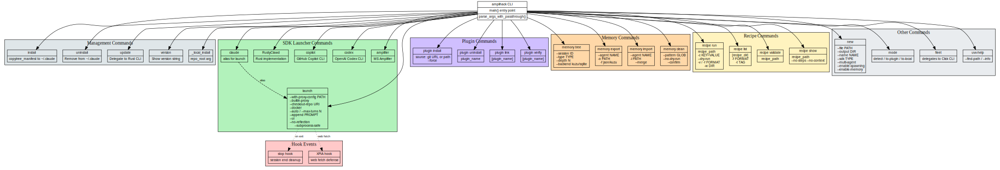

<nav class="atlas-breadcrumb">
<a href="../">Atlas</a> &raquo; Layer 5: API Contracts
</nav>

# Layer 5: API Contracts

<div class="atlas-metadata">
Category: <strong>Behavioral</strong> | Generated: 2026-03-18T05:22:08.244248+00:00
</div>

## Map

=== "Interactive (Mermaid)"

    ```mermaid
    graph TD
        ROOT["amplihack"]
        C0["generate"]
        ROOT --> C0
        C1["test"]
        ROOT --> C1
        C2["package"]
        ROOT --> C2
        C3["distribute"]
        ROOT --> C3
        C4["create-repo"]
        ROOT --> C4
        C5["update"]
        ROOT --> C5
        C6["pipeline"]
        ROOT --> C6
        C7["version"]
        ROOT --> C7
        C8["install"]
        ROOT --> C8
        C9["uninstall"]
        ROOT --> C9
        C10["update"]
        ROOT --> C10
        C11["launch"]
        ROOT --> C11
        C12["claude"]
        ROOT --> C12
        C13["RustyClawd"]
        ROOT --> C13
        C14["copilot"]
        ROOT --> C14
        C15["codex"]
        ROOT --> C15
        C16["amplifier"]
        ROOT --> C16
        C17["uvx-help"]
        ROOT --> C17
        C18["_local_install"]
        ROOT --> C18
        C19["plugin"]
        ROOT --> C19
        C20["install"]
        ROOT --> C20
        C21["uninstall"]
        ROOT --> C21
        C22["link"]
        ROOT --> C22
        C23["verify"]
        ROOT --> C23
        C24["memory"]
        ROOT --> C24
        C25["tree"]
        ROOT --> C25
        C26["export"]
        ROOT --> C26
        C27["import"]
        ROOT --> C27
        C28["clean"]
        ROOT --> C28
        C29["new"]
        ROOT --> C29
        C30["recipe"]
        ROOT --> C30
        C31["run"]
        ROOT --> C31
        C32["list"]
        ROOT --> C32
        C33["validate"]
        ROOT --> C33
        C34["show"]
        ROOT --> C34
        C35["mode"]
        ROOT --> C35
        C36["detect"]
        ROOT --> C36
        C37["to-plugin"]
        ROOT --> C37
        C38["to-local"]
        ROOT --> C38
        C39["fleet"]
        ROOT --> C39
        C40["stats"]
        ROOT --> C40
        C41["files"]
        ROOT --> C41
        C42["functions"]
        ROOT --> C42
        C43["classes"]
        ROOT --> C43
        C44["search"]
        ROOT --> C44
        C45["callers"]
        ROOT --> C45
        C46["callees"]
        ROOT --> C46
        C47["plugin"]
        ROOT --> C47
        C48["install"]
        ROOT --> C48
        C49["uninstall"]
        ROOT --> C49
        C50["verify"]
        ROOT --> C50
        C51["create"]
        ROOT --> C51
    
        click ROOT "../" "Back to Atlas"
    ```

=== "High-Fidelity (Graphviz)"

    <div class="atlas-diagram-container">
    
    </div>

=== "Data Table"

    | Command | Args | Help |
    |---------|------|------|
    | `generate` | 0 | Generate agent bundle from prompt |
    | `test` | 0 | Test generated agents and bundles |
    | `package` | 0 | Package bundle for distribution |
    | `distribute` | 0 | Distribute bundle to GitHub |
    | `create-repo` | 0 | Create GitHub repository for bundle |
    | `update` | 0 | Check for bundle updates (full update coming soon) |
    | `pipeline` | 0 | Run complete pipeline |
    | `version` | 0 | Show amplihack version |
    | `install` | 0 | Install amplihack agents and tools to ~/.claude |
    | `uninstall` | 0 | Remove amplihack agents and tools from ~/.claude |
    | `update` | 0 | Update amplihack, delegating to the Rust CLI when one is ins |
    | `launch` | 0 | Launch Claude Code with optional proxy configuration |
    | `claude` | 0 | Launch Claude Code (alias for launch) |
    | `RustyClawd` | 0 | Launch RustyClawd (Rust implementation) |
    | `copilot` | 0 | Launch GitHub Copilot CLI |
    | `codex` | 0 | Launch OpenAI Codex CLI |
    | `amplifier` | 0 | Launch Microsoft Amplifier with amplihack bundle |
    | `uvx-help` | 0 | Get help with UVX deployment |
    | `_local_install` | 0 | _local_install |
    | `plugin` | 0 | Plugin management commands |
    | `install` | 0 | Install plugin from git URL or local path |
    | `uninstall` | 0 | Remove plugin |
    | `link` | 0 | Link installed plugin to Claude Code settings |
    | `verify` | 0 | Verify plugin installation and discoverability |
    | `memory` | 0 | Memory system commands |
    | `tree` | 0 | Visualize memory graph as tree |
    | `export` | 0 | Export agent memory to a portable format |
    | `import` | 0 | Import memory from a portable format into an agent |
    | `clean` | 0 | Clean up test sessions |
    | `new` | 0 | Generate a new goal-seeking agent |
    | `recipe` | 0 | Recipe management and execution commands |
    | `run` | 0 | Execute a recipe from YAML file |
    | `list` | 0 | List available recipes |
    | `validate` | 0 | Validate a recipe YAML file |
    | `show` | 0 | Show detailed recipe information |
    | `mode` | 0 | Claude installation mode commands |
    | `detect` | 0 | Detect current Claude installation mode |
    | `to-plugin` | 0 | Migrate from local to plugin mode |
    | `to-local` | 0 | Create local .claude/ from plugin |
    | `fleet` | 0 | Fleet orchestration — manage coding agents across VMs |

## Legend

<div class="atlas-legend" markdown>

| Symbol | Meaning |
|--------|---------|
| ROOT | `amplihack` CLI entry |
| Rectangle | Subcommand |
| Label | `name` / `arg count` |
| Arrow | Parent-child command |

</div>

## Key Findings

- 52 CLI commands
- 22 HTTP routes
- 19 recipes defined

## Detail

??? info "Full data (click to expand)"

    **Summary metrics:**
    
    - **Cli Command Count**: 52
    - **Cli Argument Count**: 236
    - **Http Route Count**: 22
    - **Hook Event Count**: 274
    - **Recipe Count**: 19
    - **Skill Count**: 402
    - **Agent Count**: 41

## Cross-References

<div class="atlas-crossref" markdown>

- [Layer 8: User Journeys](../user-journeys/)

</div>

<div class="atlas-footer">

Source: [`layer5_api_contracts.json`](../../atlas_output/layer5_api_contracts.json)
 | [Mermaid source](api-contracts.mmd)

</div>
