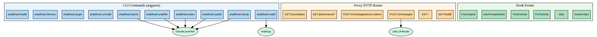

# Layer 3: Routing and API Contracts

**Generated:** 2026-03-17
**Codebase:** amplihack (v0.6.73)

## Overview

Amplihack has three distinct "routing" surfaces:

1. **CLI commands** (argparse) -- the primary user interface
2. **Proxy HTTP routes** (FastAPI/Flask) -- optional API proxy
3. **Hook events** -- lifecycle events dispatched to hook scripts

## CLI Command Routes

All CLI parsing is in `src/amplihack/cli.py`. The main parser uses argparse subcommands.

| Command | Handler | Auth | Description |
|---------|---------|------|-------------|
| `launch` (default) | `ClaudeLauncher.launch()` | None | Launch Claude Code with amplihack plugins |
| `claude` | `ClaudeLauncher.launch()` | None | Alias for launch |
| `copilot` | `ClaudeLauncher.launch()` | None | Launch GitHub Copilot |
| `codex` | `ClaudeLauncher.launch()` | None | Launch OpenAI Codex |
| `amplifier` | `ClaudeLauncher.launch()` | None | Launch Microsoft Amplifier |
| `install` | `_local_install()` | None | Install amplihack to ~/.claude |
| `uninstall` | `uninstall()` | None | Remove amplihack from ~/.claude |
| `plugin install` | `plugin_install_command()` | None | Install Claude Code plugin |
| `plugin uninstall` | `plugin_uninstall_command()` | None | Uninstall plugin |
| `plugin verify` | `plugin_verify_command()` | None | Verify plugin installation |
| `memory evaluate` | `memory.cli_evaluate` | None | Evaluate memory effectiveness |
| `memory visualize` | `memory.cli_visualize` | None | Visualize memory graph |
| `memory cleanup` | `memory.cli_cleanup` | None | Clean memory database |
| `health` | `health_check.run_checks()` | None | System health checks |
| `version` | print version | None | Show version info |

## Proxy HTTP Routes

Defined in `src/amplihack/proxy/integrated_proxy.py` (FastAPI):

| Method | Path | Handler | Auth | Description |
|--------|------|---------|------|-------------|
| GET | `/` | root | None | Proxy info |
| GET | `/health` | health_check | None | Health status |
| POST | `/v1/messages` | proxy_messages | API Key | Forward to AI provider via LiteLLM |
| POST | `/v1/messages/count_tokens` | count_tokens | API Key | Token counting |
| GET | `/performance/metrics` | get_metrics | None | Performance metrics |
| GET | `/performance/cache/status` | cache_status | None | Cache stats |
| GET | `/performance/cache/clear` | clear_cache | None | Clear cache |
| GET | `/performance/benchmark` | benchmark | None | Performance benchmark |
| GET | `/azure/status` | azure_status | None | Azure connection status |
| GET | `/azure/test-error-handling` | test_errors | None | Azure error handling test |

Additional proxy in `responses_api_proxy.py` (Flask):

| Method | Path | Handler | Auth | Description |
|--------|------|---------|------|-------------|
| POST | `/v1/messages` | proxy_request | API Key | OpenAI Responses API proxy |

Log streaming in `log_streaming.py` (FastAPI):

| Method | Path | Handler | Auth | Description |
|--------|------|---------|------|-------------|
| GET | `/stream/logs` | stream_logs | None | SSE log stream |
| GET | `/health` | health | None | SSE health |

## Hook Event Routes

Hook events are internal lifecycle events, not HTTP. Defined in `__init__.py:HOOK_CONFIGS`:

| Event Type | Hook File | Timeout | Matcher |
|-----------|-----------|---------|---------|
| SessionStart | session_start.py | 10s | - |
| Stop | stop.py | 120s | - |
| PreToolUse | pre_tool_use.py | - | * |
| PostToolUse | post_tool_use.py | - | * |
| UserPromptSubmit | user_prompt_submit.py | 10s | - |
| UserPromptSubmit | workflow_classification_reminder.py | 5s | - |
| PreCompact | pre_compact.py | 30s | - |

XPIA security hooks (separate chain):

| Event Type | Hook File | Timeout | Matcher |
|-----------|-----------|---------|---------|
| SessionStart | session_start.py | 10s | - |
| PostToolUse | post_tool_use.py | - | * |
| PreToolUse | pre_tool_use.py | - | * |

## Diagrams

### Mermaid Diagram

### Graphviz Diagram

**Source files:** [routes.mmd](routes.mmd) | [routes.dot](routes.dot)
