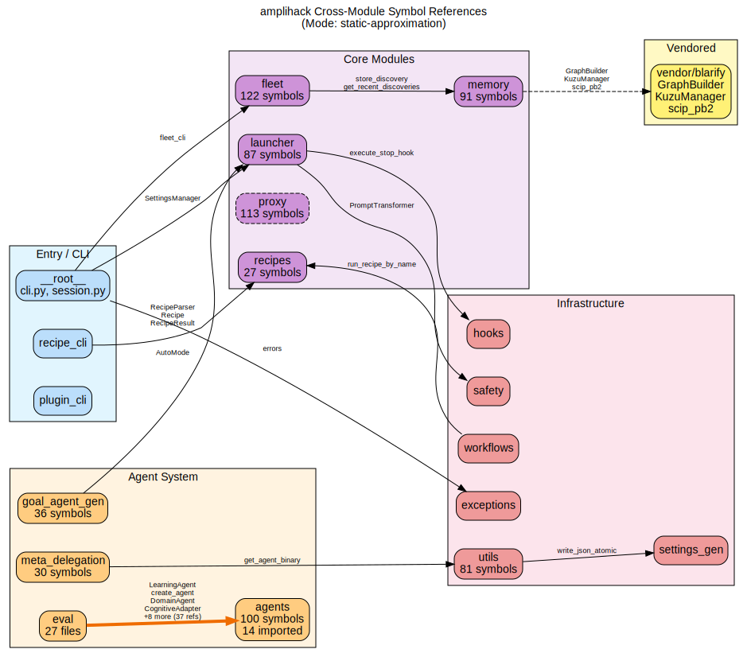

Mode: static-approximation

# Layer 8: AST + LSP Symbol Bindings

**Generated:** 2026-03-17
**Mode:** Static approximation via regex-based import analysis (no LSP server available)
**Scope:** `src/amplihack/` excluding `vendor/` and `__pycache__/`

## Methodology

This layer was built by:
1. Parsing all `from amplihack.<module> import <symbol>` statements across the codebase
2. Collecting all `class` and `def` definitions at module scope
3. Collecting all `__all__` export lists from `__init__.py` files
4. Cross-referencing defined symbols against imported symbols to find dead code candidates

Limitations of static approximation:
- Cannot detect dynamic imports (`importlib`, `__import__`)
- Cannot detect usage via CLI entry points (`console_scripts` in pyproject.toml)
- Cannot detect symbols used only within their own module (intra-module refs are not "dead")
- Cannot detect usage from external consumers of the `amplihack` package

## Cross-Module Symbol References

These are the concrete symbol-level import edges between top-level modules.

### eval -> agents (37 references, heaviest edge)

| Source File | Imported Symbol |
|-------------|----------------|
| `eval/agent_adapter.py` | `LearningAgent`, `MultiAgentLearningAgent`, `create_agent` |
| `eval/agent_subprocess.py` | `LearningAgent`, `create_agent` |
| `eval/domain_eval_harness.py` | `DomainAgent`, `EvalLevel`, `EvalScenario` |
| `eval/five_agent_experiment.py` | `CodeReviewAgent`, `DataAnalysisAgent`, `DocumentCreatorAgent`, `MeetingSynthesizerAgent`, `ProjectPlanningAgent` |
| `eval/general_capability_eval.py` | `LearningAgent`, `create_agent` |
| `eval/long_horizon_memory.py` | `CognitiveAdapter`, `LearningAgent`, `create_agent` |
| `eval/long_horizon_multi_seed.py` | `LearningAgent` |
| `eval/long_horizon_self_improve.py` | `LearningAgent`, `MultiAgentLearningAgent` |
| `eval/matrix_eval.py` | `LearningAgent`, `create_agent` |
| `eval/teaching_eval.py` | `DomainAgent`, `TeachingResult` |
| `eval/teaching_subprocess.py` | `LearningAgent` |

### launcher -> hooks, safety (4 references)

| Source File | Target Module | Imported Symbol |
|-------------|--------------|----------------|
| `launcher/core.py` | `hooks` | `execute_stop_hook` |
| `launcher/auto_mode.py` | `safety` | `PromptTransformer` |

### fleet -> memory (3 references)

| Source File | Imported Symbol |
|-------------|----------------|
| `fleet/fleet_admiral.py` | `store_discovery`, `get_recent_discoveries` |

### recipe_cli -> recipes (3 references)

| Source File | Imported Symbol |
|-------------|----------------|
| `recipe_cli/cli.py` | `RecipeParser`, `discover_recipes`, `run_recipe_via_rust` |
| `recipe_cli/cli.py` | `Recipe`, `RecipeResult`, `StepStatus` |

### Other edges (1 reference each)

| Source | Target | Symbol |
|--------|--------|--------|
| `__root__/cli.py` | `fleet` | `fleet_cli` |
| `__root__/cli.py` | `launcher` | `SettingsManager` |
| `__root__/exceptions.py` | `exceptions` | `ClaudeBinaryNotFoundError`, `LaunchError` |
| `goal_agent_generator/packager.py` | `launcher` | `AutoMode` |
| `meta_delegation/platforms.py` | `utils` | `get_agent_binary` |
| `workflows/session_start.py` | `recipes` | `run_recipe_by_name` |
| `utils/json_utils.py` | `settings` | `write_json_atomic` |
| `memory/kuzu/code_graph.py` | `vendor` | `GraphBuilder`, `KuzuManager` |

## `__all__` Export Coverage

How many symbols each module exports via `__all__` vs. how many are actually imported by other modules.

| Module | Exported | Imported Externally | Unused Exports | Coverage |
|--------|----------|-------------------|----------------|----------|
| `agents` | 31 | 13 | 18 | 42% |
| `fleet` | 47 | 2 | 45 | 4% |
| `recipes` | 23 | 5 | 18 | 22% |
| `launcher` | 10 | 4 | 8 | 20% |
| `memory` | 21 | 2 | 19 | 10% |
| `proxy` | 2 | 2 | 0 | 100% |
| `utils` | 16 | 2 | 14 | 13% |
| `security` | 11 | 0 | 11 | 0% |
| `meta_delegation` | 30 | 0 | 30 | 0% |
| `bundle_generator` | 17 | 0 | 17 | 0% |
| `eval` | 26 | 0 | 26 | 0% |
| `safety` | 5 | 1 | 4 | 20% |
| `hooks` | (no __all__) | 1 | - | - |
| `workflows` | 7 | 0 | 7 | 0% |
| `testing` | 13 | 0 | 13 | 0% |

**Observation**: Most modules export far more than is consumed internally. This is expected for a library package (external consumers use these exports), but several modules like `security`, `meta_delegation`, and `bundle_generator` have zero internal consumers, suggesting they are either entry-point-only modules or genuinely unused.

## Dead Code Candidates

Modules with the highest ratio of defined-but-never-cross-imported symbols. Note: many of these symbols may be used intra-module or via CLI entry points, so this is a **candidate list**, not a confirmed dead code report.

### High Confidence Dead Code Candidates

These modules have significant public APIs with zero external importers:

| Module | Defined | Imported | Dead Candidates | Notes |
|--------|---------|----------|-----------------|-------|
| `security` | 71 | 0 | 71 | Likely invoked via hooks, not imports |
| `meta_delegation` | 30 | 0 | 30 | CLI-driven module |
| `bundle_generator` | 59 | 0 | 59 | CLI-driven module |
| `plugin_cli` | 6 | 0 | 6 | CLI-driven module |
| `testing` | 11 | 0 | 11 | Test utility module |
| `workflows` | 9 | 0 | 9 | Invoked via recipe system |

### Moderate Confidence (large modules, few external refs)

| Module | Defined | Imported | Dead % | Notes |
|--------|---------|----------|--------|-------|
| `fleet` | 122 | 1 | 99% | Only `fleet_cli` imported by `__root__` |
| `proxy` | 113 | 3 | 97% | Only `ProxyConfig`, `ProxyManager` imported |
| `agents` | 100 | 14 | 86% | Heavy eval usage but most symbols internal |
| `memory` | 91 | 2 | 98% | Only `store_discovery`, `get_recent_discoveries` |
| `launcher` | 87 | 4 | 95% | Hub module but most symbols internal |
| `utils` | 81 | 3 | 96% | Utility grab-bag |

### Key Finding

The codebase has a **wide public surface area** (890 total dead code candidates) but most modules are **self-contained subsystems** accessed through a single entry point (CLI command or one facade function). This is consistent with the monolith architecture where CLI dispatch, not import graphs, drives execution.

## Diagrams

### Mermaid Diagram

### Graphviz Diagram

**Source files:** [symbol-references.mmd](symbol-references.mmd) | [symbol-references.dot](symbol-references.dot)
