Mode: static-approximation

# Layer 2: AST+LSP Symbol Bindings

**Slug:** `ast-lsp-bindings` | **Display Order:** 2
**Last rebuilt:** 2026-03-24 | **Package version:** 0.6.99

No LSP server was available for this refresh. The bindings below were rebuilt from direct source inspection of the PR #3500 impact slice.

## Refreshed Binding Surface

| Source                                          | Binds To                                                             | Why It Matters                                                                                                 |
| ----------------------------------------------- | -------------------------------------------------------------------- | -------------------------------------------------------------------------------------------------------------- |
| `.claude/tools/xpia/hooks/pre_tool_use.py`      | `amplihack.security.rust_xpia.is_available`, `validate_bash_command` | Canonical XPIA pre-tool hook now routes through the Rust-backed fail-closed bridge                             |
| `.claude/tools/xpia/hooks/pre_tool_use_rust.py` | `.claude/tools/xpia/hooks/pre_tool_use.py`                           | Compatibility shim keeps historical entrypoints aligned with the canonical hook                                |
| `src/amplihack/__init__.py`                     | `auto_update._find_rust_cli()`                                       | Root entrypoint now delegates `install`, `mode`, `recipe`, and `update` to the installed Rust CLI when present |
| `src/amplihack/recipes/rust_runner.py`          | `rust_runner_execution._run_rust_process()`                          | Live recipe execution now uses the shared progress-aware subprocess path                                       |
| `src/amplihack/recipes/rust_runner.py`          | `rust_runner_binary.*`                                               | Strict runner discovery and version gating remain centralized instead of being duplicated                      |
| `src/amplihack/recipes/rust_runner.py`          | `rust_runner_copilot.*`                                              | Nested Copilot normalization remains a dedicated compatibility module                                          |

## Recent Impact Notes

- The canonical XPIA hook now imports the repo source tree only when the cwd resolves to a real amplihack root (`src/amplihack/__init__.py` present), avoiding accidental binding to unrelated Python repositories.
- `pre_tool_use_rust.py` no longer owns separate logic; it delegates to `pre_tool_use.py`, which reduces symbol drift between the two entrypoints.
- `rust_runner.py` no longer owns a private progress-writer path for live execution. The shared execution helper in `rust_runner_execution.py` is now the authoritative symbol binding for progress-file writes.

## Diagrams

### Mermaid Diagram

### Graphviz Diagram

**Source files:** [ast-lsp-bindings.mmd](ast-lsp-bindings.mmd) | [ast-lsp-bindings.dot](ast-lsp-bindings.dot)
