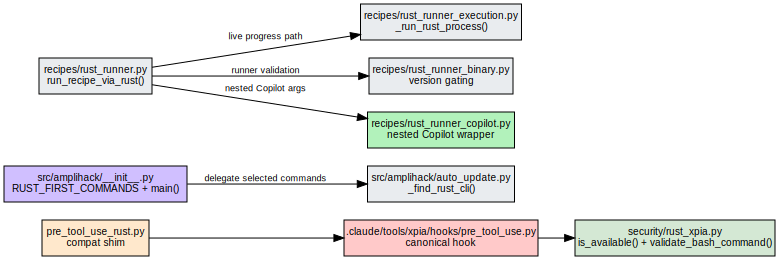

<nav class="atlas-breadcrumb">
<a href="../">Atlas</a> &raquo; Layer 2: AST + LSP Bindings
</nav>

# Layer 2: AST + LSP Bindings

<div class="atlas-metadata">
Category: <strong>Structural</strong> | Generated: 2026-03-25T19:30:00+00:00
</div>

## Map

=== "Interactive (Mermaid)"

    ```mermaid
    graph LR
        F0["models<br/>refs: 59"]
        F1["constants<br/>refs: 55"]
        F2["retrieval_constants<br/>refs: 38"]
        F3["models<br/>refs: 38"]
        F4["types<br/>refs: 36"]
        F5["errors<br/>refs: 29"]
        F6["errors<br/>refs: 29"]
        F7["errors<br/>refs: 29"]
        F8["models<br/>refs: 29"]
        F9["models<br/>refs: 28"]
        F10["exceptions<br/>refs: 28"]
        F11["models<br/>refs: 26"]
        F12["file_utils<br/>refs: 24"]
        F13["file_utils<br/>refs: 24"]
        F14["file_utils<br/>refs: 24"]
        F15["base<br/>refs: 23"]
        F16["common<br/>refs: 22"]
        F17["utils<br/>refs: 22"]
        F18["xpia_defense_interface<br/>refs: 22"]
        F19["event_bus<br/>refs: 20"]
        F20["uvx_launcher<br/>refs: 19"]
        F21["uvx_models<br/>refs: 18"]
        F22["considerations<br/>refs: 17"]
        F23["orchestrator<br/>refs: 17"]
        F24["orchestrator<br/>refs: 17"]
        F25["orchestrator<br/>refs: 17"]
        F26["__init__<br/>refs: 17"]
        F27["exceptions<br/>refs: 17"]
        F28["output_validator<br/>refs: 17"]
        F29["models<br/>refs: 16"]
        F23 --> F5
        F24 --> F6
        F25 --> F7

        click F0 "../ast-lsp-bindings/" "View AST bindings"
    ```

=== "High-Fidelity (Graphviz)"

    <div class="atlas-diagram-container">
    
    </div>

=== "Data Table"

    | Metric | Value |
    |--------|-------|
    | Total definitions | 14689 |
    | Total exports | 2163 |
    | Total imports | 16682 |
    | Potentially dead | 419 |
    | Files with `__all__` | 408 |

## Legend

<div class="atlas-legend" markdown>

| Symbol    | Meaning               |
| --------- | --------------------- |
| Rectangle | Source file           |
| Arrow     | Import dependency     |
| `refs: N` | Total reference count |

</div>

## Key Findings

- 14689 total definitions across all files
- 419 potentially dead definitions (2.9% of total)
- 1948 files without `__all__` exports

## Detail

??? info "Full data (click to expand)"

    **Summary metrics:**

    - **Total Definitions**: 14689
    - **Total Exports**: 2163
    - **Total Imports**: 16682
    - **Potentially Dead Count**: 419
    - **Files With All**: 408
    - **Files Without All**: 1948
    - **Importlib Dynamic Imports**: 23
    - **Language Counts**:
        - `python`: 14689

## Cross-References

<div class="atlas-crossref" markdown>

- [Layer 1: Repository Surface](../repo-surface/index.md)
- [Layer 3: Compile-time Dependencies](../compile-deps/index.md)
- [Layer 7: Service Components](../service-components/index.md)
- [Layer 8: User Journeys](../user-journeys/index.md)

</div>

<div class="atlas-footer">

Source: `layer2_ast_bindings.json` | [Mermaid source](ast-lsp-bindings.mmd)

</div>
