# Layer 3: Compile-time Dependencies

**Slug:** `compile-deps` | **Display Order:** 3
**Package version:** 0.6.99

## Direct Dependencies (pyproject.toml)

The project declares 37 direct dependencies in `pyproject.toml` (v0.6.99). Python >=3.11 required.

### Core Framework

| Dependency    | Version  | Used By                                        |
| ------------- | -------- | ---------------------------------------------- |
| flask         | >=2.0    | `proxy/responses_api_proxy.py` (web server)    |
| requests      | >=2.32.4 | HTTP client across multiple modules            |
| fastapi       | >=0.68   | Declared but primary server is Flask           |
| uvicorn       | >=0.15   | ASGI server (paired with FastAPI)              |
| aiohttp       | >=3.8    | `proxy/streaming.py`, `proxy/github_client.py` |
| python-dotenv | >=0.19   | Environment variable loading                   |
| rich          | >=13.0   | `fleet/fleet_tui.py`, `launcher/` TUI mode     |
| psutil        | >=7.0    | Process utilities (blarify)                    |
| packaging     | >=21.0   | Semantic version comparison (auto-update)      |
| docker        | >=7.1    | `docker/` Docker API client                    |

### AI/LLM

| Dependency             | Version | Used By                       |
| ---------------------- | ------- | ----------------------------- |
| litellm                | >=1.0   | `proxy/` LLM routing          |
| claude-agent-sdk       | >=0.1   | `launcher/` Claude Agent SDK  |
| github-copilot-sdk     | >=0.1   | GitHub Copilot integration    |
| langchain              | >=1.2.3 | `vendor/blarify/` LLM agents  |
| langchain-openai       | >=1.1.7 | Blarify OpenAI integration    |
| langchain-anthropic    | >=1.3.1 | Blarify Anthropic integration |
| langchain-google-genai | >=4.1.3 | Blarify Google integration    |

### Code Analysis

| Dependency                                       | Version | Used By                        |
| ------------------------------------------------ | ------- | ------------------------------ |
| tree-sitter                                      | >=0.23  | `vendor/blarify/` code parsing |
| tree-sitter-python/js/ts/csharp/go/java/php/ruby | >=0.23  | Language grammars              |
| jedi-language-server                             | >=0.43  | `lsp_detector/` Python LSP     |
| protobuf                                         | >=5.29  | SCIP index format              |

### Data Stores

| Dependency | Version | Used By                     |
| ---------- | ------- | --------------------------- |
| kuzu       | >=0.11  | `memory/` embedded graph DB |
| neo4j      | >=5.25  | `vendor/blarify/` graph DB  |
| falkordb   | >=1.0   | `vendor/blarify/` graph DB  |

### Git Dependencies

| Dependency           | Source                                                                                             |
| -------------------- | -------------------------------------------------------------------------------------------------- |
| amplihack-memory-lib | `git+https://github.com/rysweet/amplihack-memory-lib.git@v0.2.0`                                   |
| amplihack-agent-eval | `git+https://github.com/rysweet/amplihack-agent-eval.git@d7a28a552bed6e8daa752e465475024b281913f6` |

### Azure / Cloud

| Dependency     | Version | Used By                      |
| -------------- | ------- | ---------------------------- |
| azure-identity | >=1.12  | Azure Service Principal auth |

### Optional Dependency Groups

| Group           | Dependencies                                                         |
| --------------- | -------------------------------------------------------------------- |
| `microsoft-sdk` | agent-framework-core, opentelemetry-semantic-conventions-ai          |
| `amplifier`     | amplifier-core (git)                                                 |
| `test`          | pytest, pytest-cov, pytest-asyncio                                   |
| `dev`           | pytest, ruff, black, build, pre-commit, beautifulsoup4, lxml, pyyaml |

## Internal Package Import Graph

`cli.py` is the central hub, importing 11 subpackages directly:

```
cli -> launcher, proxy, fleet, recipes, bundle_generator,
       plugin_manager, eval, settings, uvx, docker, security
```

Other cross-package edges:

- `recipe_cli` -> `recipes`
- `launcher` -> `hooks`
- `eval` -> `knowledge_builder`
- `eval` -> `agents.domain_agents`
- `recipes/rust_runner` -> `recipes/discovery` (intra-package: imports `_AMPLIHACK_HOME_BUNDLE_DIR`, `_PACKAGE_BUNDLE_DIR`, `_REPO_ROOT_BUNDLE_DIR`)
- `vendor/blarify` is fully self-contained (no imports outside vendor/)

## Circular Dependencies

No circular cross-package imports were detected. The `vendor/blarify/` subtree is entirely self-contained with only intra-vendor imports.

## Diagrams

### Mermaid Diagram

> **Note:** SVGs were not regenerated (mmdc/dot not available). Refer to source files for the current truth.



### Graphviz Diagram


**Source files:** [compile-deps.mmd](compile-deps.mmd) | [compile-deps.dot](compile-deps.dot)
