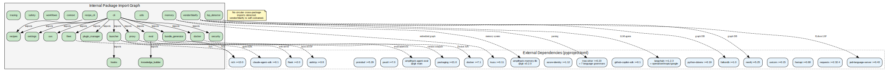

<nav class="atlas-breadcrumb">
<a href="../">Atlas</a> &raquo; Layer 3: Compile-time Dependencies
</nav>

# Layer 3: Compile-time Dependencies

<div class="atlas-metadata">
Category: <strong>Structural</strong> | Generated: 2026-03-18T22:10:22.973208+00:00
</div>

## Map

=== "Interactive (Mermaid)"

    ```mermaid
    graph LR
        subgraph ext["External Dependencies"]
            E0["pytest<br/>imports: 42"]
            E1["rich<br/>imports: 20"]
            E2["litellm<br/>imports: 15"]
            E3["tree-sitter<br/>imports: 15"]
            E4["typing-extensions<br/>imports: 13"]
            E5["kuzu<br/>imports: 10"]
            E6["requests<br/>imports: 9"]
            E7["fastapi<br/>imports: 8"]
            E8["aiohttp<br/>imports: 6"]
            E9["python-dotenv<br/>imports: 5"]
            E10["claude-agent-sdk<br/>imports: 3"]
            E11["langchain-openai<br/>imports: 3"]
            E12["psutil<br/>imports: 3"]
            E13["uvicorn<br/>imports: 2"]
            E14["langchain-anthropic<br/>imports: 2"]
            E15["langchain-google-genai<br/>imports: 2"]
            E16["flask<br/>imports: 1"]
            E17["json-repair<br/>imports: 1"]
            E18["tree-sitter-python<br/>imports: 1"]
            E19["tree-sitter-javascript<br/>imports: 1"]
        end
    
        subgraph int["Internal Packages"]
            P0["__main__"]
            P1["__version_manifest__"]
            P2["goal_seeking"]
            P3["_hierarchical_memory_local"]
            P4["action_executor"]
            P5["agentic_loop"]
            P6["cognitive_adapter"]
            P7["flat_retriever_adapter"]
            P8["graph_rag_retriever"]
            P9["hierarchical_memory"]
            P10["hive_mind"]
            P11["constants"]
            P12["controller"]
            P13["crdt"]
            P14["distributed"]
            P15["embeddings"]
            P16["event_bus"]
            P17["fact_lifecycle"]
            P18["gossip"]
            P19["hive_graph"]
            P20["quality"]
            P21["query_expansion"]
            P22["reranker"]
            P23["json_utils"]
            P24["learning_agent"]
            P25["memory_export"]
            P26["memory_retrieval"]
            P27["prompts"]
            P28["sdk"]
            P29["sdk_adapters"]
        end
    
        click P0 "../compile-deps/" "View compile deps"
    ```

=== "High-Fidelity (Graphviz)"

    <div class="atlas-diagram-container">
    
    </div>

=== "Data Table"

    | Package | Version | Group | Import Count |
    |---------|---------|-------|-------------|
    | pytest | >=7.0.0 | dev | 42 |
    | rich | >=13.0.0 | dev | 20 |
    | litellm | >=1.0.0 | core | 15 |
    | tree-sitter | >=0.23.2 | core | 15 |
    | typing-extensions | >=4.12.2 | core | 13 |
    | kuzu | >=0.11.0 | core | 10 |
    | requests | >=2.32.4 | core | 9 |
    | fastapi | >=0.68.0 | core | 8 |
    | aiohttp | >=3.8.0 | core | 6 |
    | python-dotenv | >=0.19.0 | core | 5 |
    | claude-agent-sdk | >=0.1.0 | core | 3 |
    | langchain-openai | >=1.1.7 | core | 3 |
    | psutil | >=7.0.0 | core | 3 |
    | uvicorn | >=0.15.0 | core | 2 |
    | langchain-anthropic | >=1.3.1 | core | 2 |
    | langchain-google-genai | >=4.1.3 | core | 2 |
    | flask | >=2.0.0 | core | 1 |
    | json-repair | >=0.47.7 | core | 1 |
    | tree-sitter-python | >=0.23.2 | core | 1 |
    | tree-sitter-javascript | >=0.23.0 | core | 1 |
    | tree-sitter-typescript | >=0.23.2 | core | 1 |
    | tree-sitter-c-sharp | >=0.23.1 | core | 1 |
    | tree-sitter-go | >=0.23.1 | core | 1 |
    | tree-sitter-java | >=0.23.2 | core | 1 |
    | tree-sitter-php | >=0.23.4 | core | 1 |
    | tree-sitter-ruby | >=0.23.0 | core | 1 |
    | falkordb | >=1.0.10 | core | 1 |
    | neo4j | >=5.25.0 | core | 1 |
    | docker | >=7.1.0 | core | 1 |
    | packaging | >=21.0 | core | 1 |

## Legend

<div class="atlas-legend" markdown>

| Symbol | Meaning |
|--------|---------|
| `ext` subgraph | External dependencies |
| `int` subgraph | Internal packages |
| Edge label N | Import count between packages |

</div>

## Key Findings

- 9 unused dependencies: github-copilot-sdk, rich, azure-identity, amplihack-memory-lib, langchain
- 8 circular dependency chains detected

## Detail

??? info "Full data (click to expand)"

    **Summary metrics:**
    
    - **External Dep Count**: 67
    - **Internal Packages**: 601
    - **Internal Edges**: 715
    - **Circular Dependency Count**: 8
    - **Unused Dep Count**: 9
    - **Undeclared Dep Count**: 30

## Cross-References

<div class="atlas-crossref" markdown>

- [Layer 2: AST + LSP Bindings](../ast-lsp-bindings/)
- [Layer 7: Service Components](../service-components/)

</div>

<div class="atlas-footer">

Source: `layer3_compile_deps.json` | [Mermaid source](compile-deps.mmd)

</div>
