# Layer 6: Data Flow

Traces data from CLI entry through transformation to storage across all major subsystems.

## Scope

- CLI argument parsing and dispatch
- Launch/session lifecycle data
- Auto mode state persistence
- Memory entry storage (SQLite and Kuzu)
- Recipe step execution pipeline
- Installation file copying
- XPIA security scanning

## Mermaid Diagram

## DOT Diagram

## Key Data Types

| Type | Module | Purpose |
|------|--------|---------|
| `argparse.Namespace` | cli.py | Parsed CLI arguments |
| `SessionInfo` | launcher/session_tracker.py | Session metadata (pid, dir, auto mode flag) |
| `ProxyConfig` | proxy/config.py | API key, endpoint, model for Azure proxy |
| `MemoryEntry` | memory/models.py | id, session_id, agent_id, type, title, content, metadata |
| `MemoryQuery` | memory/models.py | Filters for memory retrieval |
| `Step` | recipes/models.py | Recipe step definition (type, command, agent, condition) |
| `Recipe` | recipes/models.py | Collection of Steps with context |
| `StepResult` | recipes/models.py | Step execution output and status |
| `ScanResult` | security/ | XPIA scan verdict (safe/blocked + threats) |
| `AutoModeState` | launcher/auto_mode_state.py | Turn history, completion status (JSON persisted) |

## Storage Locations

| Store | Format | Path |
|-------|--------|------|
| Memory DB | SQLite | `~/.amplihack/memory.db` |
| Code Graph | Kuzu | `~/.amplihack/kuzu/` |
| Session Logs | JSON | `.claude/runtime/logs/` |
| Staging | Files | `~/.amplihack/.claude/` |
| Settings | JSON | `~/.config/claude-code/settings.json` |

## Key Observations

1. **Recipe context chaining**: Each step's output is injected into the context dict under its step ID, making it available to subsequent steps via condition evaluation or prompt templates.
2. **Dual memory backends**: Memory entries can be stored in both SQLite (relational queries) and Kuzu (graph queries). The coordinator manages routing.
3. **Auto mode state persistence**: State is written to JSON after every turn, enabling crash recovery and `--append` injection from external processes.
