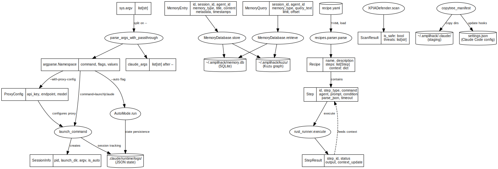

<nav class="atlas-breadcrumb">
<a href="../">Atlas</a> &raquo; Layer 6: Data Flow
</nav>

# Layer 6: Data Flow

<div class="atlas-metadata">
Category: <strong>Behavioral</strong> | Generated: 2026-03-18T14:01:03.404436+00:00
</div>

## Map

=== "Interactive (Mermaid)"

    ```mermaid
    flowchart TD
        IO0[/"json write<br/>n=339"/]
        IO1[("json read<br/>n=250")]
        IO2[/"text write<br/>n=135"/]
        IO3[("text read<br/>n=97")]
        IO4[("yaml read<br/>n=15")]
        IO5[/"yaml write<br/>n=6"/]
        IO6[("toml read<br/>n=2")]
        DB7[("kuzu<br/>ops: 188")]
        DB8[("sqlite<br/>ops: 59")]
        DB9[("neo4j<br/>ops: 44")]
        DB10[("falkordb<br/>ops: 2")]
        NET11("Network I/O<br/>n=23")
        T0{{"_create_similarity_edges"}}
        T1{{"import_from_json"}}
        T2{{"handler"}}
        T3{{"_upload_package"}}
        T4{{"update_bundle"}}
        T5{{"main"}}
        T6{{"run_harness"}}
        T7{{"_run_teaching_subprocess"}}
        T8{{"run_l7_teaching_eval"}}
        T9{{"run_single_level"}}
    ```

=== "High-Fidelity (Graphviz)"

    <div class="atlas-diagram-container">
    
    </div>

=== "Data Table"

    | Metric | Value |
    |--------|-------|
    | File I/O operations | 844 |
    | Database operations | 293 |
    | Network I/O | 23 |
    | Transformation points | 45 |
    | Files with I/O | 191 |

## Legend

<div class="atlas-legend" markdown>

| Symbol | Meaning |
|--------|---------|
| Stadium | Read operation |
| Parallelogram | Write operation |
| Cylinder | Database operation |
| Diamond | Transformation function |

</div>

## Key Findings

- 844 file I/O operations
- 293 database operations

## Detail

??? info "Full data (click to expand)"

    **Summary metrics:**
    
    - **File Io Count**: 844
    - **Database Op Count**: 293
    - **Network Io Count**: 23
    - **Transformation Point Count**: 45
    - **Files With Io**: 191

## Cross-References

<div class="atlas-crossref" markdown>

- [Layer 4: Runtime Topology](../runtime-topology/)
- [Layer 8: User Journeys](../user-journeys/)

</div>

<div class="atlas-footer">

Source: `layer6_data_flow.json` | [Mermaid source](data-flow.mmd)

</div>
