# Layer 1: Repository Surface

**Slug:** `repo-surface` | **Display Order:** 1

## Overview

Top-level directory structure and purpose of the amplihack repository. This is a Python package (v0.6.81) providing an agentic coding framework for Claude Code, GitHub Copilot CLI, and Microsoft Amplifier.

## Structure Summary

| Directory/File   | Purpose                              |
| ---------------- | ------------------------------------ |
| `src/amplihack/` | Main Python package (34 subpackages) |
| `tests/`         | Top-level test suite                 |
| `docs/`          | MkDocs documentation site            |
| `Specs/`         | Module specifications                |
| `docker/`        | Docker Compose setup                 |
| `agents/`        | Agent definition files (.md)         |
| `commands/`      | Slash command definitions            |
| `skills/`        | Skill definitions for Claude Code    |
| `scripts/`       | Utility scripts                      |
| `tools/`         | Hook utilities                       |
| `examples/`      | Usage examples                       |
| `pyproject.toml` | Build config, 57 direct dependencies |
| `Dockerfile`     | Python 3.12-slim + Node 20           |
| `CLAUDE.md`      | Agent instruction manifest           |

### src/amplihack/ Subpackages (one level)

| Subpackage                            | Purpose                               |
| ------------------------------------- | ------------------------------------- |
| `cli.py` / `cli_extensions.py`        | CLI entry point (`amplihack` command) |
| `launcher/`                           | Claude/Copilot session launcher       |
| `proxy/`                              | LLM proxy server (Flask, aiohttp)     |
| `fleet/`                              | Multi-agent fleet management + TUI    |
| `recipes/` + `recipe_cli/`            | Recipe engine and CLI                 |
| `memory/`                             | Discovery persistence (Kuzu)          |
| `security/`                           | Safety scanning                       |
| `eval/`                               | Agent evaluation framework            |
| `knowledge_builder/`                  | Knowledge graph builder               |
| `bundle_generator/`                   | Package distribution                  |
| `hooks/`                              | Git hook integration                  |
| `utils/`                              | Shared utilities                      |
| `vendor/blarify/`                     | Vendored code graph indexer           |
| `uvx/`                                | UVX packaging support                 |
| `docker/`                             | Docker detection                      |
| `plugin_manager/` + `plugin_cli/`     | Plugin system                         |
| `workflows/`                          | Workflow engine                       |
| `tracing/`                            | Observability                         |
| `context/`                            | Adaptive context                      |
| `settings.py` + `settings_generator/` | Configuration                         |
| `safety/`                             | Staging safety guards                 |
| `power_steering/`                     | Prompt control                        |
| `lsp_detector/`                       | LSP detection                         |
| `meta_delegation/`                    | Agent delegation                      |
| `mode_detector/`                      | Mode detection                        |
| `path_resolver/`                      | Path resolution                       |
| `goal_agent_generator/`               | Goal agent generation                 |

## Diagrams

### Mermaid Diagram

### Graphviz Diagram

**Source files:** [repo-surface.mmd](repo-surface.mmd) | [repo-surface.dot](repo-surface.dot)
