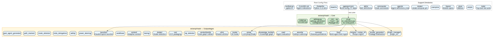

<nav class="atlas-breadcrumb">
<a href="../">Atlas</a> &raquo; Layer 1: Repository Surface
</nav>

# Layer 1: Repository Surface

<div class="atlas-metadata">
Category: <strong>Structural</strong> | Generated: 2026-03-19T00:22:49.724250+00:00
</div>

## Map

=== "Interactive (Mermaid)"

    ```mermaid
    graph TD
        D0["amplihack&lt;br/&gt;22 py / 23 total"]
        D1["agents&lt;br/&gt;0 py / 1 total"]
        D2["eval-recipes&lt;br/&gt;0 py / 1 total"]
        D3["goal_seeking&lt;br/&gt;13 py / 14 total"]
        D4["recipes&lt;br/&gt;0 py / 1 total"]
        D5["bundle_generator&lt;br/&gt;17 py / 17 total"]
        D6["adaptive&lt;br/&gt;3 py / 3 total"]
        D7["docker&lt;br/&gt;3 py / 3 total"]
        D8["eval&lt;br/&gt;23 py / 26 total"]
        D9["self_improve&lt;br/&gt;5 py / 5 total"]
        D10["examples&lt;br/&gt;2 py / 3 total"]
        D11["fleet&lt;br/&gt;54 py / 55 total"]
        D12["prompts&lt;br/&gt;1 py / 3 total"]
        D13["tests&lt;br/&gt;32 py / 32 total"]
        D14["goal_agent_generator&lt;br/&gt;9 py / 11 total"]
        D15["templates&lt;br/&gt;3 py / 3 total"]
        D16["tests&lt;br/&gt;9 py / 9 total"]
        D17["hooks&lt;br/&gt;3 py / 3 total"]
        D18["knowledge_builder&lt;br/&gt;3 py / 3 total"]
        D19["modules&lt;br/&gt;4 py / 4 total"]
        D20["launcher&lt;br/&gt;26 py / 26 total"]
        D21["tests&lt;br/&gt;4 py / 5 total"]
        D22["lsp_detector&lt;br/&gt;2 py / 2 total"]
        D23["memory&lt;br/&gt;14 py / 15 total"]
        D24["backends&lt;br/&gt;4 py / 4 total"]
        D25["evaluation&lt;br/&gt;5 py / 5 total"]
        D26["kuzu&lt;br/&gt;5 py / 6 total"]
        D27["meta_delegation&lt;br/&gt;9 py / 9 total"]
        D28["mode_detector&lt;br/&gt;3 py / 3 total"]
        D29["path_resolver&lt;br/&gt;2 py / 2 total"]
        D30["plugin_cli&lt;br/&gt;4 py / 4 total"]
        D31["plugin_manager&lt;br/&gt;2 py / 2 total"]
        D32["power_steering&lt;br/&gt;2 py / 2 total"]
        D33["prompts&lt;br/&gt;0 py / 1 total"]
        D34["proxy&lt;br/&gt;30 py / 30 total"]
        D35["recipe_cli&lt;br/&gt;3 py / 3 total"]
        D36["recipes&lt;br/&gt;6 py / 6 total"]
        D37["tests&lt;br/&gt;3 py / 3 total"]
        D38["safety&lt;br/&gt;4 py / 4 total"]
        D39["security&lt;br/&gt;10 py / 11 total"]
        D0 --> D1
        D1 --> D2
        D1 --> D3
        D0 --> D5
        D0 --> D7
        D0 --> D8
        D8 --> D9
        D0 --> D10
        D0 --> D11
        D11 --> D12
        D11 --> D13
        D0 --> D14
        D14 --> D15
        D14 --> D16
        D0 --> D17
        D0 --> D18
        D18 --> D19
        D0 --> D20
        D20 --> D21
        D0 --> D22
        D0 --> D23
        D23 --> D24
        D23 --> D25
        D23 --> D26
        D0 --> D27
        D0 --> D28
        D0 --> D29
        D0 --> D30
        D0 --> D31
        D0 --> D32
        D0 --> D33
        D0 --> D34
        D0 --> D35
        D0 --> D36
        D36 --> D37
        D0 --> D38
        D0 --> D39

        click D0 "../" "Back to Atlas index"
    ```

=== "High-Fidelity (Graphviz)"

    <div class="atlas-diagram-container">
    
    </div>

=== "Data Table"

    | Directory | Role | Python | Total |
    |-----------|------|--------|-------|
    | `/home/azureuser/src/amplihack/src/amplihack` | package | 22 | 23 |
    | `/home/azureuser/src/amplihack/src/amplihack/agents` | docs | 0 | 1 |
    | `/home/azureuser/src/amplihack/src/amplihack/agents/amplihack/core` | docs | 0 | 7 |
    | `/home/azureuser/src/amplihack/src/amplihack/agents/amplihack/specialized` | docs | 0 | 30 |
    | `/home/azureuser/src/amplihack/src/amplihack/agents/amplihack/workflows` | docs | 0 | 2 |
    | `/home/azureuser/src/amplihack/src/amplihack/agents/eval-recipes` | docs | 0 | 1 |
    | `/home/azureuser/src/amplihack/src/amplihack/agents/eval-recipes/amplihack` | config | 0 | 3 |
    | `/home/azureuser/src/amplihack/src/amplihack/agents/eval-recipes/claude_code` | config | 0 | 3 |
    | `/home/azureuser/src/amplihack/src/amplihack/agents/goal_seeking` | package | 13 | 14 |
    | `/home/azureuser/src/amplihack/src/amplihack/agents/goal_seeking/__pycache__` | other | 0 | 23 |
    | `/home/azureuser/src/amplihack/src/amplihack/agents/goal_seeking/hive_mind` | package | 13 | 13 |
    | `/home/azureuser/src/amplihack/src/amplihack/agents/goal_seeking/prompts` | package | 1 | 37 |
    | `/home/azureuser/src/amplihack/src/amplihack/agents/goal_seeking/prompts/__pycache__` | other | 0 | 2 |
    | `/home/azureuser/src/amplihack/src/amplihack/agents/goal_seeking/prompts/sdk` | package | 1 | 9 |
    | `/home/azureuser/src/amplihack/src/amplihack/agents/goal_seeking/prompts/variants` | docs | 0 | 5 |
    | `/home/azureuser/src/amplihack/src/amplihack/agents/goal_seeking/sdk_adapters` | package | 6 | 6 |
    | `/home/azureuser/src/amplihack/src/amplihack/agents/goal_seeking/sdk_adapters/__pycache__` | other | 0 | 9 |
    | `/home/azureuser/src/amplihack/src/amplihack/agents/goal_seeking/sub_agents` | package | 6 | 6 |
    | `/home/azureuser/src/amplihack/src/amplihack/agents/goal_seeking/sub_agents/__pycache__` | other | 0 | 12 |
    | `/home/azureuser/src/amplihack/src/amplihack/amplifier-bundle/recipes` | config | 0 | 1 |
    | `/home/azureuser/src/amplihack/src/amplihack/bundle_generator` | package | 17 | 17 |
    | `/home/azureuser/src/amplihack/src/amplihack/context/adaptive` | package | 3 | 3 |
    | `/home/azureuser/src/amplihack/src/amplihack/docker` | package | 3 | 3 |
    | `/home/azureuser/src/amplihack/src/amplihack/eval` | package | 23 | 26 |
    | `/home/azureuser/src/amplihack/src/amplihack/eval/self_improve` | package | 5 | 5 |
    | `/home/azureuser/src/amplihack/src/amplihack/eval/self_improve/results` | other | 0 | 1 |
    | `/home/azureuser/src/amplihack/src/amplihack/examples` | other | 2 | 3 |
    | `/home/azureuser/src/amplihack/src/amplihack/fleet` | package | 54 | 55 |
    | `/home/azureuser/src/amplihack/src/amplihack/fleet/prompts` | package | 1 | 3 |
    | `/home/azureuser/src/amplihack/src/amplihack/fleet/tests` | tests | 32 | 32 |
    | `/home/azureuser/src/amplihack/src/amplihack/goal_agent_generator` | package | 9 | 11 |
    | `/home/azureuser/src/amplihack/src/amplihack/goal_agent_generator/templates` | package | 3 | 3 |
    | `/home/azureuser/src/amplihack/src/amplihack/goal_agent_generator/tests` | tests | 9 | 9 |
    | `/home/azureuser/src/amplihack/src/amplihack/hooks` | package | 3 | 3 |
    | `/home/azureuser/src/amplihack/src/amplihack/knowledge_builder` | package | 3 | 3 |
    | `/home/azureuser/src/amplihack/src/amplihack/knowledge_builder/modules` | package | 4 | 4 |
    | `/home/azureuser/src/amplihack/src/amplihack/launcher` | package | 26 | 26 |
    | `/home/azureuser/src/amplihack/src/amplihack/launcher/tests` | tests | 4 | 5 |
    | `/home/azureuser/src/amplihack/src/amplihack/lsp_detector` | package | 2 | 2 |
    | `/home/azureuser/src/amplihack/src/amplihack/memory` | package | 14 | 15 |
    | `/home/azureuser/src/amplihack/src/amplihack/memory/backends` | package | 4 | 4 |
    | `/home/azureuser/src/amplihack/src/amplihack/memory/evaluation` | package | 5 | 5 |
    | `/home/azureuser/src/amplihack/src/amplihack/memory/kuzu` | package | 5 | 6 |
    | `/home/azureuser/src/amplihack/src/amplihack/memory/kuzu/indexing` | package | 11 | 11 |
    | `/home/azureuser/src/amplihack/src/amplihack/meta_delegation` | package | 9 | 9 |
    | `/home/azureuser/src/amplihack/src/amplihack/mode_detector` | package | 3 | 3 |
    | `/home/azureuser/src/amplihack/src/amplihack/path_resolver` | package | 2 | 2 |
    | `/home/azureuser/src/amplihack/src/amplihack/plugin_cli` | package | 4 | 4 |
    | `/home/azureuser/src/amplihack/src/amplihack/plugin_manager` | package | 2 | 2 |
    | `/home/azureuser/src/amplihack/src/amplihack/power_steering` | package | 2 | 2 |

## Legend

<div class="atlas-legend" markdown>

| Symbol    | Meaning                             |
| --------- | ----------------------------------- |
| Rectangle | Directory                           |
| Arrow     | Parent-child relationship           |
| Label     | `name` / `py count` / `total count` |

</div>

## Key Findings

- 158 directories discovered
- 5 entry points identified

## Detail

??? info "Full data (click to expand)"

    *No detailed data available.*

## Cross-References

<div class="atlas-crossref" markdown>

- [Layer 2: AST + LSP Bindings](../ast-lsp-bindings/)
- [Layer 7: Service Components](../service-components/)

</div>

<div class="atlas-footer">

Source: `layer1_repo_surface.json` | [Mermaid source](repo-surface.mmd)

</div>
