# Layer 4: Runtime Topology

**Slug:** `runtime-topology` | **Display Order:** 4

## Overview

amplihack is primarily a CLI tool (single main process) that spawns subprocesses and optionally runs server components. Docker deployment is optional.

## Main Process

| Component       | Description                                                      |
| --------------- | ---------------------------------------------------------------- |
| `amplihack` CLI | Python entry point (`amplihack:main`), dispatches to subcommands |
| Launcher        | Manages Claude/Copilot sessions, auto-mode, fork management      |
| Settings        | Loads configuration from settings.json, environment variables    |
| Installer       | Copies framework files, installs git hooks                       |

## Spawned Subprocesses

| Process                          | Spawned By                                 | Method                                |
| -------------------------------- | ------------------------------------------ | ------------------------------------- |
| `claude` (Claude CLI binary)     | `launcher/`                                | `subprocess.run` / `subprocess.Popen` |
| `git`                            | `bundle_generator/`, `hooks/`, `launcher/` | `subprocess.run`                      |
| `npm` / `node`                   | `launcher/`, `bundle_generator/`           | `subprocess.run`                      |
| `amplihack-recipe-runner` (Rust) | `recipes/rust_runner.py`                   | `subprocess.run`                      |
| `tmux`                           | `fleet/`                                   | `subprocess.run` (session management) |
| `ssh`                            | `fleet/`                                   | SSH tunnels to remote VMs             |

## Server Processes

| Server        | Module                         | Protocol | Port         |
| ------------- | ------------------------------ | -------- | ------------ |
| Flask Proxy   | `proxy/responses_api_proxy.py` | HTTP     | Configurable |
| LiteLLM Proxy | External (optional)            | HTTP     | Configurable |

The Flask proxy intercepts LLM API calls, applies token sanitization, routing, and monitoring before forwarding to upstream providers.

## Fleet Management (Multi-Agent)

| Component     | Description                                          |
| ------------- | ---------------------------------------------------- |
| Fleet TUI     | Rich-based terminal dashboard (`fleet/fleet_tui.py`) |
| tmux sessions | One per agent, managed by fleet                      |
| SSH tunnels   | Connect to remote VMs for distributed execution      |
| Fleet Admiral | Coordinates multi-agent strategies                   |
| Fleet Copilot | AI-powered fleet assistance                          |

## External Connections

| Service              | Protocol                  | Module                           |
| -------------------- | ------------------------- | -------------------------------- |
| Anthropic API        | HTTPS                     | `proxy/`, `launcher/`            |
| GitHub API (Copilot) | HTTPS                     | `proxy/github_client.py`         |
| Azure OpenAI         | HTTPS (optional)          | `proxy/azure_unified_handler.py` |
| Neo4j                | Bolt (optional)           | `vendor/blarify/`                |
| FalkorDB             | Redis protocol (optional) | `vendor/blarify/`                |
| Kuzu                 | Embedded (in-process)     | `memory/`                        |

## Docker Setup

**Dockerfile** (`docker/Dockerfile`):

- Base: `python:3.12-slim`
- Node.js 20 installed
- UV package manager installed
- Non-root user `amplihack` (UID 1000)
- Entry point: `amplihack`
- Environment: `AMPLIHACK_IN_DOCKER=1`

**docker-compose.yml** (`docker/docker-compose.yml`):

- Single service: `amplihack`
- Volume: `../workspace:/home/claude/workspace`
- Environment: `ANTHROPIC_API_KEY` passed from host
- Command: `amplihack claude`
- Interactive: `stdin_open: true`, `tty: true`

## Diagrams

### Mermaid Diagram

### Graphviz Diagram

**Source files:** [runtime-topology.mmd](runtime-topology.mmd) | [runtime-topology.dot](runtime-topology.dot)
