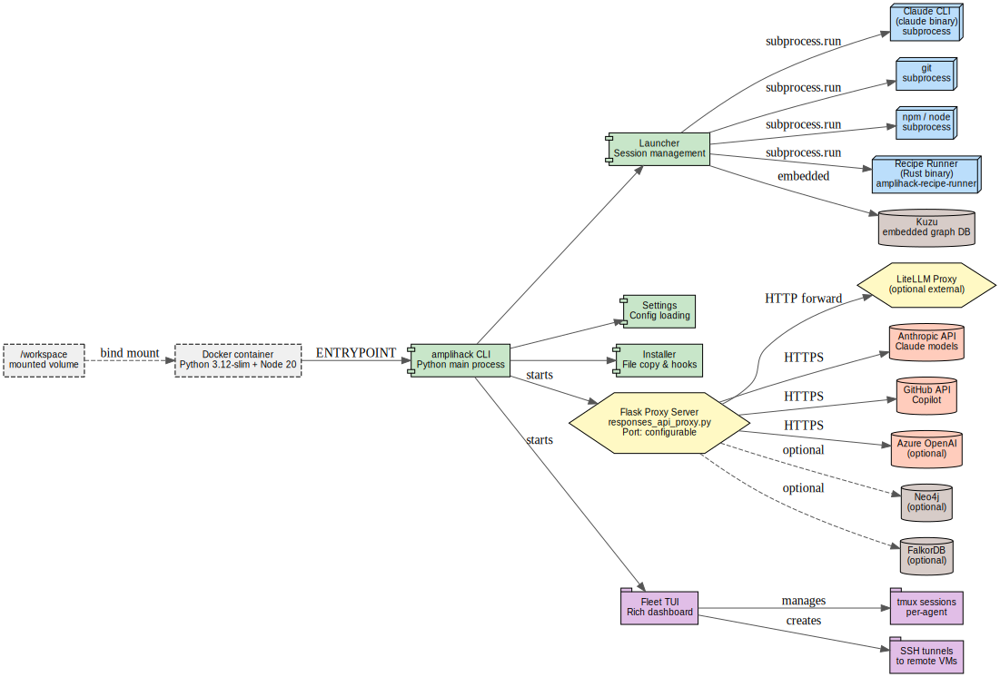

<nav class="atlas-breadcrumb">
<a href="../">Atlas</a> &raquo; Layer 4: Runtime Topology
</nav>

# Layer 4: Runtime Topology

<div class="atlas-metadata">
Category: <strong>Structural</strong> | Generated: 2026-03-19T00:27:22.305927+00:00
</div>

## Map

=== "Interactive (Mermaid)"

    ```mermaid
    graph LR
        S0(["subprocess.run"])
        S1(["uv"])
        S2(["subprocess.Popen"])
        S3(["&lt;dynamic&gt;"])
        S4(["pytest"])
        S5(["gh"])
        S6(["git"])
        B0{{"flask :None (http)"}}
        B1{{"flask :None (http)"}}
        B2{{"flask :None (http)"}}
        B3{{"uvicorn :None (http)"}}
        B4{{"uvicorn :None (http)"}}
        FN0["microsoft_sdk"]
        FN0 --> S0
        FN1["auto_update"]
        FN1 --> S1
        FN1 --> S2
        FN1 --> S3
        FN1 --> S2
        FN2["cli"]
        FN2 --> S4
        FN3["distributor"]
        FN3 --> S5
        FN3 --> S0
        FN3 --> S0
        FN3 --> S5
        FN3 --> S0
        FN3 --> S6
        FN3 --> S6
        FN3 --> S6
        FN3 --> S6
        FN3 --> S0
        FN3 --> S0
        FN3 --> S0
        FN3 --> S6
        FN3 --> S6
        FN4["filesystem_packager"]
        FN4 --> S3
        FN5["repository_creator"]
        FN5 --> S5
        FN5 --> S5
        FN5 --> S0
        FN5 --> S0
        FN5 --> S5
        FN5 --> S5
        FN5 --> S6
        FN5 --> S5
        FN6["update_manager"]
        FN6 --> S6
    ```

=== "High-Fidelity (Graphviz)"

    <div class="atlas-diagram-container">
    
    </div>

=== "Data Table"

    | Metric | Value |
    |--------|-------|
    | Subprocess calls | 286 |
    | Unique files with subprocesses | 109 |
    | Port bindings | 5 |
    | Docker services | 0 |
    | Environment variables | 335 |

## Legend

<div class="atlas-legend" markdown>

| Symbol | Meaning |
|--------|---------|
| Rounded rect | External process/command |
| Hexagon | Port binding |
| Rectangle | Source module |
| Arrow | Invocation |

</div>

## Key Findings

- 286 subprocess calls across 109 files
- 335 environment variable reads

## Detail

??? info "Full data (click to expand)"

    **Summary metrics:**
    
    - **Subprocess Call Count**: 286
    - **Unique Subprocess Files**: 109
    - **Port Binding Count**: 5
    - **Docker Service Count**: 0
    - **Dockerfile Count**: 1
    - **Env Var Count**: 335

## Cross-References

<div class="atlas-crossref" markdown>

- [Layer 6: Data Flow](../data-flow/)
- [Layer 8: User Journeys](../user-journeys/)

</div>

<div class="atlas-footer">

Source: `layer4_runtime_topology.json` | [Mermaid source](runtime-topology.mmd)

</div>
