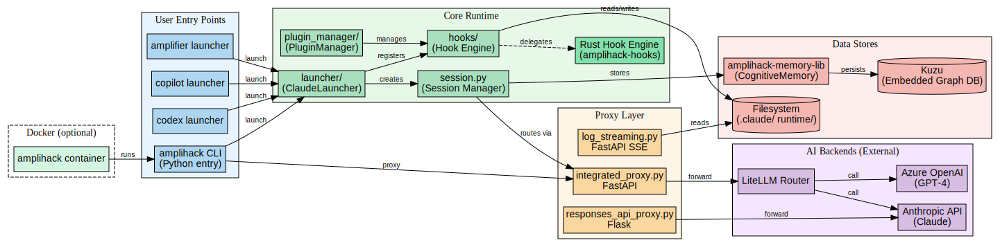

# Layer 1: Runtime Service Topology

**Generated:** 2026-03-17
**Codebase:** amplihack (v0.6.73)

## Overview

Amplihack operates as a **single-process CLI tool** with optional proxy and Docker modes. There are no microservices in the traditional sense -- the "services" are internal components within one Python package that communicate via function calls, not network protocols.

## Runtime Components

### User Entry Points

Four launcher modes share a common `ClaudeLauncher` backend:

| Entry Point | Command | Backend |
|------------|---------|---------|
| Claude Code | `amplihack launch` / `amplihack claude` | ClaudeLauncher subprocess wrapping `claude` CLI |
| GitHub Copilot | `amplihack copilot` | ClaudeLauncher wrapping `copilot` CLI |
| OpenAI Codex | `amplihack codex` | ClaudeLauncher wrapping `codex` CLI |
| Microsoft Amplifier | `amplihack amplifier` | ClaudeLauncher wrapping `amplifier` CLI |

### Core Runtime

- **session.py**: Manages the active session lifecycle, signal handling, and auto-mode
- **launcher/**: `ClaudeLauncher` discovers the correct CLI binary, installs plugins, sets up hooks, and spawns the subprocess
- **plugin_manager/**: Discovers and installs Claude Code plugins (MCP servers, tools)
- **hooks/**: Python hook scripts triggered at session lifecycle events (SessionStart, Stop, PreToolUse, PostToolUse, UserPromptSubmit, PreCompact)
- **Rust Hook Engine**: Optional high-performance hook runner (`amplihack-hooks` multicall binary) that replaces Python hooks

### Proxy Layer

The proxy layer is **optional** -- activated when users want to route AI API calls through a local proxy for logging, caching, or Azure integration.

- **integrated_proxy.py** (FastAPI): Main proxy that routes `/v1/messages` calls through LiteLLM to multiple AI providers. Supports Azure OpenAI, Anthropic, and other providers. Includes performance metrics, caching, and error handling endpoints.
- **responses_api_proxy.py** (Flask): Dedicated OpenAI Responses API proxy for compatibility with OpenAI-format clients.
- **log_streaming.py** (FastAPI): Server-Sent Events (SSE) endpoint for real-time log streaming.

### Data Stores

- **Kuzu** (embedded graph DB): Persistent memory storage for cross-session knowledge
- **amplihack-memory-lib**: CognitiveMemory 6-type system (discoveries, patterns, decisions, etc.)
- **Filesystem** (`.claude/runtime/`): Session logs, metrics, locks, classification state

### Docker (Optional)

A single `docker-compose.yml` in `docker/` defines one container that runs the full `amplihack claude` command, passing through `ANTHROPIC_API_KEY` and mounting a workspace volume.

## Communication Patterns

All internal communication is **in-process function calls**. The only network communication occurs:

1. CLI -> AI provider APIs (Anthropic, Azure OpenAI) via HTTPS
2. CLI -> Proxy -> AI provider APIs (when proxy mode is active)
3. Docker container internal networking (when Docker mode is used)

## Diagrams

### Mermaid Diagram

### Graphviz Diagram

**Source files:** [topology.mmd](topology.mmd) | [topology.dot](topology.dot)
