# Layer 7: Service Component Architecture

Internal packages/modules within the amplihack monolith, their public interfaces, and dependency arrows.

## Scope

All major packages under `src/amplihack/` treated as pseudo-services with internal module structure and inter-package dependencies.

## Mermaid Diagram

## DOT Diagram

## Package Summary

| Package | Module Count | Public Interface | Role |
|---------|-------------|-----------------|------|
| `cli.py` | 2 | `main()`, `create_parser()` | CLI entry, argument parsing |
| `launcher/` | 17 | `ClaudeLauncher`, `AutoMode`, SDK launchers | Binary management, session lifecycle |
| `proxy/` | 16 | `ProxyConfig`, `ProxyManager` | Azure OpenAI proxy, GitHub auth |
| `memory/` | 15+ | `MemoryDatabase`, `MemoryManager`, `MemoryEntry` | Persistent agent memory (SQLite + Kuzu) |
| `recipes/` | 6 | `Step`, `Recipe`, `rust_runner` | YAML recipe parsing and execution |
| `security/` | 7 | `XPIADefender`, `xpia_hook` | Cross-prompt injection defense |
| `safety/` | 3 | `GitConflictDetector`, `SafeCopyStrategy` | Data loss prevention in auto mode |
| `fleet/` | 20+ | `fleet_cli` (Click), `FleetAdmiral` | Multi-VM agent orchestration |
| `goal_agent_generator/` | 7 | `cli`, `prompt_analyzer`, `agent_assembler` | Goal-seeking agent generation |
| `install.py` + settings | 5 | `copytree_manifest`, `ensure_settings_json` | Installation and staging |
| `plugin_manager/` | 2 | `PluginManager`, plugin CLI commands | Plugin install/link/verify |
| `utils/` | 12 | `prerequisites`, `claude_cli`, `uvx_detection` | Shared utilities |
| `docker/` | 3 | `DockerManager` | Docker container execution |
| `hooks/` | 2 | `execute_stop_hook` | Hook lifecycle management |
| `workflows/` | 4 | `classifier`, `session_start` | Workflow classification |
| `tracing/` | 1 | `TraceLogger` | Execution tracing |
| `bundle_generator/` | 12 | Bundle packaging for distribution | Amplifier bundle generation |

## Key Dependency Patterns

1. **CLI is the fan-out point**: `cli.py` imports from launcher, install, plugin, memory, recipes, goal_agent_generator, fleet, and docker.
2. **Launcher depends on proxy and utils**: `core.py` pulls in ProxyManager, prerequisites, claude_cli, UVXManager, and tracing.
3. **Memory is self-contained**: The memory subsystem (database, backends, kuzu) has no dependencies on other amplihack packages.
4. **Recipes are isolated**: The recipe system depends only on its own models and the agent_resolver for finding agent prompt files.
5. **Security and safety are leaf nodes**: Neither package depends on other amplihack packages beyond standard library.
6. **Fleet is the largest subsystem**: 20+ modules with its own Click-based CLI, TUI dashboard, and multi-VM coordination.
