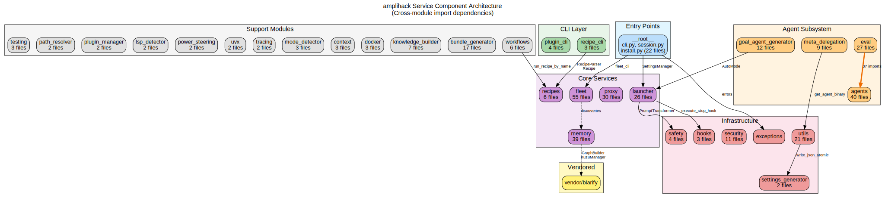

# Layer 7: Service Component Architecture

**Generated:** 2026-03-17
**Mode:** Static analysis of `src/amplihack/` package structure and cross-module imports

## Purpose

This layer maps the internal module structure of the amplihack monolith, showing how the 31 top-level subpackages depend on each other. While Layer 2 (Compile-Time Dependencies) covers external packages, this layer focuses on intra-package coupling.

## Module Inventory

| Module | Files | Role |
|--------|-------|------|
| `__root__` | 22 | CLI entry point, install, session, settings, exceptions |
| `agents` | 40 | Goal-seeking agents, domain agents, cognitive adapters |
| `bundle_generator` | 17 | Prompt-to-agent bundle pipeline |
| `context` | 3 | Adaptive launcher/hook strategy detection |
| `docker` | 3 | Docker environment detection and management |
| `eval` | 27 | Evaluation harnesses, self-improvement loops |
| `examples` | 2 | Usage examples for proxy and launcher |
| `fleet` | 55 | Distributed fleet management, task queues, dashboards |
| `goal_agent_generator` | 12 | Goal-to-agent generation pipeline |
| `hooks` | 3 | Session lifecycle hook execution |
| `knowledge_builder` | 7 | Knowledge graph construction from Q&A |
| `launcher` | 26 | Binary management, directory detection, staging |
| `lsp_detector` | 2 | Language server protocol detection |
| `memory` | 39 | Persistent memory with SQLite/Kuzu backends |
| `meta_delegation` | 9 | Multi-persona subprocess delegation |
| `mode_detector` | 3 | Claude mode detection (direct/proxy/fleet) |
| `path_resolver` | 2 | Framework path resolution |
| `plugin_cli` | 4 | Plugin install/uninstall CLI commands |
| `plugin_manager` | 2 | Plugin lifecycle management |
| `power_steering` | 2 | Prompt re-enable after disable |
| `proxy` | 30 | FastAPI/LiteLLM HTTP proxy for AI APIs |
| `recipe_cli` | 3 | CLI interface for recipe runner |
| `recipes` | 6 | YAML recipe parsing, discovery, execution |
| `safety` | 4 | Git conflict detection, safe copy, prompt transform |
| `security` | 11 | XPIA defense, pattern detection, hooks |
| `settings_generator` | 2 | Settings file generation |
| `testing` | 3 | TUI testing helpers, input validation |
| `tracing` | 2 | Trace logging |
| `utils` | 21 | Agent binary, path resolution, JSON parsing, retries |
| `uvx` | 2 | UVX deployment management |
| `workflows` | 6 | Workflow classification, session start, GH compilation |

## Cross-Module Dependency Summary

Edges represent `from amplihack.<target> import ...` statements found outside of test files and vendored code.

| Source | Target | Import Count | Key Symbols |
|--------|--------|-------------|-------------|
| `__root__` | `exceptions` | 1 | `ClaudeBinaryNotFoundError`, `LaunchError` |
| `__root__` | `fleet` | 1 | `fleet_cli` |
| `__root__` | `launcher` | 1 | `SettingsManager` |
| `eval` | `agents` | 37 | `LearningAgent`, `MultiAgentLearningAgent`, `create_agent` |
| `examples` | `launcher` | 1 | `ClaudeDirectoryDetector`, `ClaudeLauncher` |
| `examples` | `proxy` | 3 | `ProxyConfig`, `ProxyManager` |
| `examples` | `utils` | 1 | `FrameworkPathResolver` |
| `fleet` | `memory` | 3 | `store_discovery`, `get_recent_discoveries` |
| `goal_agent_generator` | `launcher` | 1 | `AutoMode` |
| `launcher` | `hooks` | 2 | `execute_stop_hook` |
| `launcher` | `safety` | 2 | `PromptTransformer` |
| `memory` | `vendor` | 3 | `GraphBuilder`, `KuzuManager`, `scip_pb2` |
| `meta_delegation` | `utils` | 1 | `get_agent_binary` |
| `power_steering` | `worktree` | 1 | `get_shared_runtime_dir` |
| `recipe_cli` | `recipes` | 3 | `RecipeParser`, `Recipe`, `RecipeResult` |
| `utils` | `settings` | 1 | `write_json_atomic` |
| `workflows` | `recipes` | 1 | `run_recipe_by_name` |

## Architectural Observations

1. **Low coupling**: Most modules are self-contained. Only 17 cross-module edges exist across 31 modules.
2. **eval is the heaviest consumer**: 37 imports from `agents`, making it tightly coupled to the agent subsystem.
3. **memory is a leaf dependency**: Only `fleet` imports from `memory`; `memory` itself only depends on `vendor` (Kuzu/blarify).
4. **recipes subsystem is cleanly layered**: `recipe_cli` -> `recipes`, `workflows` -> `recipes`. No reverse dependencies.
5. **launcher is a hub**: Imported by `__root__`, `examples`, and `goal_agent_generator`. It depends on `hooks` and `safety`.
6. **Vendor isolation**: `memory` is the only module that imports from `vendor` (blarify graph/SCIP bindings).

## Diagrams

### Mermaid Diagram

### Graphviz Diagram

**Source files:** [components.mmd](components.mmd) | [components.dot](components.dot)
