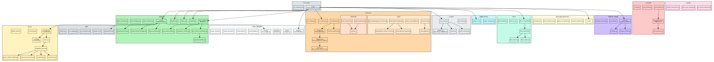

<nav class="atlas-breadcrumb">
<a href="../">Atlas</a> &raquo; Layer 7: Service Components
</nav>

# Layer 7: Service Components

<div class="atlas-metadata">
Category: <strong>Structural</strong> | Generated: 2026-04-04T16:07:23.959962+00:00
</div>

## Map

=== "Interactive (Mermaid)"

    ```mermaid
    graph TB
        subgraph utility["Utility Packages"]
            P0["amplihack<br/>1 files<br/>I=0.00"]
            P1["kuzu<br/>5 files<br/>I=0.00"]
            P2["types<br/>2 files<br/>I=0.00"]
        end

        subgraph feature["Feature Packages"]
            P3["claude<br/>1 files<br/>I=0.00"]
            P4["az-devops-tools<br/>14 files<br/>I=0.00"]
            P5["tests<br/>2 files<br/>I=0.00"]
            P6["check-broken-links<br/>2 files<br/>I=0.00"]
            P7["tests<br/>1 files<br/>I=0.00"]
            P8["mcp-manager<br/>4 files<br/>I=0.00"]
            P9["tests<br/>5 files<br/>I=0.00"]
            P10["tests<br/>2 files<br/>I=0.00"]
            P11["context-management<br/>13 files<br/>I=0.00"]
            P12["tests<br/>6 files<br/>I=0.00"]
            P13["github_pages<br/>5 files<br/>I=0.00"]
            P14["tests<br/>7 files<br/>I=0.00"]
            P15["generator<br/>15 files<br/>I=0.00"]
            P16["lsp-setup<br/>6 files<br/>I=0.00"]
            P17["tests<br/>8 files<br/>I=0.00"]
            P18["tests<br/>8 files<br/>I=0.00"]
            P19["tools<br/>4 files<br/>I=0.00"]
            P20["supply_chain_audit<br/>7 files<br/>I=0.50"]
            P21["checkers<br/>10 files<br/>I=0.50"]
            P22["tests<br/>2 files<br/>I=0.00"]
            P23["e2e<br/>2 files<br/>I=0.00"]
            P24["integration<br/>3 files<br/>I=0.00"]
            P25["unit<br/>8 files<br/>I=0.00"]
            P26["tools<br/>11 files<br/>I=0.00"]
            P27["amplihack<br/>22 files<br/>I=0.50"]
            P28["hooks<br/>42 files<br/>I=0.00"]
            P29["power_steering_checker<br/>13 files<br/>I=0.00"]
            P30["orchestration<br/>5 files<br/>I=0.00"]
            P31["profile_management<br/>10 files<br/>I=0.00"]
            P32["reflection<br/>9 files<br/>I=0.00"]
            P33["remote<br/>15 files<br/>I=0.00"]
            P34["session<br/>6 files<br/>I=0.00"]
            P35["platform_bridge<br/>6 files<br/>I=0.00"]
            P36["fix_strategies<br/>8 files<br/>I=0.00"]
            P37["pr_triage<br/>9 files<br/>I=0.00"]
            P38["tests<br/>6 files<br/>I=0.00"]
            P39["tests<br/>8 files<br/>I=0.00"]
            P40["test_strategies<br/>7 files<br/>I=0.00"]
            P41["amplifier_hook_lock_mode<br/>1 files<br/>I=0.00"]
            P42["tests<br/>2 files<br/>I=0.00"]
            P43["amplifier_hook_memory<br/>1 files<br/>I=0.00"]
            P44["amplifier_hook_post_tool_use<br/>1 files<br/>I=0.00"]
            P45["amplifier_hook_power_steering<br/>1 files<br/>I=0.00"]
            P46["amplifier_hook_pre_compact<br/>1 files<br/>I=0.00"]
            P47["amplifier_hook_pre_tool_use<br/>1 files<br/>I=0.00"]
            P48["amplifier_hook_session_start<br/>1 files<br/>I=0.00"]
            P49["amplifier_hook_session_stop<br/>1 files<br/>I=0.00"]
            P50["amplifier_hook_user_prompt<br/>1 files<br/>I=0.00"]
            P51["context-management<br/>13 files<br/>I=0.00"]
            P52["tests<br/>6 files<br/>I=0.00"]
            P53["github_pages<br/>5 files<br/>I=0.00"]
            P54["tests<br/>7 files<br/>I=0.00"]
            P55["tests<br/>8 files<br/>I=0.00"]
            P56["tools<br/>14 files<br/>I=0.00"]
            P57["amplihack<br/>21 files<br/>I=0.50"]
            P58["orchestration<br/>5 files<br/>I=0.00"]
            P59["profile_management<br/>10 files<br/>I=0.00"]
            P60["reflection<br/>9 files<br/>I=0.00"]
            P61["remote<br/>15 files<br/>I=0.00"]
            P62["session<br/>6 files<br/>I=0.00"]
            P63["platform_bridge<br/>6 files<br/>I=0.00"]
            P64["amplifier-module-orchestrator-amplihack<br/>3 files<br/>I=0.00"]
            P65["tests<br/>8 files<br/>I=0.00"]
            P66["claude<br/>1 files<br/>I=0.00"]
            P67["mcp-manager<br/>4 files<br/>I=0.00"]
            P68["tests<br/>5 files<br/>I=0.00"]
            P69["context_management<br/>13 files<br/>I=0.00"]
            P70["tests<br/>6 files<br/>I=0.00"]
            P71["github_pages<br/>5 files<br/>I=0.00"]
            P72["tests<br/>7 files<br/>I=0.00"]
            P73["tests<br/>8 files<br/>I=0.00"]
            P74["tools<br/>11 files<br/>I=0.00"]
            P75["amplihack<br/>20 files<br/>I=0.50"]
            P76["orchestration<br/>5 files<br/>I=0.00"]
            P77["profile_management<br/>10 files<br/>I=0.00"]
            P78["reflection<br/>9 files<br/>I=0.00"]
            P79["remote<br/>15 files<br/>I=0.00"]
            P80["session<br/>6 files<br/>I=0.00"]
            P81["experiments<br/>1 files<br/>I=0.00"]
            P82["hive_mind<br/>19 files<br/>I=0.00"]
            P83["atlas<br/>7 files<br/>I=0.00"]
            P84["python<br/>9 files<br/>I=0.00"]
            P85["amplihack<br/>23 files<br/>I=0.89"]
            P86["agent<br/>1 files<br/>I=0.00"]
            P87["domain_agents<br/>3 files<br/>I=0.00"]
            P88["code_review<br/>4 files<br/>I=0.00"]
            P89["meeting_synthesizer<br/>4 files<br/>I=0.00"]
            P90["goal_seeking<br/>19 files<br/>I=0.57"]
            P91["hive_mind<br/>20 files<br/>I=0.50"]
            P92["prompts<br/>1 files<br/>I=0.00"]
            P93["sdk<br/>1 files<br/>I=0.00"]
            P94["sdk_adapters<br/>6 files<br/>I=0.00"]
            P95["sub_agents<br/>6 files<br/>I=0.67"]
            P96["teaching<br/>2 files<br/>I=0.00"]
            P97["bundle_generator<br/>17 files<br/>I=0.00"]
            P98["cli<br/>3 files<br/>I=0.00"]
            P99["tests<br/>2 files<br/>I=0.00"]
            P100["adaptive<br/>3 files<br/>I=0.00"]
            P101["docker<br/>3 files<br/>I=0.00"]
            P102["eval<br/>26 files<br/>I=0.50"]
            P103["self_improve<br/>5 files<br/>I=0.50"]
            P104["fleet<br/>54 files<br/>I=0.00"]
            P105["prompts<br/>1 files<br/>I=0.00"]
            P106["tests<br/>32 files<br/>I=0.00"]
            P107["goal_agent_generator<br/>9 files<br/>I=0.33"]
            P108["templates<br/>3 files<br/>I=0.00"]
            P109["hooks<br/>5 files<br/>I=0.00"]
            P110["strategies<br/>4 files<br/>I=0.00"]
            P111["knowledge_builder<br/>3 files<br/>I=0.00"]
            P112["modules<br/>4 files<br/>I=0.00"]
            P113["launcher<br/>26 files<br/>I=0.85"]
            P114["tests<br/>4 files<br/>I=0.00"]
            P115["llm<br/>2 files<br/>I=0.00"]
            P116["lsp_detector<br/>2 files<br/>I=0.00"]
            P117["memory<br/>23 files<br/>I=0.50"]
            P118["evaluation<br/>5 files<br/>I=0.50"]
            P119["indexing<br/>11 files<br/>I=0.33"]
            P120["tests<br/>2 files<br/>I=0.00"]
            P121["meta_delegation<br/>9 files<br/>I=0.00"]
            P122["mode_detector<br/>3 files<br/>I=0.00"]
            P123["path_resolver<br/>2 files<br/>I=0.00"]
            P124["plugin_cli<br/>4 files<br/>I=0.50"]
            P125["plugin_manager<br/>2 files<br/>I=0.00"]
            P126["power_steering<br/>2 files<br/>I=0.33"]
            P127["proxy<br/>2 files<br/>I=0.00"]
            P128["recipe_cli<br/>5 files<br/>I=0.00"]
            P129["recipes<br/>10 files<br/>I=0.00"]
            P130["tests<br/>4 files<br/>I=0.00"]
            P131["recovery<br/>8 files<br/>I=0.00"]
            P132["remote<br/>1 files<br/>I=0.00"]
            P133["safety<br/>4 files<br/>I=0.00"]
            P134["security<br/>10 files<br/>I=0.00"]
            P135["settings_generator<br/>2 files<br/>I=0.00"]
            P136["testing<br/>3 files<br/>I=0.00"]
            P137["tracing<br/>2 files<br/>I=0.50"]
            P138["utils<br/>24 files<br/>I=0.33"]
            P139["uvx<br/>2 files<br/>I=0.50"]
            P140["vendor<br/>1 files<br/>I=0.00"]
            P141["blarify<br/>7 files<br/>I=0.50"]
            P142["agents<br/>4 files<br/>I=0.50"]
            P143["prompt_templates<br/>17 files<br/>I=0.00"]
            P144["rotating_provider<br/>5 files<br/>I=0.00"]
            P145["cli<br/>3 files<br/>I=0.00"]
            P146["code_hierarchy<br/>2 files<br/>I=0.80"]
            P147["languages<br/>13 files<br/>I=0.25"]
            P148["code_references<br/>4 files<br/>I=0.80"]
            P149["queries<br/>3 files<br/>I=0.00"]
            P150["utils<br/>2 files<br/>I=0.50"]
            P151["node<br/>10 files<br/>I=0.44"]
            P152["relationship<br/>5 files<br/>I=0.50"]
            P153["integrations<br/>2 files<br/>I=0.00"]
            P154["mcp_server<br/>4 files<br/>I=0.00"]
            P155["tools<br/>2 files<br/>I=0.00"]
            P156["project_file_explorer<br/>5 files<br/>I=0.00"]
            P157["repositories<br/>1 files<br/>I=0.00"]
            P158["graph_db_manager<br/>6 files<br/>I=0.00"]
            P159["dtos<br/>10 files<br/>I=0.00"]
            P160["graph_queries<br/>2 files<br/>I=0.00"]
            P161["version_control<br/>3 files<br/>I=0.00"]
            P162["utils<br/>2 files<br/>I=0.00"]
            P163["experimental<br/>2 files<br/>I=0.00"]
            P164["multilspy<br/>9 files<br/>I=0.00"]
            P165["workflows<br/>6 files<br/>I=0.00"]
            P166["hive<br/>5 files<br/>I=0.00"]
            P167["worktree<br/>2 files<br/>I=0.00"]
            P168["agents<br/>3 files<br/>I=0.00"]
            P169["domain_agents<br/>8 files<br/>I=0.00"]
            P170["goal_seeking<br/>21 files<br/>I=0.00"]
            P171["eval<br/>20 files<br/>I=0.00"]
            P172["generator<br/>3 files<br/>I=0.00"]
            P173["harness<br/>2 files<br/>I=0.00"]
            P174["hive_mind<br/>29 files<br/>I=0.00"]
            P175["hooks<br/>9 files<br/>I=0.00"]
            P176["integration<br/>19 files<br/>I=0.00"]
            P177["harness<br/>4 files<br/>I=0.00"]
            P178["knowledge_builder<br/>4 files<br/>I=0.00"]
            P179["launcher<br/>10 files<br/>I=0.00"]
            P180["framework<br/>6 files<br/>I=0.00"]
            P181["scenarios<br/>4 files<br/>I=0.00"]
            P182["microservice_project<br/>1 files<br/>I=0.00"]
            P183["models<br/>3 files<br/>I=0.00"]
            P184["services<br/>4 files<br/>I=0.50"]
            P185["utils<br/>3 files<br/>I=0.00"]
            P186["tools<br/>1 files<br/>I=0.00"]
            P187["memory<br/>8 files<br/>I=0.00"]
            P188["meta_delegation<br/>9 files<br/>I=0.00"]
            P189["e2e<br/>7 files<br/>I=0.00"]
            P190["integration<br/>3 files<br/>I=0.00"]
            P191["plugin<br/>8 files<br/>I=0.00"]
            P192["skills<br/>20 files<br/>I=0.00"]
            P193["tracing<br/>6 files<br/>I=0.00"]
            P194["hygiene<br/>2 files<br/>I=0.00"]
            P195["recipes<br/>11 files<br/>I=0.00"]
            P196["tools<br/>1 files<br/>I=0.00"]
            P197["version_check<br/>6 files<br/>I=0.00"]
            P198["workflows<br/>2 files<br/>I=0.00"]
            P199["workloads<br/>2 files<br/>I=0.00"]
        end

        subgraph leaf["Leaf Packages"]
            P200["builders<br/>4 files<br/>I=1.00"]
            P201["tests<br/>76 files<br/>I=1.00"]
            P202["memory<br/>5 files<br/>I=1.00"]
            P203["patterns<br/>6 files<br/>I=1.00"]
            P204["tests<br/>10 files<br/>I=1.00"]
            P205["examples<br/>3 files<br/>I=1.00"]
            P206["tests<br/>5 files<br/>I=1.00"]
            P207["tests<br/>7 files<br/>I=1.00"]
            P208["builders<br/>4 files<br/>I=1.00"]
            P209["memory<br/>5 files<br/>I=1.00"]
            P210["patterns<br/>6 files<br/>I=1.00"]
            P211["tests<br/>10 files<br/>I=1.00"]
            P212["examples<br/>3 files<br/>I=1.00"]
            P213["tests<br/>5 files<br/>I=1.00"]
            P214["tests<br/>7 files<br/>I=1.00"]
            P215["builders<br/>4 files<br/>I=1.00"]
            P216["memory<br/>5 files<br/>I=1.00"]
            P217["patterns<br/>6 files<br/>I=1.00"]
            P218["tests<br/>10 files<br/>I=1.00"]
            P219["examples<br/>3 files<br/>I=1.00"]
            P220["tests<br/>5 files<br/>I=1.00"]
            P221["tests<br/>9 files<br/>I=1.00"]
            P222["commands<br/>2 files<br/>I=1.00"]
            P223["documentation<br/>4 files<br/>I=1.00"]
            P224["prebuilt<br/>2 files<br/>I=1.00"]
            P225["tools<br/>11 files<br/>I=1.00"]
            P226["workloads<br/>1 files<br/>I=1.00"]
            P227["tests<br/>116 files<br/>I=1.00"]
            P228["uvx<br/>8 files<br/>I=1.00"]
            P229["mcp_evaluation<br/>4 files<br/>I=1.00"]
            P230["handlers<br/>5 files<br/>I=1.00"]
            P231["cli<br/>7 files<br/>I=1.00"]
            P232["workflows<br/>8 files<br/>I=1.00"]
        end

        P20 -->|1| P21
        P21 -->|8| P20
        P27 -->|1| P0
        P200 -->|2| P27
        P200 -->|2| P0
        P201 -->|2| P28
        P202 -->|2| P0
        P203 -->|7| P30
        P204 -->|24| P33
        P205 -->|4| P34
        P206 -->|6| P34
        P207 -->|7| P35
        P57 -->|1| P0
        P208 -->|2| P57
        P208 -->|2| P0
        P209 -->|2| P0
        P210 -->|7| P58
        P211 -->|24| P61
        P212 -->|4| P62
        P213 -->|6| P62
        P214 -->|7| P63
        P75 -->|1| P0
        P215 -->|2| P0
        P215 -->|2| P75
        P216 -->|2| P0
        P217 -->|7| P76
        P218 -->|24| P79
        P219 -->|4| P80
        P220 -->|6| P80
        P85 -->|21| P113
        P85 -->|7| P138
        P85 -->|4| P0
        P90 -->|4| P91
        P90 -->|1| P92
        P90 -->|1| P94
        P91 -->|3| P90
        P95 -->|8| P90
        P95 -->|1| P94
        P102 -->|2| P103
        P103 -->|1| P102

        click P0 "../service-components/" "View details"
    ```

=== "High-Fidelity (Graphviz)"

    <div class="atlas-diagram-container">
    
    </div>

=== "Data Table"

    | Package | Files | Ca | Ce | Instability | Class |
    |---------|-------|----|----|-------------|-------|
    | `tests` | 116 | 0 | 1 | 1.00 | leaf |
    | `.claude.tools.amplihack.hooks.tests` | 76 | 0 | 1 | 1.00 | leaf |
    | `src.amplihack.fleet` | 54 | 0 | 0 | 0.00 | feature |
    | `.claude.tools.amplihack.hooks` | 42 | 1 | 0 | 0.00 | feature |
    | `src.amplihack.fleet.tests` | 32 | 0 | 0 | 0.00 | feature |
    | `tests.hive_mind` | 29 | 0 | 0 | 0.00 | feature |
    | `src.amplihack.eval` | 26 | 1 | 1 | 0.50 | feature |
    | `src.amplihack.launcher` | 26 | 2 | 11 | 0.85 | feature |
    | `src.amplihack.utils` | 24 | 4 | 2 | 0.33 | feature |
    | `src.amplihack` | 23 | 2 | 16 | 0.89 | feature |
    | `src.amplihack.memory` | 23 | 2 | 2 | 0.50 | feature |
    | `.claude.tools.amplihack` | 22 | 1 | 1 | 0.50 | feature |
    | `amplifier-bundle.tools.amplihack` | 21 | 1 | 1 | 0.50 | feature |
    | `tests.agents.goal_seeking` | 21 | 0 | 0 | 0.00 | feature |
    | `docs.claude.tools.amplihack` | 20 | 1 | 1 | 0.50 | feature |
    | `src.amplihack.agents.goal_seeking.hive_mind` | 20 | 1 | 1 | 0.50 | feature |
    | `tests.eval` | 20 | 0 | 0 | 0.00 | feature |
    | `tests.skills` | 20 | 0 | 0 | 0.00 | feature |
    | `experiments.hive_mind` | 19 | 0 | 0 | 0.00 | feature |
    | `src.amplihack.agents.goal_seeking` | 19 | 3 | 4 | 0.57 | feature |
    | `tests.integration` | 19 | 0 | 0 | 0.00 | feature |
    | `src.amplihack.bundle_generator` | 17 | 1 | 0 | 0.00 | feature |
    | `src.amplihack.vendor.blarify.agents.prompt_templates` | 17 | 2 | 0 | 0.00 | feature |
    | `.claude.skills.e2e-outside-in-test-generator.generator` | 15 | 0 | 0 | 0.00 | feature |
    | `.claude.tools.amplihack.remote` | 15 | 1 | 0 | 0.00 | feature |
    | `amplifier-bundle.tools.amplihack.remote` | 15 | 1 | 0 | 0.00 | feature |
    | `docs.claude.tools.amplihack.remote` | 15 | 1 | 0 | 0.00 | feature |
    | `.claude.scenarios.az-devops-tools` | 14 | 0 | 0 | 0.00 | feature |
    | `amplifier-bundle.tools` | 14 | 0 | 0 | 0.00 | feature |
    | `.claude.skills.context-management` | 13 | 0 | 0 | 0.00 | feature |

## Legend

<div class="atlas-legend" markdown>

| Symbol       | Meaning                                   |
| ------------ | ----------------------------------------- |
| Subgraph     | Package classification                    |
| Rectangle    | Package                                   |
| `I=`         | Instability metric (0=stable, 1=unstable) |
| Edge label N | Coupling count                            |

</div>

## Key Findings

- 233 packages analyzed
- 33 leaf packages (no dependents)

## Detail

??? info "Full data (click to expand)"

    **Summary metrics:**

    - **Total Packages**: 233
    - **By Classification**:
        - `feature`: 197
        - `leaf`: 33
        - `utility`: 3
    - **Core Packages**: 0
    - **Leaf Packages**: 33
    - **Utility Packages**: 3
    - **Feature Packages**: 197
    - **Avg Instability**: 0.463
    - **Most Coupled Pair**: 2 items
        - `.claude.tools.amplihack.remote.tests`
        - `.claude.tools.amplihack.remote`
    - **Total Cross Package Edges**: 126

## Cross-References

<div class="atlas-crossref" markdown>

- [Layer 2: AST + LSP Bindings](../ast-lsp-bindings/)
- [Layer 3: Compile-time Dependencies](../compile-deps/)

</div>

<div class="atlas-footer">

Source: `layer7_service_components.json` | [Mermaid source](service-components.mmd)

</div>
