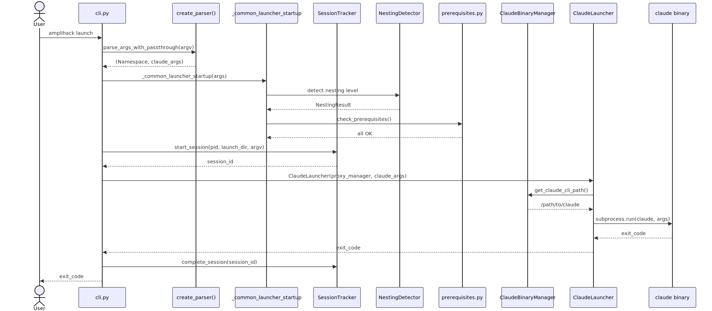
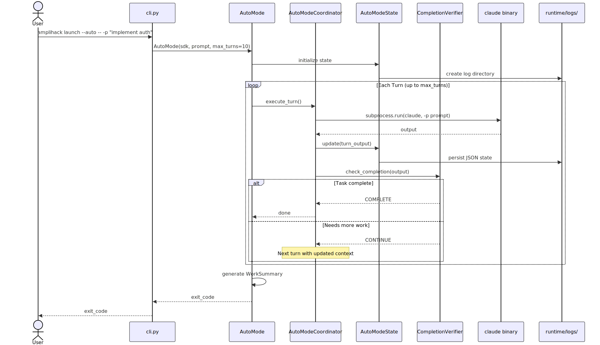
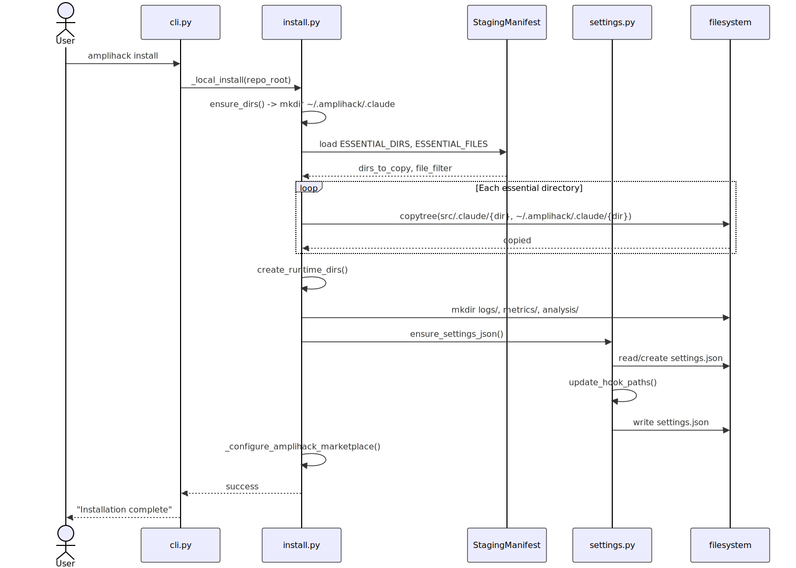
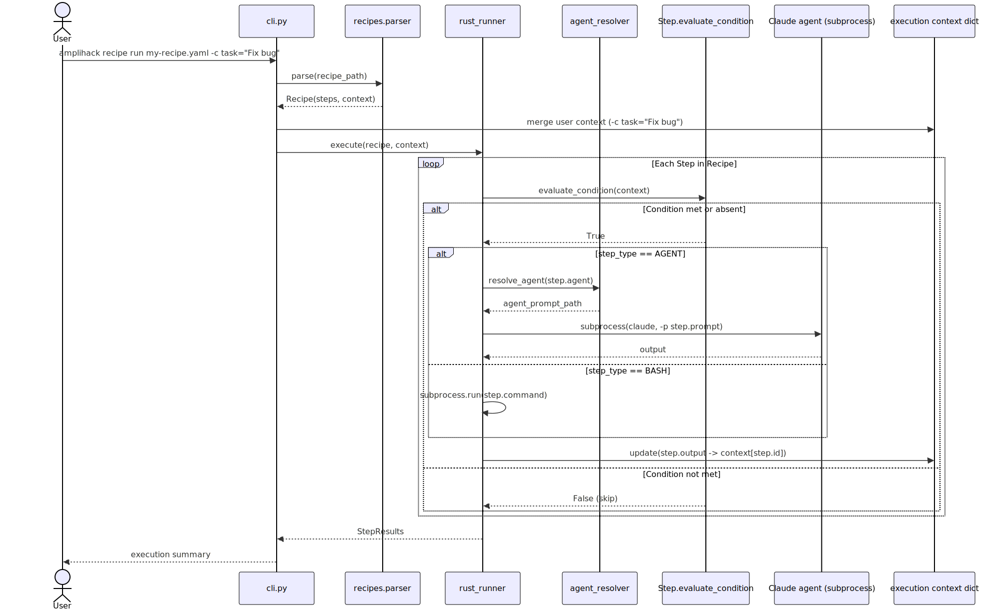
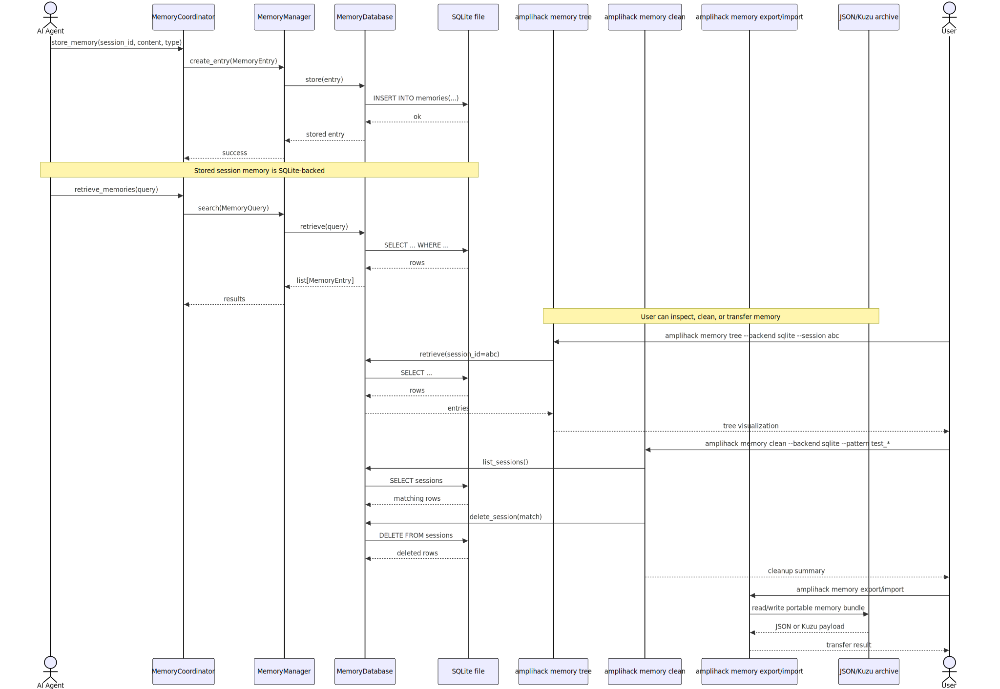

# Layer 8: User Journey Scenarios

Five key user journeys traced from CLI entry to outcome through all relevant layers.

## Scope

1. Launch Claude Code interactively
2. Run in autonomous auto mode
3. Install amplihack
4. Execute a recipe
5. Store and retrieve agent memory

## Overview

## Journey 1: Launch Claude Code

The default path when a user runs `amplihack` or `amplihack launch`.

**Path**: argv -> parse_args -> common_startup (nesting, prereqs) -> SessionTracker -> ClaudeLauncher -> claude binary (subprocess) -> exit

**Key modules**: `cli.py`, `launcher/core.py`, `launcher/session_tracker.py`, `launcher/nesting_detector.py`, `utils/prerequisites.py`, `launcher/claude_binary_manager.py`

## Journey 2: Auto Mode

Autonomous iterative execution with `--auto` flag.

**Path**: argv -> AutoMode -> loop(AutoModeCoordinator -> claude subprocess -> CompletionVerifier -> state persist) -> WorkSummary -> exit

**Key modules**: `cli.py`, `launcher/auto_mode.py`, `launcher/auto_mode_coordinator.py`, `launcher/auto_mode_state.py`, `launcher/completion_verifier.py`, `launcher/work_summary.py`

## Journey 3: Install

First-time installation of amplihack into `~/.amplihack/.claude/`.

**Path**: argv -> ensure_dirs -> load manifest -> copytree each essential dir -> create_runtime_dirs -> ensure_settings_json -> configure marketplace -> done

**Key modules**: `install.py`, `settings.py`, `staging_safety.py`

## Journey 4: Recipe Run

Execute a YAML recipe with context variables.

**Path**: argv -> parse YAML -> merge user context -> for each step: evaluate_condition -> resolve agent -> subprocess(claude) -> update context -> results

**Key modules**: `recipes/parser.py`, `recipes/rust_runner.py`, `recipes/agent_resolver.py`, `recipes/models.py`

## Journey 5: Memory Store and Retrieve

Agent stores a memory entry, later retrieved by user via CLI.

**Path (store)**: Agent -> MemoryCoordinator -> MemoryManager -> MemoryDatabase -> SQLite INSERT
**Path (retrieve)**: CLI `memory tree` -> MemoryDatabase -> SQLite SELECT -> tree visualization
**Path (transfer)**: CLI `memory export` / `memory import` -> agent-local hierarchical store -> portable JSON/Kuzu transfer

**Key modules**: `memory/coordinator.py`, `memory/manager.py`, `memory/database.py`, `memory/models.py`, `memory/cli_visualize.py`, `cli.py`

### Current CLI surface note

- The supported top-level memory journey is now explicitly `memory tree`,
  `memory export`, and `memory import`.
- `memory clean` is removed from the top-level CLI.
- `memory tree --backend ...` is no longer part of the supported user journey;
  backend-specific import/export behavior remains behind the dedicated memory
  transfer commands and lower-level tooling.
