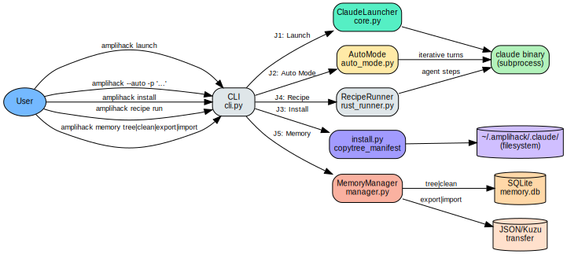

<nav class="atlas-breadcrumb">
<a href="../">Atlas</a> &raquo; Layer 8: User Journeys
</nav>

# Layer 8: User Journeys

<div class="atlas-metadata">
Category: <strong>Behavioral</strong> | Generated: 2026-03-23T16:47:34.397599+00:00
</div>

## Map

=== "Interactive (Mermaid)"

    ```mermaid
    sequenceDiagram
        participant User
        participant CLI as cli.py
        participant Launch as launcher/core.py
        User->>CLI: amplihack launch
        CLI->>Launch: launch()
        Launch->>Launch: common_startup()
        Launch-->>CLI: subprocess result
        CLI-->>User: exit code

        participant Auto as launcher/auto_mode.py
        User->>CLI: amplihack --auto
        CLI->>Auto: run_auto_mode()
        Auto->>Auto: coordinate iterations
        Auto-->>CLI: completion verdict
        CLI-->>User: exit code

        participant Install as install.py
        User->>CLI: amplihack install
        CLI->>Install: install()
        Install->>Install: stage runtime assets
        Install-->>CLI: install result
        CLI-->>User: exit code

        participant Recipe as recipes/rust_runner.py
        User->>CLI: amplihack recipe run
        CLI->>Recipe: recipe()
        Recipe->>Recipe: run_recipe()
        Recipe-->>CLI: step results
        CLI-->>User: exit code

        participant Memory as memory/database.py
        User->>CLI: amplihack memory tree|clean|export|import
        CLI->>Memory: memory subcommands
        Memory->>Memory: sqlite inspect/cleanup or transfer bridge
        Memory-->>CLI: memory result
        CLI-->>User: exit code
    ```

=== "High-Fidelity (Graphviz)"

    <div class="atlas-diagram-container">
    
    </div>

=== "Data Table"

    | Entry | Type | Depth | Functions | Outcomes |
    |-------|------|-------|-----------|----------|
    | `list` | cli | 2 | 6 | 3 |
    | `enable` | cli | 2 | 10 | 4 |
    | `disable` | cli | 2 | 10 | 4 |
    | `validate` | cli | 2 | 5 | 3 |
    | `add` | cli | 2 | 11 | 4 |
    | `remove` | cli | 2 | 12 | 4 |
    | `show` | cli | 3 | 6 | 3 |
    | `export` | cli | 2 | 6 | 4 |
    | `import` | cli | 2 | 12 | 4 |
    | `init` | cli | 1 | 3 | 2 |
    | `add-item` | cli | 1 | 5 | 2 |
    | `update-item` | cli | 1 | 3 | 1 |
    | `create-workstream` | cli | 1 | 5 | 2 |
    | `update-workstream` | cli | 1 | 4 | 2 |
    | `list-backlog` | cli | 1 | 2 | 1 |
    | `list-workstreams` | cli | 1 | 2 | 1 |
    | `init` | cli | 3 | 5 | 2 |
    | `update-decision` | cli | 3 | 9 | 2 |
    | `track-preference` | cli | 0 | 1 | 1 |
    | `set-focus` | cli | 3 | 9 | 2 |
    | `add-question` | cli | 3 | 9 | 2 |
    | `add-action` | cli | 3 | 9 | 2 |
    | `show` | cli | 0 | 1 | 1 |
    | `search` | cli | 0 | 1 | 1 |
    | `lock` | cli | 0 | 1 | 1 |
    | `unlock` | cli | 0 | 1 | 1 |
    | `check` | cli | 0 | 1 | 1 |
    | `diagnose` | cli | 3 | 9 | 3 |
    | `iterate-fixes` | cli | 4 | 10 | 3 |
    | `poll-status` | cli | 3 | 7 | 1 |

## Legend

<div class="atlas-legend" markdown>

| Symbol       | Meaning          |
| ------------ | ---------------- |
| Actor        | User             |
| Participant  | Module/component |
| Solid arrow  | Synchronous call |
| Dashed arrow | Response/return  |

</div>

## Key Findings

- 479 user journeys traced
- 28301 functions unreachable from any entry point

## Detail

??? info "Full data (click to expand)"

    **Summary metrics:**

    - **Total Journeys**: 479
    - **Cli Journeys**: 172
    - **Http Journeys**: 33
    - **Hook Journeys**: 274
    - **Out Of Scope Journeys**: 274
    - **Avg Trace Depth**: 1.0
    - **Total Functions In Graph**: 28653
    - **Total Functions Reached**: 404
    - **Unreachable Function Count**: 28301

## Cross-References

<div class="atlas-crossref" markdown>

- [Layer 2: AST + LSP Bindings](../ast-lsp-bindings/)
- [Layer 4: Runtime Topology](../runtime-topology/)
- [Layer 5: API Contracts](../api-contracts/)
- [Layer 6: Data Flow](../data-flow/)

</div>

<div class="atlas-footer">

Source: `layer8_user_journeys.json` | [Mermaid source](user-journeys.mmd)

</div>
