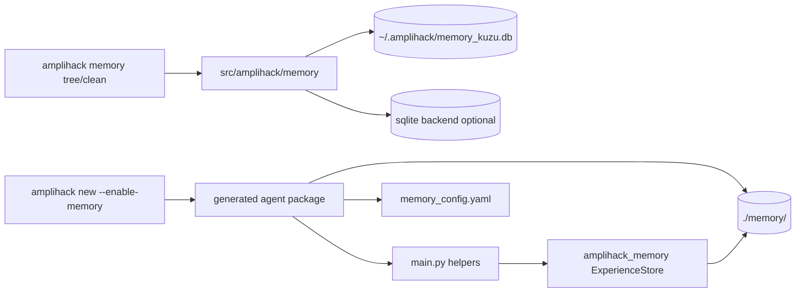

# Memory-Enabled Agents Architecture

This page explains the memory architecture that exists in this checkout today.

## The Important Split

There are two memory surfaces in the repo, and they serve different jobs.

### 1. The in-repo memory backend

The package under `src/amplihack/memory` powers the top-level CLI memory commands and related graph-oriented features.

It is centered around a Kuzu-backed graph store by default and supports these primary memory types:

- `episodic`
- `semantic`
- `procedural`
- `prospective`
- `working`

It also keeps legacy names for backward compatibility:

- `conversation`
- `decision`
- `pattern`
- `context`
- `learning`
- `artifact`

### 2. The generated goal-agent memory scaffold

`amplihack new --enable-memory` packages a standalone goal agent that uses `amplihack_memory` helpers such as:

- `MemoryConnector`
- `ExperienceStore`
- `store_success()`
- `store_failure()`
- `store_pattern()`
- `store_insight()`
- `recall_relevant()`

That generated package stores its own data under `./memory/` and ships a `memory_config.yaml` alongside `main.py`.

## Why the Split Exists

The two surfaces optimize for different things.

- the in-repo backend is a graph-oriented, CLI-visible, session-friendly memory layer
- the generated package is scaffolding for a standalone agent bundle that can carry its own experience store and config

That means you should not assume the CLI memory tree is a live view into a generated agent's `./memory/` directory.

## Kuzu Backend Defaults

When the in-repo memory backend uses Kuzu, the database path resolves in this order:

1. `AMPLIHACK_GRAPH_DB_PATH`
2. `AMPLIHACK_KUZU_DB_PATH` (deprecated)
3. `~/.amplihack/memory_kuzu.db`

This is the backend used by `amplihack memory tree` and `amplihack memory clean` unless you override `--backend`.

## Current CLI Shape

The verified top-level CLI memory surfaces in this checkout are:

- `amplihack memory tree`
- `amplihack memory clean`
- `amplihack new --enable-memory`

The `tree` and `clean` commands talk to the in-repo memory backend. The generator command scaffolds a standalone package that uses `amplihack_memory`.

## Architecture Diagram

## Design Implication

When you are documenting, testing, or extending memory behavior, decide first which surface you are talking about:

- CLI/session memory graph
- generated standalone agent memory scaffold

Most confusion around the current docs came from mixing those two stories together.

## Related Docs

- [Agent Memory Quickstart](../AGENT_MEMORY_QUICKSTART.md)
- [Memory tutorial](../tutorials/memory-enabled-agents-getting-started.md)
- [How to integrate memory into agents](../howto/integrate-memory-into-agents.md)
- [Memory CLI reference](../reference/memory-cli-reference.md)
- [Memory diagrams](../../Specs/MEMORY_AGENTS_DIAGRAMS.md)
