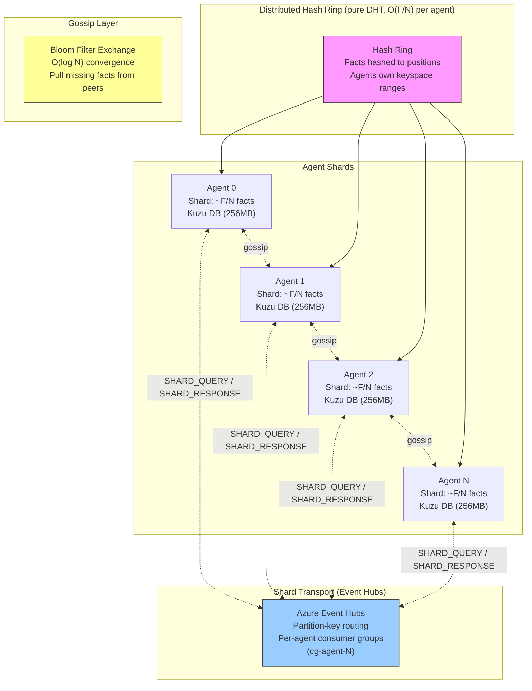
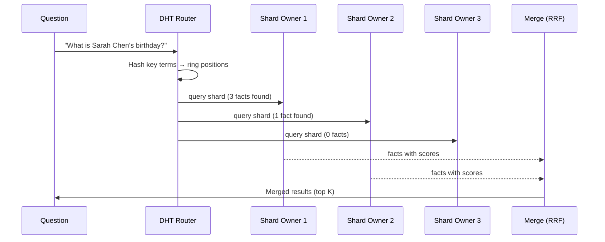
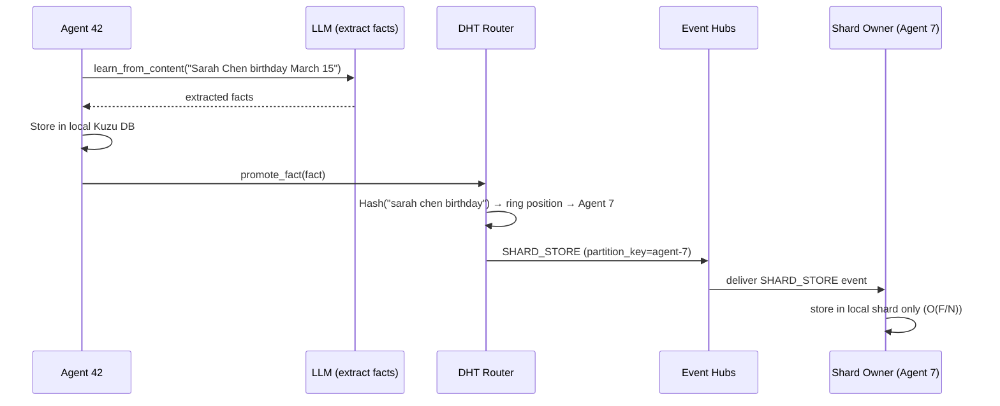
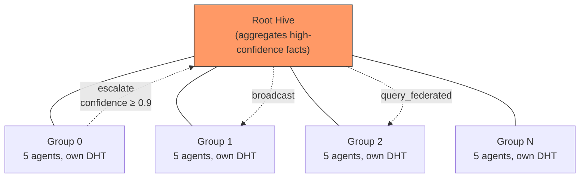

# Distributed Hive Mind Architecture

## Overview

The distributed hive mind replaces the centralized `InMemoryHiveGraph` for deployments with 20+ agents. Instead of every agent holding all facts in memory, facts are partitioned across agents via consistent hashing (DHT). Queries route to the relevant shard owners instead of scanning all agents.

## Architecture



### Shard Transport: Event Hubs (as of 2026-03-12)

Cross-shard queries travel over **Azure Event Hubs** via `EventHubsShardTransport` (replacing the former Service Bus shard topic). Key design points:

| Aspect       | Detail                                                                                                                                                                                                    |
| ------------ | --------------------------------------------------------------------------------------------------------------------------------------------------------------------------------------------------------- |
| Routing      | `SHARD_QUERY` published with `partition_key=target_agent`; `SHARD_RESPONSE` with `partition_key=requesting_agent`                                                                                         |
| Isolation    | Each agent reads from its own consumer group `cg-{agent_id}`                                                                                                                                              |
| Correlation  | `correlation_id + threading.Event` — querying agent blocks in `query_shard()` until the response event fires or timeout expires                                                                           |
| Local bypass | Queries to own shard bypass the network entirely (no EH round-trip)                                                                                                                                       |
| Retrieval    | `handle_shard_query()` calls `agent.memory.search()` via `CognitiveAdapter` (n-gram overlap, reranking, semantic matching), falling back to raw `ShardStore.search()` when no agent instance is available |

**Service Bus** is retained only for the main `hive-events` / `hive-graph` topic used by the gossip layer and `NetworkGraphStore`.

### Pure DHT sharding (no broadcast replication)

`promote_fact()` routes each fact to exactly the primary shard owner(s) determined by the DHT ring. The `SHARD_STORE` broadcast-to-all-agents loop (introduced in commit `e2da57e9`) was reverted — every agent holds only `O(F/N)` facts, not a full copy. Cross-shard retrieval is handled by the agentic search path described above.

## Query Flow



## Learning Flow



> **Note:** Facts are stored on the primary shard owner only (pure DHT). There is no broadcast replication to all agents.

## Federation



Facts with confidence >= 0.9 escalate from group hives to the root. Federated queries traverse the tree, collecting results from all groups and merging via RRF.

## When to Use Which

| Scenario        | Implementation         | Reason                         |
| --------------- | ---------------------- | ------------------------------ |
| < 20 agents     | `InMemoryHiveGraph`    | Simple, all facts in one dict  |
| 20-1000 agents  | `DistributedHiveGraph` | DHT sharding, O(F/N) per agent |
| Testing/dev     | `InMemoryHiveGraph`    | No setup overhead              |
| Production eval | `DistributedHiveGraph` | Avoids Kuzu mmap OOM           |

## Components

### HashRing (`dht.py`)

Consistent hash ring with 64 virtual nodes per agent. Maps fact content to ring positions. Supports dynamic agent join/leave with automatic fact redistribution.

```python
ring = HashRing(replication_factor=3)
ring.add_agent("agent_0")
owners = ring.get_agents("sarah chen birthday")  # Returns 3 agents
```

### ShardStore (`dht.py`)

Lightweight per-agent fact storage. Each agent holds only its shard — facts assigned by the hash ring. Content-hash deduplication prevents duplicates.

### DHTRouter (`dht.py`)

Coordinates between HashRing and ShardStores. Routes facts to shard owners during learning, routes queries to relevant shards during Q&A.

### BloomFilter (`bloom.py`)

Space-efficient probabilistic set membership. Each agent maintains a bloom filter of its fact IDs. During gossip, agents exchange bloom filters and pull missing facts. 1KB for 1000 facts at 1% false positive rate.

**Important:** Gossip exchanges full graph nodes (not flat string facts), preserving all metadata (confidence, timestamps, embeddings). When a new agent joins, a full shard rebuild is triggered to redistribute facts from existing agents to the new ring position.

### DistributedHiveGraph (`distributed_hive_graph.py`)

Drop-in replacement for `InMemoryHiveGraph`. Implements the `HiveGraph` protocol using DHT sharding internally. Supports federation, gossip, and all existing hive operations.

### EventHubsShardTransport (`distributed_hive_graph.py`)

Implements the `ShardTransport` Protocol for cloud deployments. Uses `azure-eventhub` with partition-key routing:

- `SHARD_QUERY` → `partition_key=target_agent` (routes to the owning agent's partition)
- `SHARD_RESPONSE` → `partition_key=requesting_agent` (routes response back)
- Per-agent consumer groups (`cg-{agent_id}`) for isolated consumption
- `correlation_id + threading.Event` for synchronous `query_shard()` semantics
- `handle_shard_query()` calls `agent.memory.search()` (CognitiveAdapter: n-gram, reranking, semantic) when an agent instance is bound; falls back to raw `ShardStore.search()`

```python
# Activated automatically when env vars are set (agent_entrypoint.py)
transport = EventHubsShardTransport(
    connection_string=os.environ["AMPLIHACK_EH_CONNECTION_STRING"],
    eventhub_name=os.environ["AMPLIHACK_EH_NAME"],
    agent_id="agent-3",
)
```

For **local / unit tests**, use `LocalEventBus` (in-process) — no Azure credentials required.

### ServiceBusShardTransport (`distributed_hive_graph.py`)

**Retained for backward compatibility** and for the main `hive-events` / `hive-graph` gossip topic. Not used for shard queries in new deployments.

## Configuration

| Constant                     | Default | Purpose                            |
| ---------------------------- | ------- | ---------------------------------- |
| `DEFAULT_REPLICATION_FACTOR` | 3       | Copies per fact across agents      |
| `DEFAULT_QUERY_FANOUT`       | 5       | Max agents queried per request     |
| `KUZU_BUFFER_POOL_SIZE`      | 256MB   | Per-agent Kuzu memory limit        |
| `KUZU_MAX_DB_SIZE`           | 1GB     | Per-agent Kuzu max size            |
| `VIRTUAL_NODES_PER_AGENT`    | 64      | Hash ring distribution granularity |

## Kuzu Buffer Pool Fix

Kuzu defaults to ~80% of system RAM per database and 8TB mmap address space. With 100 agents, this causes:

```
RuntimeError: Buffer manager exception: Mmap for size 8796093022208 failed.
```

The fix: `CognitiveAdapter` monkey-patches `kuzu.Database.__init__` to bound each DB to 256MB buffer pool and 1GB max size. The proper fix (in `amplihack-memory-lib` PR #11, merged) adds `buffer_pool_size` and `max_db_size` parameters to `CognitiveMemory.__init__`.

## Performance

| Metric             | InMemoryHiveGraph | DistributedHiveGraph |
| ------------------ | ----------------- | -------------------- |
| 100-agent creation | OOM crash         | 12.3s, 4.8GB RSS     |
| Memory per agent   | O(F) all facts    | O(F/N) shard only    |
| Query fan-out      | O(N) all agents   | O(K) relevant agents |
| Gossip convergence | N/A               | O(log N) rounds      |

## Eval Results

| Condition                   | Model      | Score | Std Dev | Notes                                 |
| --------------------------- | ---------- | ----- | ------- | ------------------------------------- |
| Single agent                | Sonnet 4.5 | 94.1% | —       | Baseline, 5000 turns, 21.7h           |
| Federated smoke (10 agents) | Sonnet 4.5 | 65.7% | 6.7%    | Best multi-agent result, low variance |
| Federated full (100 agents) | Sonnet 4.5 | 45.8% | 21.7%   | Routing precision degrades at scale   |
| Federated v1 (naive)        | Sonnet 4.5 | 40.0% | —       | Longest-answer-wins merge             |
| Federated broken routing    | Sonnet 4.5 | 34.9% | 31.2%   | Root hive empty, random fallback      |
| Parallel learning speedup   | —          | 9x    | —       | 10 workers: 21.6h → 2.4h              |

**Key insight:** Routing precision degrades at 100-agent scale (45.8% median, 21.7% stddev vs 65.7% at 10 agents). The 28.4-point gap vs single-agent baseline is the primary open problem.

### Known Issues (as of 2026-03-06)

1. **Empty root hive**: Facts go to group hives but routing queries root hive (empty). Falls back to random agents.
2. **Swallowed errors**: `_synthesize_with_llm()` catches all exceptions silently, masking rate limits as "internal error".
3. **Routing precision degradation**: At 100-agent scale, semantic routing loses precision, causing 21.7% stddev.
4. **High variance**: Random agent selection (from bug #1) causes 31% stddev across runs.

### Fixes applied (2026-03-12, PR #3074)

- **SHARD_STORE broadcast replication reverted** (commit `e2da57e9` reverted): pure DHT sharding restored — each agent holds O(F/N) facts, not a full copy.
- **Cross-shard retrieval now uses CognitiveAdapter**: `handle_shard_query()` calls `agent.memory.search()` (n-gram overlap, reranking, semantic matching) instead of raw `ShardStore.search()`, improving retrieval precision.
- **Service Bus shard topic removed**: SHARD_QUERY / SHARD_RESPONSE now route through Azure Event Hubs with partition-key isolation, eliminating cross-agent message bleed.

> **Eval status**: Post-fix 5000-turn distributed eval results pending (requires Azure deployment).

## Related

- PR #3074: Event Hubs shard transport + CognitiveAdapter cross-shard retrieval (amplihack, 2026-03-12)
- PR #2876: DistributedHiveGraph initial implementation — pure DHT sharding (amplihack, superseded by #3074 for transport layer)
- PR #17: Eval integration (amplihack-agent-eval, merged)
- PR #11: Kuzu buffer_pool_size (amplihack-memory-lib, merged)
- Issue #2871: Tracking issue
- Issue #2866: Original 5000-turn eval spec

---

## Deploying the Distributed Hive Mind

This section covers deploying a hive of agents locally and to Azure Container Apps.

### Prerequisites

- Python 3.11+, `amplihack` installed
- For Azure: `az` CLI authenticated, `docker` running, `ANTHROPIC_API_KEY` set
- For Redis transport: Redis server accessible
- For Azure Service Bus: Azure subscription with Service Bus Standard tier

---

### Local deployment (subprocess-based)

Use the `amplihack-hive` CLI to manage hives locally.

**1. Create a hive config:**

```bash
amplihack-hive create \
  --name my-hive \
  --agents 5 \
  --transport local
```

Creates `~/.amplihack/hives/my-hive/config.yaml`:

```yaml
name: my-hive
transport: local
connection_string: ""
storage_path: /data/hive/my-hive
shard_backend: memory
agents:
  - name: agent_0
    prompt: "You are agent 0 in the my-hive hive."
  - name: agent_1
    prompt: "You are agent 1 in the my-hive hive."
  # ...
```

**2. Customize agent prompts:**

```bash
amplihack-hive add-agent \
  --hive my-hive \
  --agent-name security-analyst \
  --prompt "You are a cybersecurity analyst specializing in threat detection."

amplihack-hive add-agent \
  --hive my-hive \
  --agent-name network-engineer \
  --prompt "You are a network engineer focused on infrastructure reliability." \
  --kuzu-db /path/to/existing.db   # optional: mount existing Kuzu DB
```

**3. Start the hive:**

```bash
amplihack-hive start --hive my-hive --target local
```

Each agent runs as a Python subprocess with `AMPLIHACK_MEMORY_TRANSPORT=local`.

**4. Check status:**

```bash
amplihack-hive status --hive my-hive
```

Output:

```
Hive: my-hive
Transport: local
Agents: 5

Agent                Status       PID        Facts
-------------------------------------------------------
agent_0              running      12345      ?
security-analyst     running      12346      ?
network-engineer     stopped      -          -
```

**5. Stop all agents:**

```bash
amplihack-hive stop --hive my-hive
```

---

### Azure Service Bus transport (multi-machine)

For production deployments where agents run on separate machines (local VMs, Docker, Azure),
use `azure_service_bus` or `redis` transport.

**Create hive with Service Bus:**

```bash
amplihack-hive create \
  --name prod-hive \
  --agents 20 \
  --transport azure_service_bus \
  --connection-string "Endpoint=sb://mynamespace.servicebus.windows.net/;SharedAccessKeyName=..." \
  --shard-backend kuzu
```

Each agent will then:

- Store facts locally in Kuzu
- Publish `create_node` events to the Service Bus topic `hive-graph`
- Receive and apply remote facts from other agents via background thread
- Respond to distributed search queries with local results

---

### Azure Container Apps deployment

For cloud-scale deployments (100+ agents), use the `deploy/azure_hive/` scripts.

**Infrastructure provisioned by `deploy/azure_hive/deploy.sh` / `main.bicep`:**

| Resource                                                                                     | Purpose                                                                       |
| -------------------------------------------------------------------------------------------- | ----------------------------------------------------------------------------- |
| Azure Container Registry (`hivacrhivemind.azurecr.io`)                                       | Stores the amplihack agent Docker image                                       |
| **Event Hubs Namespace** + Event Hub `hive-shards-{hiveName}` + consumer groups `cg-agent-N` | **Shard transport** — SHARD_QUERY / SHARD_RESPONSE routing                    |
| Service Bus Namespace (`hive-sb-dj2qo2w7vu5zi`) + Topic `hive-graph` + N subscriptions       | Gossip / `NetworkGraphStore` event transport (retained)                       |
| Azure Storage Account (`hivesadj2qo2w7vu5zi`) + File Share                                   | Provisioned for persistence; **not mounted for Kuzu** (POSIX lock limitation) |
| Container Apps Environment                                                                   | Managed container runtime (westus2, hive-mind-rg)                             |
| N Container Apps (`amplihive-app-0`…`amplihive-app-N`)                                       | Each app hosts up to 5 agent containers                                       |

**Deploy a 20-agent hive to Azure:**

```bash
export ANTHROPIC_API_KEY="<your-api-key>"
export HIVE_NAME="prod-hive"
export HIVE_AGENT_COUNT=20
export HIVE_AGENTS_PER_APP=5        # 4 Container Apps total
export HIVE_TRANSPORT=azure_service_bus

bash deploy/azure_hive/deploy.sh
```

This will:

1. Create resource group `hive-mind-rg` in `westus2`
2. Build and push the Docker image to ACR (`hivacrhivemind.azurecr.io`)
3. Deploy Bicep template: Service Bus namespace `hive-sb-dj2qo2w7vu5zi`, Storage account `hivesadj2qo2w7vu5zi`, Container Apps Environment
4. Launch 4 Container Apps (`amplihive-app-0` through `amplihive-app-3`) with 5 agents each (20 total)

> **Note:** Containers now use **ephemeral volumes** (`EmptyDir`) at `/data` so Kuzu can acquire POSIX advisory file locks. Azure Files (SMB) does not support POSIX file locks. Agents use the `cognitive` (Kuzu) backend identically in containers and local development.

**Check deployment status:**

```bash
bash deploy/azure_hive/deploy.sh --status
```

**Tear down:**

```bash
bash deploy/azure_hive/deploy.sh --cleanup
```

**Environment variables for Container App agents:**

Each container receives:

| Variable                             | Value                                                        |
| ------------------------------------ | ------------------------------------------------------------ |
| `AMPLIHACK_AGENT_NAME`               | `agent-N` (unique per container)                             |
| `AMPLIHACK_AGENT_PROMPT`             | Agent role prompt                                            |
| `AMPLIHACK_MEMORY_TRANSPORT`         | `azure_service_bus` (for gossip/hive-graph)                  |
| `AMPLIHACK_MEMORY_CONNECTION_STRING` | Service Bus connection string (from Key Vault secret)        |
| `AMPLIHACK_MEMORY_STORAGE_PATH`      | `/data/agent-N` (on mounted Azure File Share)                |
| `AMPLIHACK_EH_CONNECTION_STRING`     | **Event Hubs** namespace connection string (shard transport) |
| `AMPLIHACK_EH_NAME`                  | Event Hub name (`hive-shards-{hiveName}`)                    |
| `ANTHROPIC_API_KEY`                  | From Container Apps secret                                   |

When `AMPLIHACK_EH_CONNECTION_STRING` and `AMPLIHACK_EH_NAME` are set, `agent_entrypoint.py` automatically selects `EventHubsShardTransport`; otherwise it falls back to `ServiceBusShardTransport`.

**Dockerfile highlights:**

```dockerfile
FROM python:3.11-slim
# installs amplihack + kuzu + sentence-transformers + azure-servicebus + azure-eventhub==5.11.7
# non-root user: amplihack-agent
# VOLUME /data  (Azure File Share mount)
# HEALTHCHECK via /tmp/.agent_ready sentinel
CMD ["python3", "/app/agent_entrypoint.py"]
```

**Scaling to 100 agents (production deployment):**

```bash
export HIVE_AGENT_COUNT=100
export HIVE_AGENTS_PER_APP=5   # 20 Container Apps: amplihive-app-0 through amplihive-app-19
bash deploy/azure_hive/deploy.sh
```

Bicep automatically calculates `appCount = ceil(agentCount / agentsPerApp)` and creates the corresponding Container Apps with correct agent indices (`agent-0` through `agent-99`).

**Actual Azure deployment (westus2, hive-mind-rg):**

| Resource              | Name                                                                     |
| --------------------- | ------------------------------------------------------------------------ |
| Container Apps        | `amplihive-app-0` … `amplihive-app-19` (20 total)                        |
| Agents                | `agent-0` … `agent-99` (100 total, 5 per app)                            |
| ACR                   | `hivacrhivemind.azurecr.io`                                              |
| Service Bus namespace | `hive-sb-dj2qo2w7vu5zi`                                                  |
| Service Bus topic     | `hive-graph` (100 subscriptions, one per agent)                          |
| Volume type           | Ephemeral (`EmptyDir`) — POSIX lock compatible, Kuzu works in containers |
| Memory backend        | `cognitive` (Kuzu) — identical to local development                      |

---

### Choosing a transport

| Transport           | Use case                        | Latency                   | Scale          |
| ------------------- | ------------------------------- | ------------------------- | -------------- |
| `local`             | Development, single machine     | Microseconds (in-process) | 1 machine      |
| `redis`             | Multi-machine on same network   | <1ms                      | 10s of agents  |
| `azure_service_bus` | Cloud, multi-region, production | 10-100ms                  | 100s of agents |

---

### Troubleshooting

**Agents not sharing facts**

Check that all agents use the same `topic_name` (default: `hive-graph`) and that
Service Bus subscriptions exist with the correct agent names.

**High search latency**

The default `search_timeout=3.0s` waits for remote responses. Reduce with:

```bash
export AMPLIHACK_MEMORY_SEARCH_TIMEOUT=1.0
```

Or set programmatically:

```python
NetworkGraphStore(..., search_timeout=1.0)
```

**Container Apps not starting**

Check logs:

```bash
az containerapp logs show \
  --name prod-hive-app-0 \
  --resource-group hive-mind-rg \
  --follow
```

---

## Q&A Eval Against the Live Azure Hive

`experiments/hive_mind/query_hive.py` provides a standalone client and eval
runner for testing the **live** hive deployment. It uses the same
`network_graph.search_query` / `network_graph.search_response` protocol that
the agents themselves use, without requiring any local agent instances.

### How It Works

```
query_hive.py ──publishes──► hive-graph topic (Azure Service Bus)
                                     │
                    ┌────────────────┼────────────────┐
                    ▼                ▼                ▼
              agent-0 sub      agent-1 sub   …  agent-19 sub
              (Container App)  (Container App)   (Container App)
                    │                │                │
                    └────────────────┼────────────────┘
                                     ▼
                          eval-query-agent sub
                          (responses collected here)
```

1. `query_hive.py` publishes a `network_graph.search_query` event to the topic.
2. Each live agent receives it via its subscription, searches local memory, and
   publishes a `network_graph.search_response`.
3. Responses arrive on the `eval-query-agent` subscription and are merged.

### Prerequisites

```bash
pip install azure-servicebus
```

The `eval-query-agent` subscription must exist on the `hive-graph` topic:

```bash
az servicebus topic subscription create \
  --resource-group hive-mind-rg \
  --namespace-name hive-sb-dj2qo2w7vu5zi \
  --topic-name hive-graph \
  --name eval-query-agent \
  --max-delivery-count 1 \
  --default-message-time-to-live P1D
```

### Running the Q&A Eval

```bash
# Run built-in 15-question eval suite
python experiments/hive_mind/query_hive.py --run-eval

# Save results to JSON
python experiments/hive_mind/query_hive.py --run-eval --output results.json

# Single ad-hoc query
python experiments/hive_mind/query_hive.py --query "What is Newton's second law?"

# Increase timeout for cold-started agents
python experiments/hive_mind/query_hive.py --run-eval --timeout 15
```

### Environment Variables

| Variable                 | Default            | Description                          |
| ------------------------ | ------------------ | ------------------------------------ |
| `HIVE_CONNECTION_STRING` | embedded           | Azure Service Bus connection string  |
| `HIVE_TOPIC`             | `hive-graph`       | Topic name                           |
| `HIVE_SUBSCRIPTION`      | `eval-query-agent` | Subscription for receiving responses |
| `HIVE_TIMEOUT`           | `10`               | Wait timeout per query (seconds)     |

### Eval Dataset

The built-in dataset covers 15 questions across 5 domains (3 per domain):
biology, chemistry, physics, mathematics, computer_science. Scoring uses
keyword matching — a question is a **hit** if at least one returned fact
contains all expected keywords.

### Programmatic Usage

```python
from experiments.hive_mind.query_hive import HiveQueryClient, _score_response

client = HiveQueryClient(timeout=10)
results = client.query("What is Newton's second law?")
hit = _score_response(results, ["F", "ma"])
print(f"Hit: {hit}, Results: {len(results)}")
client.close()
```

### Live Hive Resources

| Resource            | Name                                   |
| ------------------- | -------------------------------------- |
| Resource group      | `hive-mind-rg`                         |
| Service Bus         | `hive-sb-dj2qo2w7vu5zi`                |
| Topic               | `hive-graph`                           |
| Eval subscription   | `eval-query-agent`                     |
| Agent subscriptions | `agent-0` … `agent-19`                 |
| Container Apps      | `amplihive-app-0` … `amplihive-app-19` |

See also: `amplihack-agent-eval/docs/azure-hive-qa-eval.md` for the full
tutorial including troubleshooting and custom dataset instructions.
