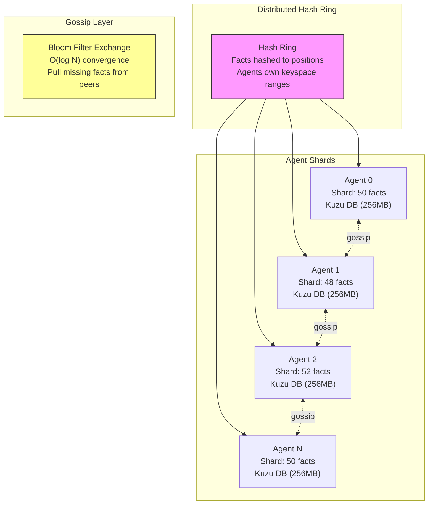
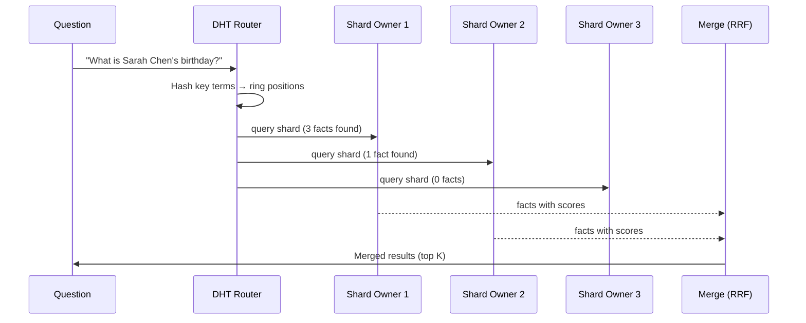
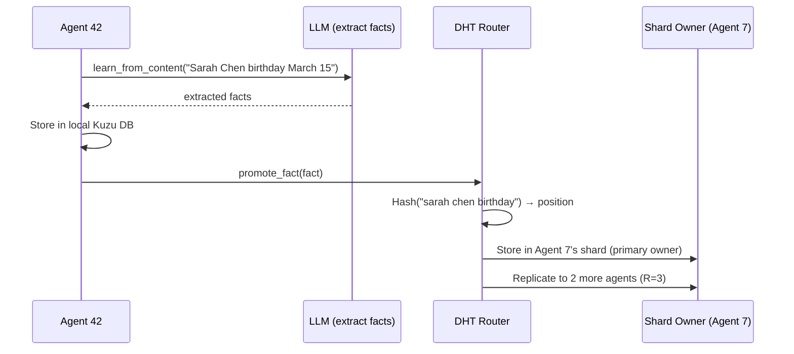
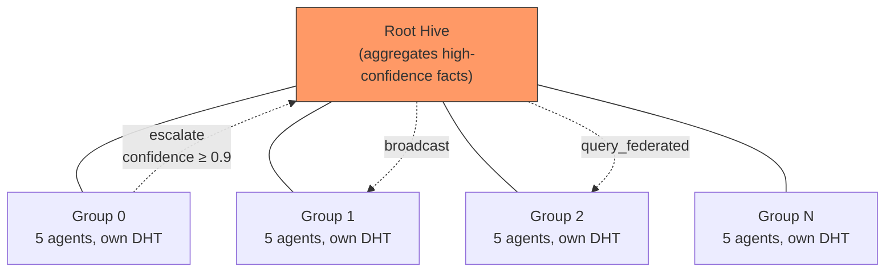

# Distributed Hive Mind Architecture

## Overview

The distributed hive mind replaces the centralized `InMemoryHiveGraph` for deployments with 20+ agents. Instead of every agent holding all facts in memory, facts are partitioned across agents via consistent hashing (DHT). Queries route to the relevant shard owners instead of scanning all agents.

## Architecture



## Query Flow



## Learning Flow



## Federation



Facts with confidence >= 0.9 escalate from group hives to the root. Federated queries traverse the tree, collecting results from all groups and merging via RRF.

## When to Use Which

| Scenario | Implementation | Reason |
|----------|---------------|--------|
| < 20 agents | `InMemoryHiveGraph` | Simple, all facts in one dict |
| 20-1000 agents | `DistributedHiveGraph` | DHT sharding, O(F/N) per agent |
| Testing/dev | `InMemoryHiveGraph` | No setup overhead |
| Production eval | `DistributedHiveGraph` | Avoids Kuzu mmap OOM |

## Components

### HashRing (`dht.py`)

Consistent hash ring with 64 virtual nodes per agent. Maps fact content to ring positions. Supports dynamic agent join/leave with automatic fact redistribution.

```python
ring = HashRing(replication_factor=3)
ring.add_agent("agent_0")
owners = ring.get_agents("sarah chen birthday")  # Returns 3 agents
```

### ShardStore (`dht.py`)

Lightweight per-agent fact storage. Each agent holds only its shard — facts assigned by the hash ring. Content-hash deduplication prevents duplicates.

### DHTRouter (`dht.py`)

Coordinates between HashRing and ShardStores. Routes facts to shard owners during learning, routes queries to relevant shards during Q&A.

### BloomFilter (`bloom.py`)

Space-efficient probabilistic set membership. Each agent maintains a bloom filter of its fact IDs. During gossip, agents exchange bloom filters and pull missing facts. 1KB for 1000 facts at 1% false positive rate.

### DistributedHiveGraph (`distributed_hive_graph.py`)

Drop-in replacement for `InMemoryHiveGraph`. Implements the `HiveGraph` protocol using DHT sharding internally. Supports federation, gossip, and all existing hive operations.

## Configuration

| Constant | Default | Purpose |
|----------|---------|---------|
| `DEFAULT_REPLICATION_FACTOR` | 3 | Copies per fact across agents |
| `DEFAULT_QUERY_FANOUT` | 5 | Max agents queried per request |
| `KUZU_BUFFER_POOL_SIZE` | 256MB | Per-agent Kuzu memory limit |
| `KUZU_MAX_DB_SIZE` | 1GB | Per-agent Kuzu max size |
| `VIRTUAL_NODES_PER_AGENT` | 64 | Hash ring distribution granularity |

## Kuzu Buffer Pool Fix

Kuzu defaults to ~80% of system RAM per database and 8TB mmap address space. With 100 agents, this causes:

```
RuntimeError: Buffer manager exception: Mmap for size 8796093022208 failed.
```

The fix: `CognitiveAdapter` monkey-patches `kuzu.Database.__init__` to bound each DB to 256MB buffer pool and 1GB max size. The proper fix (in `amplihack-memory-lib` PR #11, merged) adds `buffer_pool_size` and `max_db_size` parameters to `CognitiveMemory.__init__`.

## Performance

| Metric | InMemoryHiveGraph | DistributedHiveGraph |
|--------|-------------------|---------------------|
| 100-agent creation | OOM crash | 12.3s, 4.8GB RSS |
| Memory per agent | O(F) all facts | O(F/N) shard only |
| Query fan-out | O(N) all agents | O(K) relevant agents |
| Gossip convergence | N/A | O(log N) rounds |

## Eval Results

| Condition | Model | Score | Notes |
|-----------|-------|-------|-------|
| Single agent | Sonnet 4.5 | 94.1% | Baseline (21.7h) |
| Federated v1 (naive) | Sonnet 4.5 | 40.0% | Longest-answer-wins |
| Federated v3 (routing) | Sonnet 4.5 | 73.8% | Single run, consensus+routing |
| Federated 3-rep median | Sonnet 4.5 | 34.9% | High variance (23-83%), routing bug |
| Federated 3-rep median | Opus 4.5 | 3.6% | Rate limit errors masked |

### Known Issues (as of 2026-03-05)

1. **Empty root hive**: Facts go to group hives but routing queries root hive (empty). Falls back to random agents.
2. **Swallowed errors**: `_synthesize_with_llm()` catches all exceptions silently, masking rate limits as "internal error".
3. **High variance**: Random agent selection (from bug #1) causes 31% stddev across runs.

## Related

- PR #2876: DistributedHiveGraph implementation (amplihack)
- PR #17: Eval integration (amplihack-agent-eval, merged)
- PR #11: Kuzu buffer_pool_size (amplihack-memory-lib, merged)
- Issue #2871: Tracking issue
- Issue #2866: Original 5000-turn eval spec

---

## Deploying the Distributed Hive Mind

This section covers deploying a hive of agents locally and to Azure Container Apps.

### Prerequisites

- Python 3.11+, `amplihack` installed
- For Azure: `az` CLI authenticated, `docker` running, `ANTHROPIC_API_KEY` set
- For Redis transport: Redis server accessible
- For Azure Service Bus: Azure subscription with Service Bus Standard tier

---

### Local deployment (subprocess-based)

Use the `amplihack-hive` CLI to manage hives locally.

**1. Create a hive config:**

```bash
amplihack-hive create \
  --name my-hive \
  --agents 5 \
  --transport local
```

Creates `~/.amplihack/hives/my-hive/config.yaml`:

```yaml
name: my-hive
transport: local
connection_string: ""
storage_path: /data/hive/my-hive
shard_backend: memory
agents:
  - name: agent_0
    prompt: "You are agent 0 in the my-hive hive."
  - name: agent_1
    prompt: "You are agent 1 in the my-hive hive."
  # ...
```

**2. Customize agent prompts:**

```bash
amplihack-hive add-agent \
  --hive my-hive \
  --agent-name security-analyst \
  --prompt "You are a cybersecurity analyst specializing in threat detection."

amplihack-hive add-agent \
  --hive my-hive \
  --agent-name network-engineer \
  --prompt "You are a network engineer focused on infrastructure reliability." \
  --kuzu-db /path/to/existing.db   # optional: mount existing Kuzu DB
```

**3. Start the hive:**

```bash
amplihack-hive start --hive my-hive --target local
```

Each agent runs as a Python subprocess with `AMPLIHACK_MEMORY_TRANSPORT=local`.

**4. Check status:**

```bash
amplihack-hive status --hive my-hive
```

Output:
```
Hive: my-hive
Transport: local
Agents: 5

Agent                Status       PID        Facts
-------------------------------------------------------
agent_0              running      12345      ?
security-analyst     running      12346      ?
network-engineer     stopped      -          -
```

**5. Stop all agents:**

```bash
amplihack-hive stop --hive my-hive
```

---

### Azure Service Bus transport (multi-machine)

For production deployments where agents run on separate machines (local VMs, Docker, Azure),
use `azure_service_bus` or `redis` transport.

**Create hive with Service Bus:**

```bash
amplihack-hive create \
  --name prod-hive \
  --agents 20 \
  --transport azure_service_bus \
  --connection-string "Endpoint=sb://mynamespace.servicebus.windows.net/;SharedAccessKeyName=..." \
  --shard-backend kuzu
```

Each agent will then:
- Store facts locally in Kuzu
- Publish `create_node` events to the Service Bus topic `hive-graph`
- Receive and apply remote facts from other agents via background thread
- Respond to distributed search queries with local results

---

### Azure Container Apps deployment

For cloud-scale deployments (100+ agents), use the `deploy/azure_hive/` scripts.

**Infrastructure provisioned by `deploy.sh` / `main.bicep`:**

| Resource | Purpose |
|---|---|
| Azure Container Registry | Stores the amplihack agent Docker image |
| Service Bus Namespace + Topic + Subscriptions | Event transport for NetworkGraphStore |
| Azure Storage Account + File Share | Persistent Kuzu databases per agent |
| Container Apps Environment | Managed container runtime |
| N Container Apps | Each app hosts up to 5 agent containers |

**Deploy a 20-agent hive to Azure:**

```bash
export ANTHROPIC_API_KEY="sk-ant-..."
export HIVE_NAME="prod-hive"
export HIVE_AGENT_COUNT=20
export HIVE_AGENTS_PER_APP=5        # 4 Container Apps total
export HIVE_TRANSPORT=azure_service_bus

bash deploy/azure_hive/deploy.sh
```

This will:
1. Create resource group `hive-mind-rg` in `eastus`
2. Build and push the Docker image to ACR
3. Deploy Bicep template: Service Bus, File Share, Container Apps Environment
4. Launch 4 Container Apps with 5 agents each (20 total)

**Check deployment status:**

```bash
bash deploy/azure_hive/deploy.sh --status
```

**Tear down:**

```bash
bash deploy/azure_hive/deploy.sh --cleanup
```

**Environment variables for Container App agents:**

Each container receives:

| Variable | Value |
|---|---|
| `AMPLIHACK_AGENT_NAME` | `agent-N` (unique per container) |
| `AMPLIHACK_AGENT_PROMPT` | Agent role prompt |
| `AMPLIHACK_MEMORY_TRANSPORT` | `azure_service_bus` |
| `AMPLIHACK_MEMORY_CONNECTION_STRING` | Service Bus connection string (from Key Vault secret) |
| `AMPLIHACK_MEMORY_STORAGE_PATH` | `/data/agent-N` (on mounted Azure File Share) |
| `ANTHROPIC_API_KEY` | From Container Apps secret |

**Dockerfile highlights:**

```dockerfile
FROM python:3.11-slim
# installs amplihack + kuzu + sentence-transformers + azure-servicebus
# non-root user: amplihack-agent
# VOLUME /data  (Azure File Share mount)
# HEALTHCHECK via /tmp/.agent_ready sentinel
CMD ["python3", "/app/agent_entrypoint.py"]
```

**Scaling to 100 agents:**

```bash
export HIVE_AGENT_COUNT=100
export HIVE_AGENTS_PER_APP=5   # 20 Container Apps
bash deploy/azure_hive/deploy.sh
```

Bicep automatically calculates `appCount = ceil(agentCount / agentsPerApp)` and
creates the corresponding Container Apps with correct agent indices.

---

### Choosing a transport

| Transport | Use case | Latency | Scale |
|---|---|---|---|
| `local` | Development, single machine | Microseconds (in-process) | 1 machine |
| `redis` | Multi-machine on same network | <1ms | 10s of agents |
| `azure_service_bus` | Cloud, multi-region, production | 10-100ms | 100s of agents |

---

### Troubleshooting

**Agents not sharing facts**

Check that all agents use the same `topic_name` (default: `hive-graph`) and that
Service Bus subscriptions exist with the correct agent names.

**High search latency**

The default `search_timeout=3.0s` waits for remote responses. Reduce with:
```bash
export AMPLIHACK_MEMORY_SEARCH_TIMEOUT=1.0
```
Or set programmatically:
```python
NetworkGraphStore(..., search_timeout=1.0)
```

**Container Apps not starting**

Check logs:
```bash
az containerapp logs show \
  --name prod-hive-app-0 \
  --resource-group hive-mind-rg \
  --follow
```
