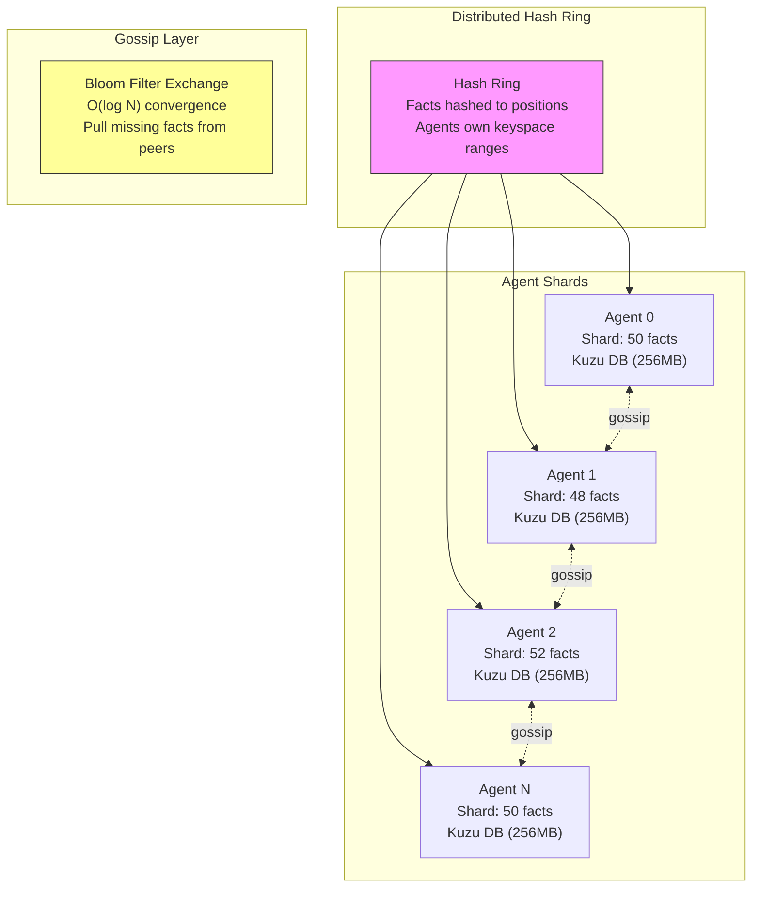
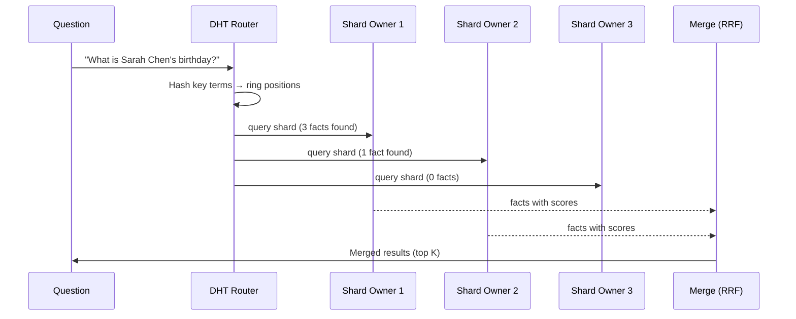
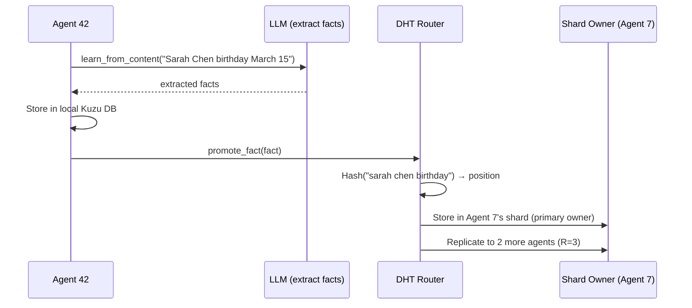
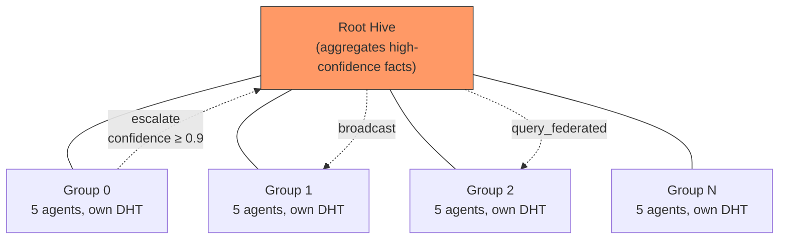

# Distributed Hive Mind Architecture

## Overview

The distributed hive mind replaces the centralized `InMemoryHiveGraph` for deployments with 20+ agents. Instead of every agent holding all facts in memory, facts are partitioned across agents via consistent hashing (DHT). Queries route to the relevant shard owners instead of scanning all agents.

## Architecture



## Query Flow



## Learning Flow



## Federation



Facts with confidence >= 0.9 escalate from group hives to the root. Federated queries traverse the tree, collecting results from all groups and merging via RRF.

## When to Use Which

| Scenario | Implementation | Reason |
|----------|---------------|--------|
| < 20 agents | `InMemoryHiveGraph` | Simple, all facts in one dict |
| 20-1000 agents | `DistributedHiveGraph` | DHT sharding, O(F/N) per agent |
| Testing/dev | `InMemoryHiveGraph` | No setup overhead |
| Production eval | `DistributedHiveGraph` | Avoids Kuzu mmap OOM |

## Components

### HashRing (`dht.py`)

Consistent hash ring with 64 virtual nodes per agent. Maps fact content to ring positions. Supports dynamic agent join/leave with automatic fact redistribution.

```python
ring = HashRing(replication_factor=3)
ring.add_agent("agent_0")
owners = ring.get_agents("sarah chen birthday")  # Returns 3 agents
```

### ShardStore (`dht.py`)

Lightweight per-agent fact storage. Each agent holds only its shard — facts assigned by the hash ring. Content-hash deduplication prevents duplicates.

### DHTRouter (`dht.py`)

Coordinates between HashRing and ShardStores. Routes facts to shard owners during learning, routes queries to relevant shards during Q&A.

### BloomFilter (`bloom.py`)

Space-efficient probabilistic set membership. Each agent maintains a bloom filter of its fact IDs. During gossip, agents exchange bloom filters and pull missing facts. 1KB for 1000 facts at 1% false positive rate.

### DistributedHiveGraph (`distributed_hive_graph.py`)

Drop-in replacement for `InMemoryHiveGraph`. Implements the `HiveGraph` protocol using DHT sharding internally. Supports federation, gossip, and all existing hive operations.

## Configuration

| Constant | Default | Purpose |
|----------|---------|---------|
| `DEFAULT_REPLICATION_FACTOR` | 3 | Copies per fact across agents |
| `DEFAULT_QUERY_FANOUT` | 5 | Max agents queried per request |
| `KUZU_BUFFER_POOL_SIZE` | 256MB | Per-agent Kuzu memory limit |
| `KUZU_MAX_DB_SIZE` | 1GB | Per-agent Kuzu max size |
| `VIRTUAL_NODES_PER_AGENT` | 64 | Hash ring distribution granularity |

## Kuzu Buffer Pool Fix

Kuzu defaults to ~80% of system RAM per database and 8TB mmap address space. With 100 agents, this causes:

```
RuntimeError: Buffer manager exception: Mmap for size 8796093022208 failed.
```

The fix: `CognitiveAdapter` monkey-patches `kuzu.Database.__init__` to bound each DB to 256MB buffer pool and 1GB max size. The proper fix (in `amplihack-memory-lib` PR #11, merged) adds `buffer_pool_size` and `max_db_size` parameters to `CognitiveMemory.__init__`.

## Performance

| Metric | InMemoryHiveGraph | DistributedHiveGraph |
|--------|-------------------|---------------------|
| 100-agent creation | OOM crash | 12.3s, 4.8GB RSS |
| Memory per agent | O(F) all facts | O(F/N) shard only |
| Query fan-out | O(N) all agents | O(K) relevant agents |
| Gossip convergence | N/A | O(log N) rounds |

## Eval Results

| Condition | Model | Score | Notes |
|-----------|-------|-------|-------|
| Single agent | Sonnet 4.5 | 94.1% | Baseline (21.7h) |
| Federated v1 (naive) | Sonnet 4.5 | 40.0% | Longest-answer-wins |
| Federated v3 (routing) | Sonnet 4.5 | 73.8% | Single run, consensus+routing |
| Federated 3-rep median | Sonnet 4.5 | 34.9% | High variance (23-83%), routing bug |
| Federated 3-rep median | Opus 4.5 | 3.6% | Rate limit errors masked |

### Known Issues (as of 2026-03-05)

1. **Empty root hive**: Facts go to group hives but routing queries root hive (empty). Falls back to random agents.
2. **Swallowed errors**: `_synthesize_with_llm()` catches all exceptions silently, masking rate limits as "internal error".
3. **High variance**: Random agent selection (from bug #1) causes 31% stddev across runs.

## Related

- PR #2876: DistributedHiveGraph implementation (amplihack)
- PR #17: Eval integration (amplihack-agent-eval, merged)
- PR #11: Kuzu buffer_pool_size (amplihack-memory-lib, merged)
- Issue #2871: Tracking issue
- Issue #2866: Original 5000-turn eval spec
