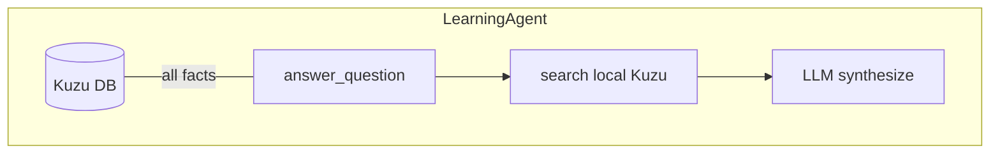
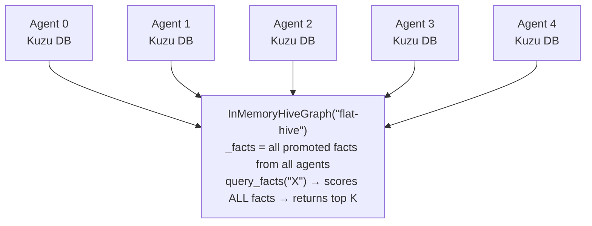
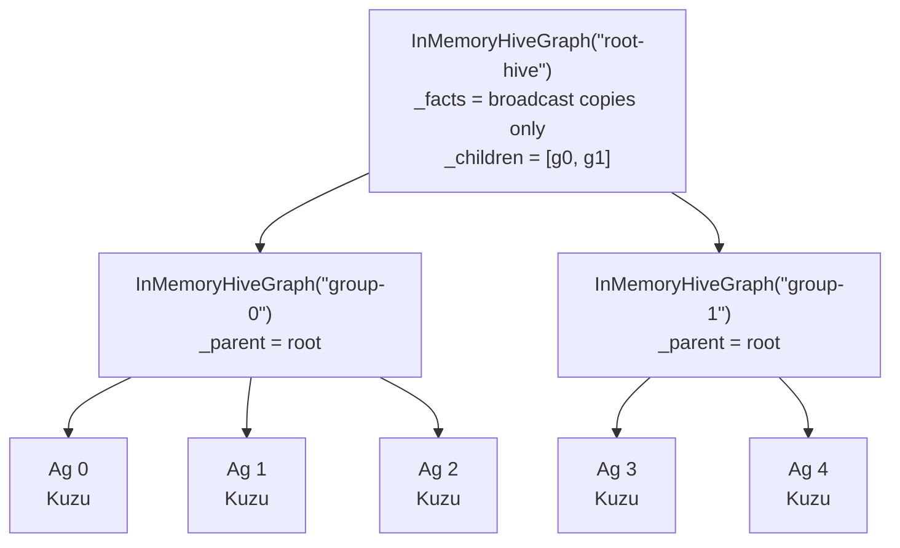
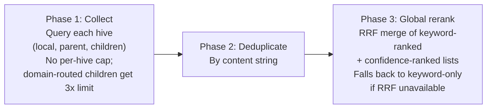
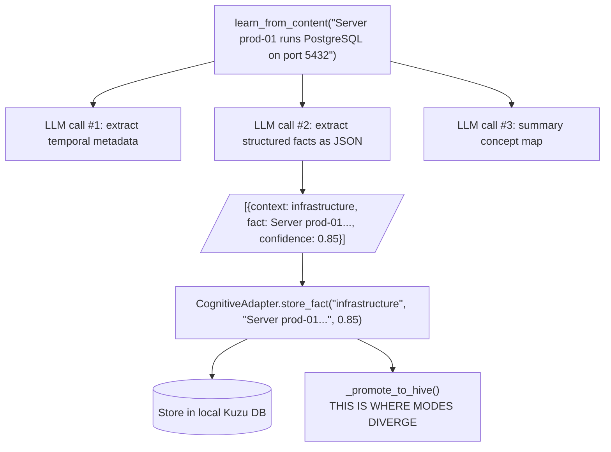
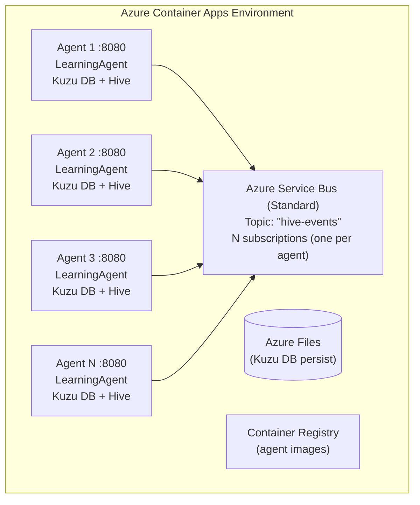
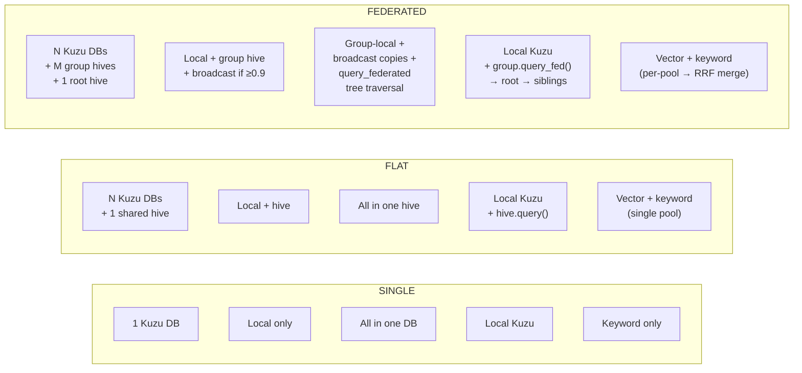

# Hive Mind Architecture

This document explains the data structures, algorithms, and code paths that
compose the hive mind system. It covers fact flow, retrieval, replication, and
lifecycle management.

## The Three Eval Topologies

### Single: One Agent, No Hive



One agent learns all turns. All facts in one Kuzu DB. No hive involved.

### Flat: N Agents, One Shared Hive



All agents share the SAME Python object reference. `store_fact()` auto-promotes
and the fact lands in one shared dict. Every agent sees every fact immediately.

### Federated: N Agents, M Group Hives + Root



Agents in each group share a group-level hive. High-confidence facts (≥ 0.9)
broadcast to all groups via the root. Cross-group queries use `query_federated()`
which recursively traverses the tree.

## Retrieval Pipeline

### Vector Search + Keyword Fallback

`query_facts()` uses a two-tier retrieval strategy:

1. **Vector search (primary)**: When an `embedding_generator` is available,
   embed the query and compute cosine similarity against all fact embeddings.
   Score via `hybrid_score_weighted()`:

   ```
   score = 0.5 * semantic_similarity + 0.3 * confirmation_count + 0.2 * source_trust
   ```

2. **Keyword fallback**: When embeddings are unavailable or vector search fails,
   fall back to Jaccard word-overlap scoring:

   ```
   score = keyword_hits + confidence * 0.01
   ```

The vector path produces higher-quality results for semantic queries while
keyword fallback ensures the system always returns results.

### RRF Federation Merge

Federated queries (`query_federated()`) collect results from each hive in
the tree, then apply **Reciprocal Rank Fusion (RRF)** to merge multiple
ranked lists:



Domain routing gives priority to children whose agents have domains matching
the query keywords, ensuring domain-relevant groups contribute more facts.

## CRDTs (Conflict-Free Replicated Data Types)

CRDTs enable eventual consistency between hive replicas without coordination.

### ORSet (Observed-Remove Set) — Fact Membership

Tracks which facts exist in the hive. Each `promote_fact()` adds the fact_id
to the ORSet; each `retract_fact()` tombstones it. Merge is union of
element-tag pairs and tombstones. Add-wins semantics: a concurrent add and
remove results in the element being present.

```python
# On promote:  self._fact_set.add(fact.fact_id)
# On retract:  self._fact_set.remove(fact_id)
# On merge:    self._fact_set.merge(other._fact_set)
```

### LWWRegister (Last-Writer-Wins Register) — Agent Trust

Each agent's trust score is stored in an LWWRegister. On merge, the register
with the later timestamp wins. Deterministic tiebreaking by value ensures
convergence regardless of merge order.

```python
# On update_trust:  self._trust_registers[agent_id].set(trust, time.time())
# On merge:         self._trust_registers[agent_id].merge(other._trust_registers[agent_id])
```

### merge_state()

`InMemoryHiveGraph.merge_state(other)` merges CRDTs from another replica:

1. Merge ORSets (fact membership)
2. Copy HiveFact objects for new fact_ids
3. Sync fact status with ORSet membership (add-wins)
4. Merge LWWRegisters and update agent trust values

## Gossip Protocol

Epidemic-style fact dissemination between hive peers.

### How It Works

1. **Peer selection**: Trust-weighted random selection (configurable fanout,
   default 2 peers per round)
2. **Fact selection**: Top-K facts by confidence above minimum threshold
   (default top 10, min confidence 0.3)
3. **Deduplication**: Skip facts the peer already has (content-based check)
4. **Relay agent**: Facts are promoted into the peer via a `__gossip_{hive_id}__`
   relay agent
5. **Loop prevention**: Gossip-received facts are tagged `gossip_from:{hive_id}`
   and excluded from re-gossip

### Auto-Gossip on Promote

When `enable_gossip=True` and peers are registered (via a prior `run_gossip()`
call), each `promote_fact()` automatically gossips new facts to known peers.
Gossip copies and broadcast copies are excluded from auto-gossip to prevent
infinite loops.

### Convergence Measurement

`convergence_check(hives)` measures knowledge overlap across multiple hives:

- Returns fraction of total unique fact content shared by ALL hives
- 0.0 = no overlap, 1.0 = identical knowledge

## Fact TTL and Garbage Collection

### Confidence Decay

When `enable_ttl=True`, facts lose confidence over time via exponential decay:

```
confidence_decayed = confidence_original × e^(-decay_rate × elapsed_hours)
```

Default decay rate is 0.01 per hour. Decay is applied at query time (lazy),
not stored permanently. The original confidence is preserved so that repeated
queries do not compound the decay.

### Garbage Collection

`gc()` removes facts older than the TTL threshold (default 24 hours):

1. Iterates the TTL registry
2. Facts exceeding max age are retracted via `retract_fact()`
3. TTL entries and original confidence records are cleaned up
4. Returns list of garbage-collected fact_ids

When TTL is disabled, `gc()` is a no-op returning an empty list.

## The Fact Lifecycle

### Step 1: Learning (same in all modes)



### Step 2: Promotion (mode-dependent)

**Flat mode** — fact lands directly in the one shared dict. All agents see it
on the next query.

**Federated mode** — fact lands in the group hive. If confidence ≥ 0.9, it
broadcasts to all sibling groups via the root. Facts below the threshold stay
in their group but are still reachable via `query_federated()` tree traversal.

### Step 3: Query (mode-dependent)

**Flat mode** — `query_facts()` scores every fact in the one shared pool and
returns top-K.

**Federated mode** — `query_federated()` recursively queries local group,
parent, and sibling groups, then applies RRF global reranking across all
collected facts.

## Azure Deployment Architecture



In Azure, containers can't share Python objects. Service Bus acts as the
broadcast layer — each `FACT_PROMOTED` event propagates to all agents (with
optional group filtering for federated mode).

## Data Flow Summary



## Key Files

| File                                  | Purpose                                       |
| ------------------------------------- | --------------------------------------------- |
| `src/.../hive_mind/hive_graph.py`     | HiveGraph protocol, InMemoryHiveGraph         |
| `src/.../hive_mind/crdt.py`           | GSet, ORSet, LWWRegister implementations      |
| `src/.../hive_mind/gossip.py`         | Gossip protocol and convergence measurement   |
| `src/.../hive_mind/fact_lifecycle.py` | FactTTL, confidence decay, garbage collection |
| `src/.../hive_mind/embeddings.py`     | EmbeddingGenerator (sentence-transformers)    |
| `src/.../hive_mind/reranker.py`       | hybrid_score_weighted, rrf_merge              |
| `src/.../hive_mind/controller.py`     | HiveController (desired-state YAML manifests) |
| `src/.../hive_mind/distributed.py`    | AgentNode, HiveCoordinator                    |
| `src/.../hive_mind/event_bus.py`      | EventBus protocol + Local/Azure SB/Redis      |
| `src/.../cognitive_adapter.py`        | CognitiveAdapter (local Kuzu + hive bridge)   |
