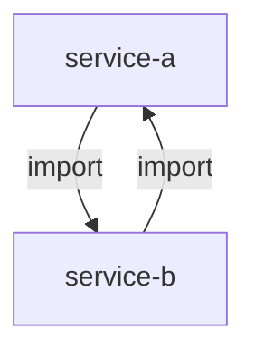

# Atlas Layers Explained

What each layer captures, how it detects bugs, and what signals it reads from code.

---

## Layer 1: Runtime Topology

**Question answered:** What is running, where is it, and how do the pieces talk to each other?

### Source signals

| Signal | Framework/File |
|--------|---------------|
| Service names and ports | `docker-compose.yml` services + ports |
| Container dependencies | `depends_on:` blocks in docker-compose |
| Kubernetes services | `k8s/**/*.yaml` Service resources |
| Helm chart services | `helm/**/*.yaml` service templates |
| Service-to-service URLs | `*.env.example` values matching `*URL*`, `*HOST*`, `*ENDPOINT*` |
| Listen addresses | Source files with `ListenAndServe`, `app.listen`, `app.run` |

### Structural bugs Layer 1 detects

- Service referenced in docker-compose but no routes in Layer 3 (dead service)
- Service with routes in Layer 3 but not present in docker-compose (missing deployment definition)
- Port conflict: two services declare the same host port
- Missing dependency: Layer 3 cross-service call not reflected in Layer 1 topology

---

## Layer 2: Compile-time Dependencies

**Question answered:** What does each module depend on, and are there any circular dependencies?

### Source signals

| Signal | Language/File |
|--------|--------------|
| Direct imports | `import` statements, `require()` |
| Module declarations | `go.mod`, `package.json`, `Cargo.toml`, `*.csproj`, `pyproject.toml`, `requirements*.txt` |
| Version constraints | Version fields in above files |
| Internal vs. external | Package paths matching `@org/` or project root = internal |

### Circular dependency representation

Circular dependencies appear as bidirectional edges:

**Always filed as severity: `major`** — cycles mean build order is undefined and must be resolved.

### Structural bugs Layer 2 detects

- Package imported in code but not declared in the module file
- Circular import cycle between packages
- Deprecated package version with known CVE (requires manual cross-reference)
- Internal package imported as external (wrong path prefix)

---

## Layer 3: HTTP Routing

**Question answered:** What API surface does each service expose?

### Source signals by framework

| Framework | Pattern searched |
|-----------|----------------|
| Go (chi/gin/echo) | `r.Get`, `r.Post`, `router.GET`, `e.GET`, `*handler*.go` files |
| TypeScript (Express) | `router.get`, `router.post`, `app.get` |
| TypeScript (NestJS) | `@Get()`, `@Post()`, `@Controller()` decorators |
| Python (FastAPI) | `@app.get()`, `@router.post()` |
| Python (Django) | `path()`, `re_path()` in `urls.py` |
| .NET (ASP.NET Core) | `[HttpGet]`, `[HttpPost]`, `MapGet()`, `MapPost()` |
| Rust (axum/actix) | `.route()`, `Router::new()` |
| OpenAPI specs | `openapi*.json`, `openapi*.yaml`, `swagger*.json` |

### Structural bugs Layer 3 detects (cross-referenced with Layer 4)

- Handler accesses request field not declared in DTO (Pass 1, Step 1.1)
- Route declared in OpenAPI spec but no handler found in code
- Route in code but not documented in OpenAPI spec
- Auth middleware missing on route that accesses privileged data

---

## Layer 4: Data Flow

**Question answered:** How does data enter, transform, persist, and exit?

### Source signals

| Signal | Patterns searched |
|--------|-----------------|
| Request DTOs | `*dto*.ts`, `*_request.go`, `class.*BaseModel`, `interface.*Request` |
| Response DTOs | `*_response.go`, `interface.*Response` |
| DB models | `@Entity`, `type.*struct`, `class.*Model`, `*model*.go` |
| ORM mappings | Annotations: `@Column`, `json:`, `db:` tags |
| Event types | `publish`, `emit`, `dispatch`, Kafka/RabbitMQ send patterns |

### Structural bugs Layer 4 detects (cross-referenced with Layer 3)

- DTO field referenced in handler but not declared in the DTO type
- DB model field not mapped from any DTO (data goes to DB but can never be set)
- Event published but no subscriber registered (dead event)
- Response DTO contains field that is never populated in handler

---

## Layer 5: User Journey Scenarios

**Question answered:** What does the system do end-to-end for a named business operation?

### How journeys are derived

If no `journeys.yaml` is provided, Layer 5 auto-derives journeys from Layer 3 by:
1. Identifying routes that mutate state (POST, PUT, PATCH, DELETE) as journey entry points
2. Grouping related routes by resource prefix (`/api/orders/*` = "order management" journey)
3. Selecting the top 3–5 groups by route count (most complex first)

Named journeys from `docs/atlas/journeys.yaml` always take precedence.

### What Pass 2 traces per journey

For each journey step, Pass 2 verifies:
- **Layer 3**: Route exists and accepts the expected DTO
- **Layer 4**: Data transformation matches expectations (correct fields written to DB)
- **Layer 1**: Inter-service calls match topology (service A calling service B is in the topology)
- **Layer 2**: All packages required for this path are declared as dependencies

### Structural bugs Layer 5 (Pass 2) detects

- Journey step calls a route that no longer exists (stale journey definition)
- Multi-service call bypasses API gateway (direct service-to-service not in Layer 1 topology)
- Data written in step N is not available in step N+1 (data flow break)
- Journey has no termination condition (infinite loop risk in async flows)

---

## Layer 6: Exhaustive Inventory

**Question answered:** What are all the system entities — services, configuration, storage, external dependencies?

### Sub-layers

| Sub-layer | File | Content |
|-----------|------|---------|
| 6a | `services.md` | All services: language, port, protocol, health check |
| 6b | `env-vars.md` | All env vars: key name, required, default, used-by (never values) |
| 6c | `data-stores.md` | All databases/caches/queues: type, version, consumers |
| 6d | `external-deps.md` | All third-party APIs: auth type, rate limit, fallback strategy |

### Env var classification

| Classification | Criteria |
|---------------|---------|
| `Required: yes` | Service fails to start without it |
| `Required: no` | Default value exists, or feature degrades gracefully |
| Canonical source | `.env.example` (committed to repository) |
| Excluded from inventory | `.env.local`, `.env.development` (developer overrides) |

### Structural bugs Layer 6 detects (cross-referenced with Layers 1 and 3)

- Env var used in code (`process.env.X`, `os.Getenv("X")`) not in `.env.example` (orphaned)
- Env var in `.env.example` but never used in any service code (undead)
- Service in service inventory with no health check endpoint in Layer 3
- External dependency used in Layer 3 route handler but no fallback in Layer 6d

---

## Cross-Layer Bug Detection Summary

| Bug Type | Layers | Pass |
|---------|--------|------|
| Route reads undeclared DTO field | 3 × 4 | 1 |
| Service in topology with no routes | 1 × 3 | 1 |
| Env var used but undeclared | 1 × 6b | 1 |
| Env var declared but unused | 1 × 6b | 1 |
| Docs reference removed routes | Docs × 3 | 1 |
| Journey step missing route | 5 × 3 | 2 |
| Direct service call bypasses gateway | 5 × 1 | 2 |
| Data from step N not in step N+1 | 5 × 4 | 2 |
| Circular import cycle | 2 | 1 |
