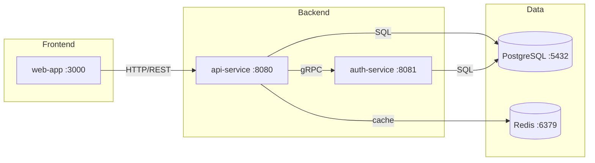

# Getting Started with Code Atlas

**Time required:** 30–45 minutes
**What you'll learn:** How to build a complete code atlas, read each layer, find your first structural bug, and set up CI freshness detection.

**Prerequisites:**
- A repository with source code (Go, TypeScript, Python, .NET, or Rust)
- Claude Code with the amplihack plugin installed
- `git` available in your terminal

---

## Step 1: Build Your First Atlas

Open Claude Code in your repository and run:

```
Build a complete code atlas for this repository
```

The skill will:
1. Detect your language(s) from build files and entry points
2. Build 6 layers of architecture documentation
3. Run a 2-pass bug hunt
4. Save all outputs to `docs/atlas/`

**Expected output (first 10 lines):**

```
Analyzing codebase: /path/to/your-repo
Languages detected: Go, TypeScript
Services found: 3 (api-service, auth-service, worker)

Building Layer 1: Runtime Topology...
  Found: docker-compose.yml — 3 services, 2 external deps
  Output: docs/atlas/layer1-runtime/topology.mmd ✓

Building Layer 2: Compile-time Dependencies...
  Found: go.mod, package.json
  Output: docs/atlas/layer2-dependencies/deps.mmd ✓
```

The full build takes 2–5 minutes for a typical multi-service repository.

---

## Step 2: Read the Runtime Topology (Layer 1)

Open `docs/atlas/layer1-runtime/topology.mmd` or `topology.svg`.

This diagram shows:
- Every service (box shape)
- Every database and cache (cylinder shape)
- Every connection between them (labeled arrows)

**What to look for:** Are there services you didn't know existed? Are there connections that don't match your mental model?

**Example Layer 1 output:**



---

## Step 3: Check Your Route Inventory (Layer 3)

Open `docs/atlas/layer3-routing/inventory.md`.

This table lists every HTTP route in your system:

```markdown
| Method | Path | Handler | Auth | Request DTO | Response DTO |
|--------|------|---------|------|-------------|--------------|
| POST | /api/auth/login | AuthController.login | None | LoginRequest | TokenResponse |
| GET | /api/users | UserController.list | JWT | — | UserListResponse |
| POST | /api/orders | OrderController.create | JWT | CreateOrderRequest | OrderResponse |
```

**What to look for:**
- Routes with no auth that should require it
- Routes referencing DTOs that don't exist (bug!)
- Routes documented but no longer in the code

---

## Step 4: Find BUG-001 — The First Structural Bug

After the atlas builds, check `docs/atlas/bug-reports/`. You may already have a bug report.

Bug reports look like this:

```markdown
# Bug: POST /api/orders handler reads undeclared field

**Severity:** major
**Found in pass:** 1 (contradiction-hunt)
**Layers involved:** 3, 4

## Evidence

### Layer 3 truth: HTTP Routing
```go
// src/handlers/orders.go:47
customerId := req.Body.CustomerId  // accesses customerId
```
*Source: `src/handlers/orders.go:47`*

### Layer 4 truth: Data Flow
```go
// src/dtos/orders.go:12
type CreateOrderRequest struct {
    Items           []OrderItem `json:"items"`
    DeliveryAddress string      `json:"delivery_address"`
    // No customerId field
}
```

## Contradiction
Layer 3 handler reads `customerId`; Layer 4 DTO does not declare it.

## Recommendation
Add `CustomerId string` to `CreateOrderRequest` or remove the handler reference.
```

**This is a real structural bug** — the kind that causes silent TypeErrors in production.

---

## Step 5: Set Up CI Staleness Detection

Run:

```
Set up CI staleness detection for the code atlas
```

Or add the workflow manually:

```bash
# Copy the workflow file (already created by the skill)
cat .github/workflows/atlas-ci.yml
```

The CI workflow runs `scripts/check-atlas-staleness.sh` on every push and reports which layers need rebuilding.

**Test it locally:**

```bash
# Check if your atlas is stale after recent changes
bash scripts/check-atlas-staleness.sh

# Example output:
# Layer 3 STALE: HTTP Routing — triggered by: src/api/routes/user-routes.ts
#   Rebuild: /code-atlas rebuild layer3
#
# Summary: 1 layer(s) stale: [3]
# Run '/code-atlas rebuild all' to refresh the full atlas.
```

---

## What's Next

Now that you have a complete atlas:

- **[How to use code atlas daily](../howto/use-code-atlas.md)** — 15 practical recipes including partial rebuilds, bug hunt commands, and PR review
- **[How to add custom journeys](../howto/add-custom-journeys.md)** — Define business-critical user paths for deeper bug hunting
- **[Full reference](../reference/code-atlas-reference.md)** — All flags, layer IDs, output files, and error codes
- **[Atlas layers explained](../reference/atlas-layers-explained.md)** — What each layer detects and why it matters

---

*This tutorial uses retcon documentation — commands and outputs reflect the intended behavior of the `/code-atlas` skill.*
